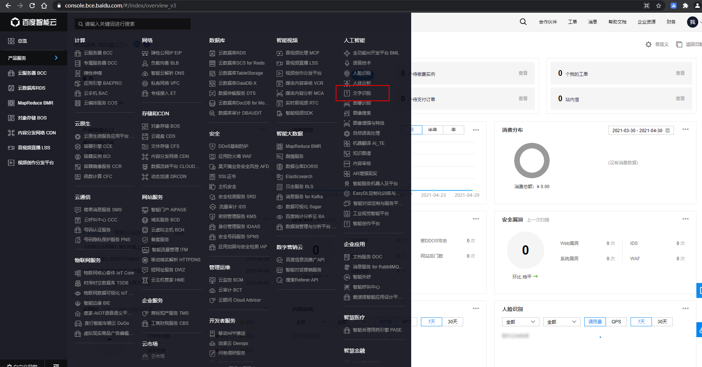
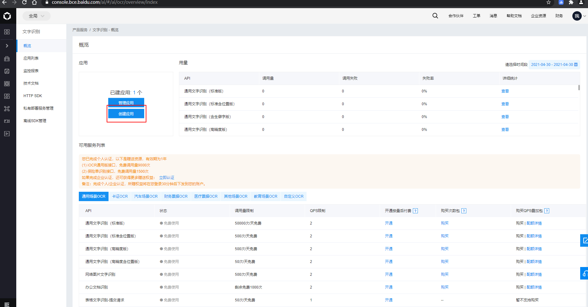
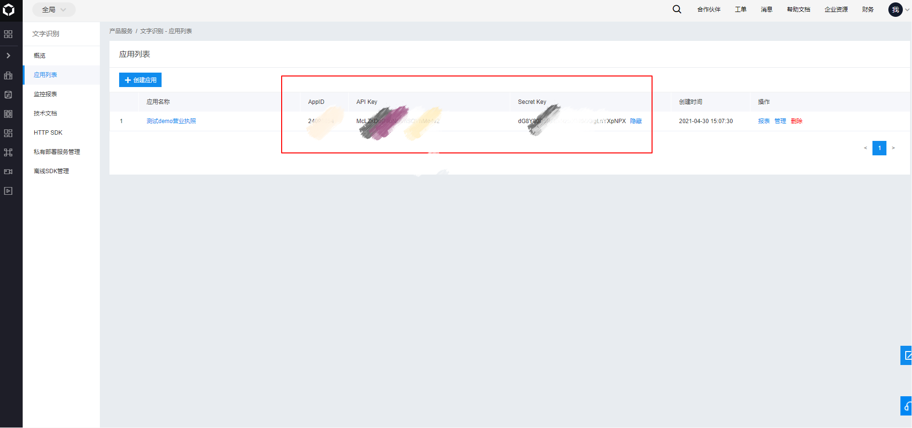
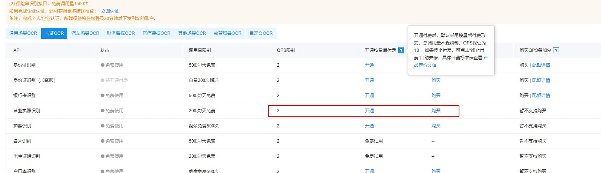

# 概述

百度AI平台 ，https://ai.baidu.com/  ，提供了各种 ai 的开放功能，如语音识别，人脸识别，文字识别，图像识别。

## 接入准备

注册百度账号，登录控制台  https://console.bce.baidu.com/  

添加 sdk 依赖，项目里使用了slf4j做日志，需要排除调自带的日志实现。

```xml
<dependency>
    <groupId>com.baidu.aip</groupId>
    <artifactId>java-sdk</artifactId>
    <version>4.15.4</version>
    <exclusions>
        <exclusion>
            <groupId>org.slf4j</groupId>
            <artifactId>slf4j-simple</artifactId>
        </exclusion>
    </exclusions>
</dependency>
```

# 使用

大部分情况下，每个功能都会以应用的形式存在，需要先创建应用，获取到 AppId ,APIKey, SecretKey，进行调用

1，选择想要添加的业务



2, 点击创建应用



3, 创建应用，默认会全部勾选对应的一级功能下的所有子功能。


4, 返回应用列表，拿到对应的  AppId ,APIKey, SecretKey



5,编写代码，构建 Client 实例

比如 用作文字识别的Client 为 AipOcr  ，使用三个参数构建。

```java
String appId = "123";
String apiKey = "aaa";
String secretKey = "bbbb";

// 初始化一个AipOcr
AipOcr aipOcr = new AipOcr(appId, apiKey, secretKey);

// 可选：设置网络连接参数
aipOcr.setConnectionTimeoutInMillis(2000);
aipOcr.setSocketTimeoutInMillis(60000);
```

该实例最好为单例，建议在spring容器中配置为bean。

使用时,调用对应接口方法即可。

本质上都是发起 http 请求，但是使用sdk的接口，可以省去一些操作，比如交换 Access Key ，封装请求参数，图片转base64编码等。

接口返回的都是 `org.json.JSONObject` 需要自己处理参数，详见 官方的接口文档。

6，需要关注每个接口的 qps ，做好限流，不要直接一个循环去调用，容易超出限制。

充钱可以提高qps



## 文字识别

官方文档 ，https://ai.baidu.com/ai-doc/OCR/

### 卡证识别

#### 营业执照

```java
String path = "f://demoBL.jpg";
JSONObject res = aipOcr.businessLicense(path, new HashMap<>());
BaiduBusinessLicenseVo baiduBusinessLicenseVo = transToBusinessLicense(res);
```

转换的方法

```java
private BaiduBusinessLicenseVo transToBusinessLicense(JSONObject res){
    System.out.println(res);
    BaiduBusinessLicenseVo baiduBusinessLicenseVo = new BaiduBusinessLicenseVo();
    try {
        JSONObject wordsResult = res.getJSONObject("words_result");
        baiduBusinessLicenseVo.setCompanyName(wordsResult.getJSONObject("单位名称").getString("words"));
        baiduBusinessLicenseVo.setLegalPerson(wordsResult.getJSONObject("法人").getString("words"));
        baiduBusinessLicenseVo.setAddress(wordsResult.getJSONObject("地址").getString("words"));
        baiduBusinessLicenseVo.setValidityTerm(wordsResult.getJSONObject("有效期").getString("words"));
        baiduBusinessLicenseVo.setDocumentNumber(wordsResult.getJSONObject("证件编号").getString("words"));
        baiduBusinessLicenseVo.setSocialCreditCode(wordsResult.getJSONObject("社会信用代码").getString("words"));
        baiduBusinessLicenseVo.setOrganizationType(wordsResult.getJSONObject("组成形式").getString("words"));
        baiduBusinessLicenseVo.setBusinessScope(wordsResult.getJSONObject("经营范围").getString("words"));
        baiduBusinessLicenseVo.setRegisteredCapital(wordsResult.getJSONObject("注册资本").getString("words"));
        baiduBusinessLicenseVo.setPaidInCapital(wordsResult.getJSONObject("实收资本").getString("words"));
        baiduBusinessLicenseVo.setEstablishmentDate(wordsResult.getJSONObject("成立日期").getString("words"));
        baiduBusinessLicenseVo.setTaxRegistrationNumber(wordsResult.getJSONObject("税务登记号").getString("words"));
        baiduBusinessLicenseVo.setRegistrationAuthority(wordsResult.getJSONObject("登记机关").getString("words"));
        baiduBusinessLicenseVo.setType(wordsResult.getJSONObject("类型").getString("words"));
    } catch (JSONException e) {
        System.out.println("解析失败,errorMsg:{},errorCode:{}");
    }
    return baiduBusinessLicenseVo;
}
```

对应实体类

```java
@Data
public class BaiduBusinessLicenseVo {

    /**
     * 单位名称
     */
    private String companyName;

    /**
     * 法人
     */
    private String legalPerson;

    /**
     * 地址
     */
    private String address;

    /**
     * 有效期
     */
    private String validityTerm;

    /**
     * 证件编号
     */
    private String documentNumber;

    /**
     * 社会信用代码
     */
    private String socialCreditCode;

    /**
     * 组成形式
     */
    private String organizationType;

    /**
     * 经营范围
     */
    private String  businessScope;

    /**
     * 注册资本
     */
    private String registeredCapital;

    /**
     * 实收资本
     */
    private String  paidInCapital;

    /**
     * 成立日期
     */
    private String establishmentDate;

    /**
     * 税务登记号
     */
    private String taxRegistrationNumber;

    /**
     * 登记机关
     */
    private String registrationAuthority;

    /**
     * 类型
     */
    private String type;
}
```

#### 护照

调用方法

```java
String file = "f://hz2.jpg";
JSONObject passport = aipOcr.passport(file,  new HashMap<>());
transPassport(passport);
```

转换

```java
private BaiduPassportVo transPassport(JSONObject res){
    System.out.println(res);
    BaiduPassportVo baiduPassportVo = new BaiduPassportVo();
    try {
        JSONObject wordsResult = res.getJSONObject("words_result");
        baiduPassportVo.setMrzCode1(wordsResult.getJSONObject("MRZCode1").getString("words"));
        baiduPassportVo.setMrzCode2(wordsResult.getJSONObject("MRZCode2").getString("words"));
        baiduPassportVo.setType(wordsResult.getJSONObject("护照类型").getString("words"));
        baiduPassportVo.setIssuePlace(wordsResult.getJSONObject("护照签发地点").getString("words"));
        baiduPassportVo.setNumber(wordsResult.getJSONObject("护照号码").getString("words"));
        baiduPassportVo.setIssuingAuthority(wordsResult.getJSONObject("签发机关").getString("words"));
        baiduPassportVo.setIssueDate(wordsResult.getJSONObject("签发日期").getString("words"));
        baiduPassportVo.setBirthday(wordsResult.getJSONObject("生日").getString("words"));
        baiduPassportVo.setBirthPlace(wordsResult.getJSONObject("出生地点").getString("words"));
        baiduPassportVo.setValidityTerm(wordsResult.getJSONObject("有效期至").getString("words"));
        baiduPassportVo.setNameSpell(wordsResult.getJSONObject("姓名拼音").getString("words"));
        baiduPassportVo.setGender(wordsResult.getJSONObject("性别").getString("words"));
        baiduPassportVo.setName(wordsResult.getJSONObject("姓名").getString("words"));
        baiduPassportVo.setNationalCode(wordsResult.getJSONObject("国家码").getString("words"));
        baiduPassportVo.setNationality(wordsResult.getJSONObject("国籍").getString("words"));
    } catch (JSONException e) {
        System.out.println("解析失败,errorMsg:{},errorCode:{}");
    }
    System.out.println(baiduPassportVo);
    return baiduPassportVo;
}
```

实体类

```java
@Data
public class BaiduPassportVo {

    /**
     * MRZCode2
     */
    private String mrzCode2;

    /**
     * 护照类型
     */
    private String type;

    /**
     * 护照签发地点
     */
    private String issuePlace;

    /**
     * 护照号码
     */
    private String number;

    /**
     * 签发机关
     */
    private String issuingAuthority;

    /**
     * 签发日期
     */
    private String issueDate;

    /**
     * 生日
     */
    private String birthday;

    /**
     * 出生地点
     */
    private String birthPlace;

    /**
     * 有效期至
     */
    private String validityTerm;

    /**
     * 姓名拼音
     */
    private String nameSpell;

    /**
     * 性别
     */
    private String gender;

    /**
     * 姓名
     */
    private String name;

    /**
     * 国家码
     */
    private String nationalCode;

    /**
     * 国籍
     */
    private String nationality;

    /**
     * MRZCode1
     */
    private String mrzCode1;
}
```


#### 身份证

身份证区分正反面，正面为人像面，反面为国徽面

调用时，指定正反面

正面

```java
String file = "f://id1.jpg";
JSONObject idCard = aipOcr.idcard(file, "front", new HashMap<>());
transIdCard(idCard);
```

转换

```java
private BaiduIdCardVo transIdCard(JSONObject jsonObject) {
    System.out.println(jsonObject);
    BaiduIdCardVo baiduIdCardVo = new BaiduIdCardVo();
    try {
        JSONObject wordsResult = jsonObject.getJSONObject("words_result");
        baiduIdCardVo.setName(wordsResult.getJSONObject("姓名").getString("words"));
        baiduIdCardVo.setNation(wordsResult.getJSONObject("民族").getString("words"));
        baiduIdCardVo.setAddress(wordsResult.getJSONObject("住址").getString("words"));
        baiduIdCardVo.setIdNumber(wordsResult.getJSONObject("公民身份号码").getString("words"));
        baiduIdCardVo.setGender(wordsResult.getJSONObject("性别").getString("words"));
        baiduIdCardVo.setBirthday(wordsResult.getJSONObject("出生").getString("words"));
    } catch (JSONException e) {
        System.out.println("解析失败,errorMsg:{},errorCode:{}");
    }
    System.out.println(baiduIdCardVo);
    return baiduIdCardVo;
}
```

实体类

```java
@Data
public class BaiduIdCardVo {

    /**
     * 姓名
     */
    private String name;

    /**
     * 民族,"汉"
     */
    private String nation;

    /**
     * 住址
     */
    private String address;

    /**
     * 身份证号
     */
    private String idNumber;

    /**
     * 出生日期，格式:19980727
     */
    private String birthday;

    /**
     * 性别，返回 "男"，”女“
     */
    private String gender;
}
```

背面

```java
String file = "f://id1_.jpg";
JSONObject idCard = aipOcr.idcard(file, "back", new HashMap<>());
transIdCardBack(idCard);
```

转换

```java
private BaiduIdCardBackVo transIdCardBack(JSONObject idCard) {
    System.out.println(idCard);
    BaiduIdCardBackVo baiduIdCardBackVo = new BaiduIdCardBackVo();
    try {
        JSONObject wordsResult = idCard.getJSONObject("words_result");
        baiduIdCardBackVo.setIssuingAuthority(wordsResult.getJSONObject("签发机关").getString("words"));
        baiduIdCardBackVo.setIssueDate(wordsResult.getJSONObject("签发日期").getString("words"));
        baiduIdCardBackVo.setExpiryDate(wordsResult.getJSONObject("失效日期").getString("words"));
    } catch (JSONException e) {
        System.out.println("解析失败,errorMsg:{},errorCode:{}");
    }
    System.out.println(baiduIdCardBackVo);
    return baiduIdCardBackVo;
}
```

实体类

```java
@Data
public class BaiduIdCardBackVo {

    /**
     * 签发机关
     */
    private String issuingAuthority;

    /**
     * 签发日期
     */
    private String issueDate;

    /**
     * 失效日期
     */
    private String expiryDate;
}
```

#### 银行卡

调用

```java
String file = "f://yhk1.jpg";
JSONObject passport = aipOcr.bankcard(file,  new HashMap<>());
transBankCard(passport);
```

转换

```java
private BaiduBankCardVo transBankCard(JSONObject res){
    System.out.println(res);
    BaiduBankCardVo baiduBankCardVo = new BaiduBankCardVo();
    try {
        JSONObject result = res.getJSONObject("result");
        baiduBankCardVo.setBankName(result.getString("bank_name"));
        baiduBankCardVo.setBankCardType(result.getInt("bank_card_type"));
        baiduBankCardVo.setBankCardNumber(result.getString("bank_card_number"));
        baiduBankCardVo.setValidDate(result.getString("valid_date"));
    } catch (JSONException e) {
        System.out.println("解析失败,errorMsg:{},errorCode:{}");
    }
    System.out.println(baiduBankCardVo);
    return baiduBankCardVo;
}
```

实体类

```java
@Data
public class BaiduBankCardVo {

    /**
     * 银行名
     */
    private String bankName;

    /**
     * 银行卡号，中间带空格，如 "xxxx xxxx xxxx xxxx"
     */
    private String bankCardNumber;

    /**
     * 有效期
     */
    private String validDate;

    /**
     * 银行卡类型 ，0：不能识别; 1：借记卡; 2：贷记卡（原信用卡大部分为贷记卡）; 3：准贷记卡; 4：预付费卡
     */
    private Integer bankCardType;
}
```


# 注意事项

1,卡的问题 ,如果本地测试性能不错，提交到生产的服务器，性能很慢，可以先本地 ping 下  `aip.baidubce.com` ，查看对应的 ip 节点，对比下服务器上ping出来的 ip 节点，再用服务器直接ping本地的查出来的那个ip节点，试下哪个快一点，直接改服务器的 host ，选择快的节点。或者更换dns服务器。