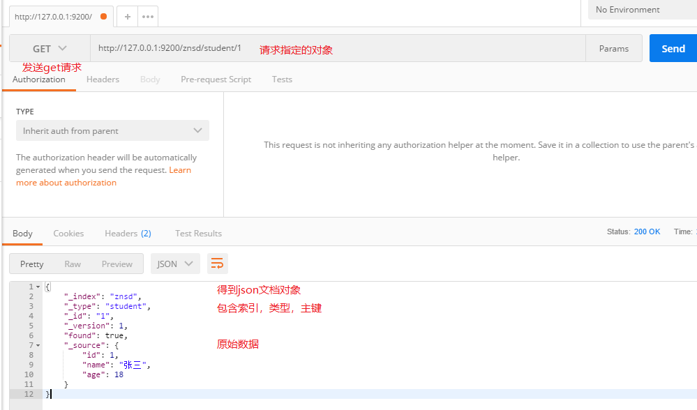

###添加&修改

使用postman发送put请求到`127.0.0.1:9200/索引/类型/主键`,传输json格式的文档，添加记录,会自动创建索引和类型

第一次添加的文档version属性为1，每次修改都会自增version属性


### 查询

发送get请求，得到json



### 删除

发送delete请求，删除指定坐标的对象，再一次使用get请求，得到found属性为false

```json
{
    "_index": "znsd",
    "_type": "student",
    "_id": "3",
    "found": false
}
```

### 轻量搜索

发送get请求，把参数由主键改为`_search`,查询所有的学生,想要添加条件，把条件赋值给参数`q`,

```
http://127.0.0.1:9200/znsd/student/_search?q=name:李四
```

ex:查询name为李四的student

### 表达式搜索


