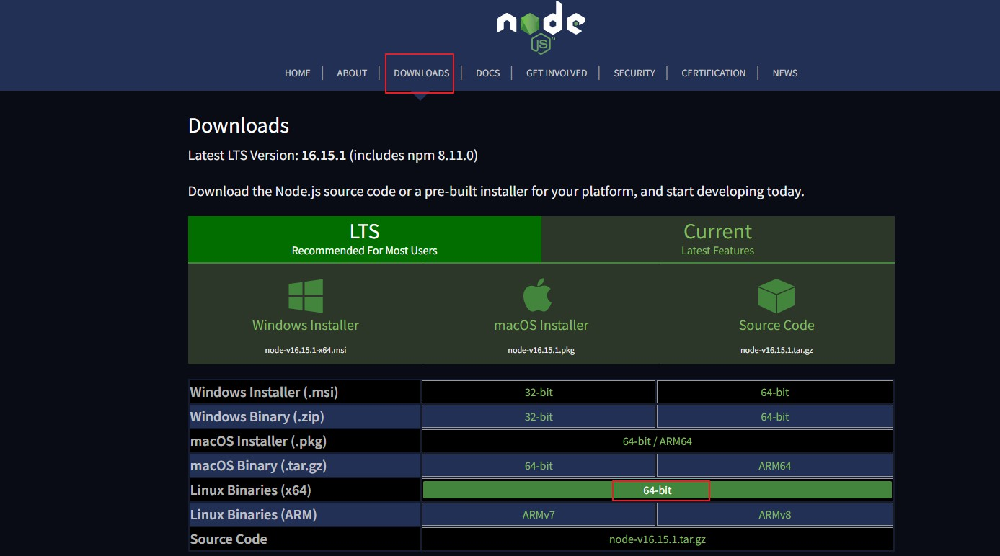

# 概述

Node.js 是为 js 提供一个服务器运行环境。

windows 直接下载安装程序 msi ,直接运行即可

linux 安装步骤

官网下载 liunx 二进制包 .tar.xz 文件



命令

```bash
# 创建目录
mkdir -p /usr/local/lib/nodejs
# 解压到刚才的目录
tar -xJvf node-v16.15.1-linux-x64.tar.xz -C /usr/local/lib/nodejs

vim /etc/profile
# 编辑，添加下面这行到文件结尾 , 追加环境变量到path
export PATH=/usr/local/lib/nodejs/node-v16.15.1-linux-x64/bin:$PATH
# 重载文件
source /etc/profile
```

安装后验证

```bash
node -v
```

# 使用

编辑 hello.js

```js
console.log('hello node')
```

使用 node 运行

```bash
node hello.js
```

# 模块化

原生 js 没有模块化的概念，在node中使用CommonJS作为模块化规范。

每个 js 文件都是一个模块。

编辑 a.js ,定义成员，使用 exports 导出成员，使得外部能够访问。

```js
let num=12
let stu={name:'张三'}
function add(v1,v2){
    return v1+v2
}

exports.num=num
exports.add=add
```

编辑 b.js ，使用 require 函数导入成员，必须使用 `./` 或`../` 开头，可以不带后缀`.js`

声明为一个变量，通过该变量访问该模块暴露的成员，没有暴露的则为 undefined

```js
let a= require('./a')

console.log(a.num)//12
console.log(a.stu)//undefined
console.log(a.add(1,2))//3
```

## es6简写

可以配合 es6 的语法简写,通过箭头函数直接暴露成员，调用同模块的函数使用 this 

```js
exports.add=(...nums)=>{
    let result=0
    nums.forEach((value)=>{
        result+=value
    })
    return result
}

exports.avg=(...nums)=>{
    let total=this.add(...nums)
    return total/nums.length
}

exports.num=12
```

接收时可以通过解构赋值语法接收想要的成员。并直接调用

```js
let {add,avg}=require('./a')

console.log(add(1,2,3))
console.log(avg(3,4,5,6))
```

## 系统模块

node 提供了一些核心模块以供使用，导入时无需加`./`

```js
let fs = require('fs')
```

## 全局对象

node 中 使用 global 作为全局对象，没有 window 对象

```js
console.log(global)
console.log(window)
```

## 原理

通过查看当前函数实体，一个 js 模块就是一个闭包。

```js
console.log(arguments.callee+"")
```

像 exports , require 由参数传入。

```js
function (exports, require, module, __filename, __dirname) {

console.log(arguments.callee+"")

}
```

## module

module 代表当前模块对象，对象中有 exports 属性。

```js
console.log(exports===module.exports)  //true
```

但是 exports 只能使用`.成员`的方式暴露，使用 `module.exports` 可以直接指向一个新的对象。

原因是 使用`.`语法不会改变对象在堆中的引用，而`=` 改变了引用，指向了一个新的对象。

```js
module.exports={
    num:12,
    add(v1,v2){
        return v1+v2
    }
}
```


 # NPM

node 通过 package.json 来描述包信息，使用 npm 来管理包。

查看 npm 版本

```bash
npm -v
```

搜索一个模块

```bash
npm search 包名
```

初始化包，会生成 package.json 文件

```bash
npm init
```

安装包,会在`node_modules`目录下安装指定的包。同时会在 package.json中添加依赖信息。

```bash
npm i 包名
```

-g 全局安装，通常使用于一些命令行工具或编译依赖。

根据 描述文件安装依赖

```
npm i
```

删除包

```bash
npm r 包名
```

设置淘宝镜像，后续使用 cnpm 作为命令

```bash
npm install -g cnpm --registry=https://registry.npm.taobao.org
```


