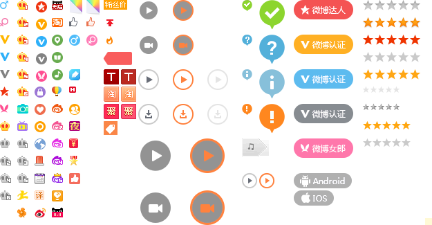
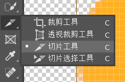
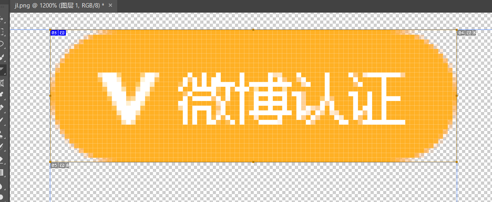
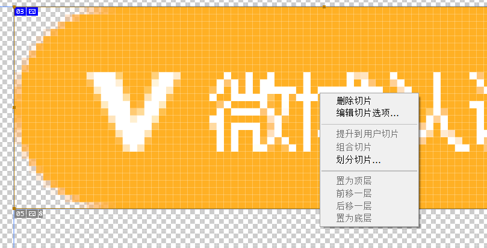
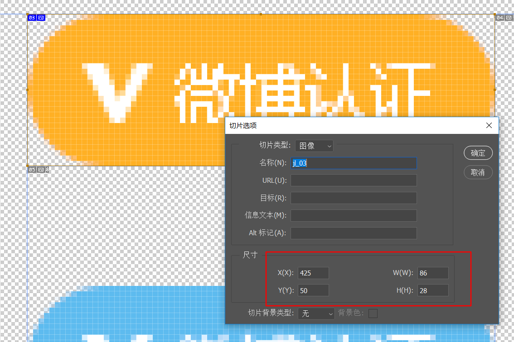
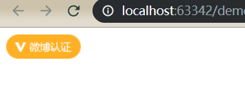
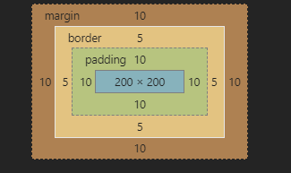

div 用于配合css完成布局，span用于修改局部样式

div是容器级元素，可以放其他所有标签，且会独占一行

span是文本级标签，只能放文本图片超链接，不会独占一行

# 显示模式

## 块级元素

常见，div，p，h，td，li等

块级元素会独占一行

可以设置宽高，默认和父元素一样宽高

## 行内元素

常见，span

不会独占一行

不可以设置宽高，宽高和内容一样

## 行内块级元素

常见 img

不会独占一行

可以设置宽高，默认和内容一样


## 切换

通过设置`display`属性改变，显示模式

```css
div{
    display: inline;
    background: red;
    width: 200px;
    height: 100px;
}
```

`inline`: 行内元素

`block` :块级元素

`inline-block` ：行内块级元素

# 背景

设置**背景颜色**

```css
background-color: red;
```

**背景图片**

```css
background-image: url(img/a.gif);
```

图片会自动平铺扩展,与背景颜色同时设置会覆盖背景颜色

通过设置bg-repeat控制**平铺**

```css
background-repeat: repeat;
```

`repeat`:全平铺

`no-repeat` 不平铺

`repeat-x` 水平方向平铺

`repeat-y` 垂直方向平铺 

设置**定位**

```css
 background-position: 20% bottom;
```

第一个值为，水平方向x轴的位置

第二个值为，垂直方向y轴的位置

取值

1,名词

x:left center right

y:top center bottom

2，px

如：200px,可以指定负值

3，%

如 20%，可以指定负值

设置**关联方式**

```css
background-attachment: scroll;
```

`scroll` : 可以滚动

`fixed` 固定模式.图片不会随滚动条滚动

**简写**

```css
background: url("img/a.gif") no-repeat red  fixed;
```

通过`background`设置多个属性

## 精灵图

css sprites 也称雪碧图，通过多个小图片组成，只加载一次，多次使用



ps打开，选择切片工具



放大图片后，选择要切的图标,调整宽高位置




在目标切片上右键选择,编辑切片选项



得到宽高wh和坐标xy



编辑代码

```css
div{
    background: url("img/jl.png") no-repeat -425px -50px;
    width:86px;
    height: 28px;
}
```

设置宽高,xy坐标设置为负数

浏览器即可得到指定图标



# 边框

写法一

一次设置四条边的所有属性

```css
border: 2px solid black;
```

属性为 宽度，样式，颜色.样式为必须属性

样式的常用值:

`solid` : 实线

`dashed` :虚线

写法二

依次设置每条边的所有属性,不要某个边可以设置为none

```css
border-top:10px solid red ;
border-right: 2px dashed black;
border-bottom: none;
border-left: 10px solid red;
```

写法三

设置四条边的某个属性

```css
border-width: 2px 5px;
border-style: solid dashed double solid;
border-color: red;
```

四条边的顺序为 ， 上 右 下 左，一个顺时针的顺序，如果省略值，将使用对面的值，只有一个值就全用这个值

写法四

分别给每条边设置每个属性,略繁琐

```css
border-bottom-color: black;
border-bottom-style: solid;
border-bottom-width: 5px;
```

案例-三角形

```css
div {
    width: 0;
    height: 0;
    border: 10px solid red;
    border-bottom: none;
    border-left-color: white;
    border-right-color: white;
}
```

div的宽高设置为0，朝向那边就去掉那边的边框，其他两边的颜色设置为白色

# 内边距

内容与边框的距离为内边距，设置内边距会改变元素原有大小，内边距也是元素的一部分

写法一

同时设置四条内边距,规则和边框一样

```css
padding: 20px 50px 5px 10px;
```

写法二

分别设置

```css
padding-top: 20px;
padding-right: 5px;
padding-bottom: 6px;
padding-left: 50px;
```

# 外边距

标签与标签的距离

```css
margin: 10px;
```

和padding一样可以分别设置和简写

水平方向的margin可以设置为auto，居中 `margin:0 auto`

**合并现象**：水平方向的外边距和累加，垂直方向的外边距会重叠

# 盒子模型

元素就好比盒子，都可以设置宽高，外边距，边框，内边距



元素内容的宽高由 width、height设置

元素的显示大小，等于 内容 + 内边距+边框

元素占用空间为，等于 内容 + 内边距+边框+外边距

如果想要增加内边距和边框，而保持显示大小不变，对应内容宽高要减少

css3新增属性 box-sizing

```css
box-sizing: border-box;
```

默认值为`content-box`,计算方式不变

设置为`border-box` 后，元素的显示大小恒等于w/h设置的属性，自动计算内容宽高

**清空默认边距**

```css
* {
    margin: 0;
    padding: 0;
}
```

# 文字

行高,文字在行高中默认居中

```css
line-height: 60px;
```


