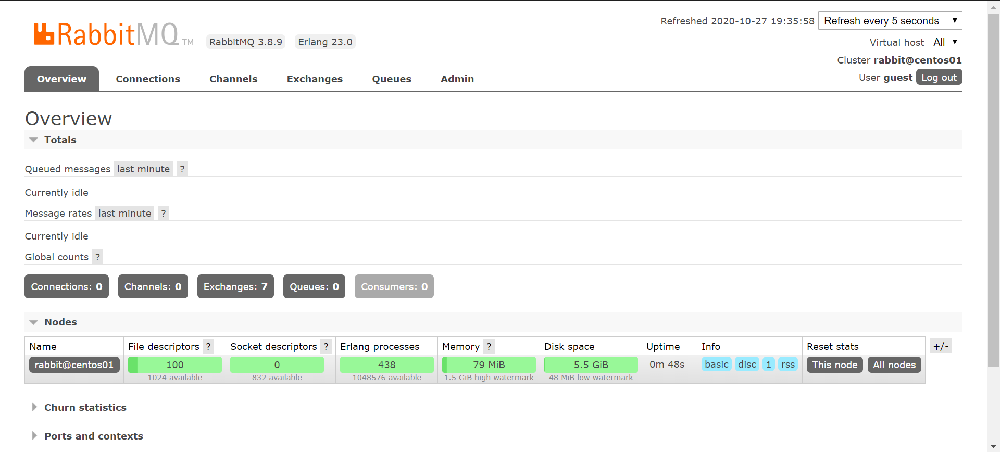

# 概述

[RabbitMQ](https://www.rabbitmq.com/)是 pivotal 团队研发，后被 VMware收购，基于 Erlang 语言开发的消息队列中间件。

# 安装

[参考 ](https://blog.csdn.net/weixin_41004350/article/details/83046842)

1，安装依赖

```bash
yum -y install gcc glibc-devel make ncurses-devel openssl-devel xmlto perl wget gtk2-devel binutils-devel
```

2，安装 Erlang ，由于是erlang语言开发的软件，需要先装运行环境，本次安装使用 rabbitmq 3.8.9版本

[查看对应erlang版本](https://www.rabbitmq.com/which-erlang.html) , 选择了 erlang 23.0  ，去 [erlang官方下载地址](http://erlang.org/download/) 下载 `opt_src_23.0.tar.gz`

找一个目录解压

```bash
# 解压
tar -zxvf otp_src_23.0.tar.gz
# 指定一个安装目录 ，可能会告警，但是不影响
./configure --prefix=/app/rabbitmq/erlang
# 编译
make && make install
```

编译好后，指定的目录会多出两个文件夹 bin , lib

```bash
vim /etc/profile
# 添加环境变量
export PATH=$PATH:/app/rabbitmq/erlang/bin
# 激活
source /etc/profile
```

验证 ，控制台直接调用 `erl` 命令，能进入 erlang 的shell窗口，即安装完成。

3, 安装 rabbitmq

从[官网下载](https://www.rabbitmq.com/install-generic-unix.html)通用二进制包 ,  找到对应版本下载 `rabbitmq-server-generic-unix-3.8.9.tar.xz` 

```bash
# 解压
tar -xvf rabbitmq-server-generic-unix-3.8.9.tar.xz
# 设置环境变量
vim /etc/profile
export PATH=$PATH:/app/rabbitmq/rabbitmq_server-3.8.9/sbin
source /etc/profile
```

开启web 管理插件

```bash
rabbitmq-plugins enable rabbitmq_management
```

后台启动服务

```bash
rabbitmq-server -detached
```

防火墙放开 `15672` 端口，浏览器访问15672 端口，进入控制台 

还需暴露 5672 端口，是程序的访问端口

默认使用 `guest/guest` 登录 ，但是默认情况只能本机登录

修改配置，需要先去`https://github.com/rabbitmq/rabbitmq-server/blob/master/docs/` 下载配置模板，因为本身没有配置文件，下载 `advanced.config` 和 `rabbitmq.conf` ，复制进 `rabbitmq-3.8.9/etc/rabbitmq/`目录下

修改配置

```properties
loopback_users.guest=false
```

关闭服务，重新启动

```bash
rabbitmqctl stop
rabbitmq-server -detached
```

即可使用浏览器远程访问控制台



