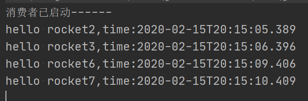
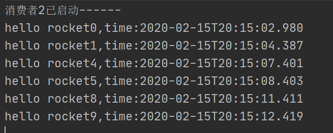

# 生产者

引入依赖,与部署的版本对应

```xml
<dependency>
    <groupId>org.apache.rocketmq</groupId>
    <artifactId>rocketmq-client</artifactId>
    <version>4.6.0</version>
</dependency>
```

直接 new 的方式创建生产者，指定一个生产者组。设置好 name server服务地址，启动。

创建 `org.apache.rocketmq.common.message.Message`对象，设置 topic 和 消息体。

发送后关闭即可。

```java
public class Provider {

    public static void main(String[] args) throws Exception {
        DefaultMQProducer producer = new DefaultMQProducer("demo-prov-group");
        producer.setNamesrvAddr("192.168.80.128:9876");
        producer.start();

        String hello = "hello rocket";
        Message msg = new Message("student",hello.getBytes());
        producer.send(msg);
        producer.shutdown();
        System.out.println("发生消息完成-----");
    }
}
```

## SendResult

发送会产生一个发送结果对象,可以得到 SendStatus ，判断是否成功。

默认是同步发送消息，等待服务器返回发送结果。

```java
for (int i = 0; i < 10; i++) {
    String hello = "hello rocket" + i + ",time:" + LocalDateTime.now().toString();
    Message msg = new Message("student", hello.getBytes());
    SendResult result = producer.send(msg);
    if (result.getSendStatus().equals(SendStatus.SEND_OK)) {
        System.out.println("发生成功，msgId:" + result.getMsgId());
    } else {
        System.out.println("发生失败");
    }
    TimeUnit.SECONDS.sleep(1);
}
```

## SendCallback

如果想要异步发送消息，不等待发送结果，而是得到结果执行回调函数。

使用 SendCallback 对象，作为 send 的第二个参数。

```java
producer.send(msg, new SendCallback() {
    @Override
    public void onSuccess(SendResult sendResult) {
        System.out.println("发送成功:"+sendResult.getMsgId());
    }

    @Override
    public void onException(Throwable e) {
        System.out.println("发送失败:"+e.getMessage());
    }
});
```

## 单向消息

如果不需要发送结果，则调用 sendOneway 方法，该方法没有返回值。

```java
producer.sendOneway(msg);
```

## 顺序消息

想要控制一组消息的顺序，发送时通过选择队列`MessageQueueSelector`，消费时使用顺序消费 `MessageListenerOrderly`。

## 延时消息

消息发送前可以设置一个延迟级别。控制 broker 服务器发送给消费者的时间。

```java
Message msg = new Message("student", hello.getBytes());
msg.setDelayTimeLevel(3);
```

设置为 0 ，为不延迟。延迟级别从 1 开始。目前仅支持以下级别。

```java
//位于服务器 rocketmq-store-4.6.0.jar 包下的 org.apache.rocketmq.store.config.MessageStoreConfig 中
private String messageDelayLevel = "1s 5s 10s 30s 1m 2m 3m 4m 5m 6m 7m 8m 9m 10m 20m 30m 1h 2h";
```

## 批量发送

批量发送只需把消息对象放进集合，send 即可。

```java
List<Message> msgs = new ArrayList<>();
msgs.add(new Message(topic,"Hello 1".getBytes()));
msgs.add(new Message(topic,"Hello 2".getBytes()));
msgs.add(new Message(topic,"Hello 3".getBytes()));

producer.send(msgs);
```

## 过滤消息

### tag

创建 消息对象时，还可以指定一个 tag 参数。

```java
List<Message> msgs = new ArrayList<>();
msgs.add(new Message(topic,"tag1","Hello 1".getBytes()));
msgs.add(new Message(topic,"tag2","Hello 2".getBytes()));
msgs.add(new Message(topic,"tag3","Hello 3".getBytes()));

producer.send(msgs);
```

而消费的时候可以指定一个表达式，指定过滤添加。指定 `*` 则消费所有类型。

例如，只消费 tag1 或 tag3

```java
consumer.subscribe("student", "tag1 || tag3");
```

## 事物消息

可以控制消息是否能被消费。

# 消费者

直接创建消费者，指定消费者组，订阅一个topic。

设置监听器，相当于回调函数，有消息时，会调用该函数。

注册进消费者。启动。

```java
public class Consumer {
    public static void main(String[] args) throws MQClientException {
        DefaultMQPushConsumer consumer = new DefaultMQPushConsumer("demo-consumer-group");
        consumer.setNamesrvAddr("192.168.80.128:9876");
        consumer.subscribe("student", "*");

        MessageListenerConcurrently listener = (msgs, context) -> {
            for (MessageExt msg : msgs) {
                String body = new String(msg.getBody());
                System.out.println(body);
            }
            return ConsumeConcurrentlyStatus.CONSUME_SUCCESS;
        };
        consumer.registerMessageListener(listener);
        
        consumer.start();
        System.out.println("消费者已启动------");
    }
}
```

## 负载均衡

当启动多个同**消费者组**下的消费者时，默认会采用负载均衡的方式，分发到这些消费者。

消费者1



消费者2



## 广播模式

可以通过设置消息模式，设置为广播模式后的消费者，将得到所有消息。

```java
consumer.setMessageModel(MessageModel.BROADCASTING);
```

