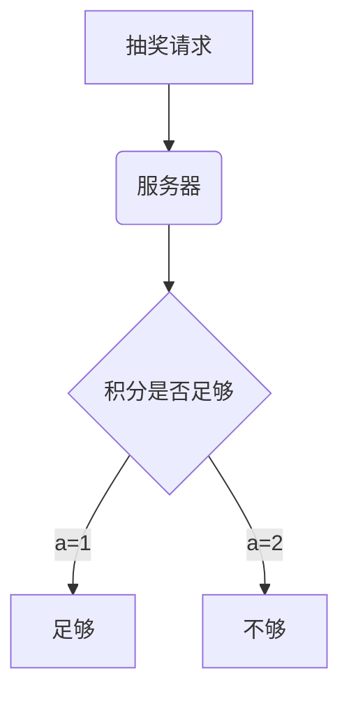

# note
自己写些笔记

# markdown 语法

后缀名为md，类似于html，是一种标记语言

##  标题

以`#` 开头，后接一个空格

```markdown
# 一级标题
## 二级标题
### 三级标题
#### 四级标题
```

## 代码块

以三个反引号包住代码块，可以选择编程语言

```markdown
​```js
var a = 1;
​```
```

## 列表

无序列表，可以使用 `*`，`+` ，`-` 三种符号

```markdown
* item1
+ item2
- item3
```

* item1
+ item2

- item3

有序列表

```markdown
1. item1
2. item2
```

1. item1
2. item2

## 分割线

```markdown
---
```

---

## 超链接

```markdown
[Google](http://www.google.com/)
```

[Google](http://www.google.com/)

## 图片

```markdown

```

## 引用

```markdown
> 引用
>> 一段提示
```

> 引用

> >  一段提示

## emoji 表情

```markdown
:smile:  :worried:
```

:smile:  :worried:

## 文本修饰

加粗

```markdown
**加粗**
```

代码 （波浪号 ~ 那个键）

```markdown
`div`
```

`div`

删除线 ( 双波浪号 ~~)

```markdown
~~删除线~~
```

~~删除的内容~~

## TODO 

```markdown
- [ ] 吃饭

- [x] 睡觉
```

- [ ] 吃饭

- [x] 睡觉

## 数学公式 

公式和流程图，其他软件或网站不一定支持，写法也复杂，不常用

```markdown
$$
\mathbf{V}_1 \times \mathbf{V}_2 =  \begin{vmatrix} 
\mathbf{i} & \mathbf{j} & \mathbf{k} \\
\frac{\partial X}{\partial u} &  \frac{\partial Y}{\partial u} & 0 \\
\frac{\partial X}{\partial v} &  \frac{\partial Y}{\partial v} & 0 \\
\end{vmatrix}
${$tep1}{\style{visibility:hidden}{(x+1)(x+1)}}
$$
```

$$
\mathbf{V}_1 \times \mathbf{V}_2 =  \begin{vmatrix} 
\mathbf{i} & \mathbf{j} & \mathbf{k} \\
\frac{\partial X}{\partial u} &  \frac{\partial Y}{\partial u} & 0 \\
\frac{\partial X}{\partial v} &  \frac{\partial Y}{\partial v} & 0 \\
\end{vmatrix}
${$tep1}{\style{visibility:hidden}{(x+1)(x+1)}}
$$

## 流程图

TD 标识纵向，可替换为 LR 改为横向 

`[]` 为方框，`()` 为圆角框，`{}`为条件框

```markdown
​```mermaid
graph TD
A[抽奖请求] --> B(服务器)
B-->C{积分是否足够}
C--> |a=1| D[足够]
C--> |a=2| E[不够]
​```
```





# github访问慢

1,访问 <http://tool.chinaz.com/dns/>  或 <https://www.ipaddress.com/>  

2，查询 `github.global.ssl.fastly.net` 和 `github.com`的ip地址

3,在host文件中配置

```
69.63.184.142 github.global.ssl.fastly.net
13.250.177.223 github.com
```

4,cmd中运行 `ipconfig /flushdns` ,刷新dns