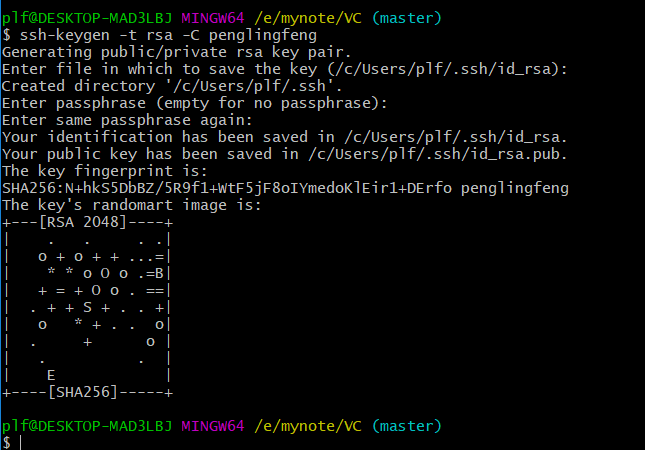
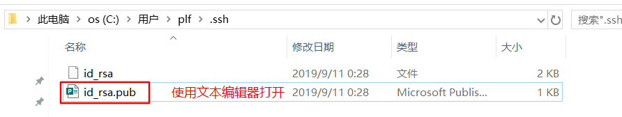
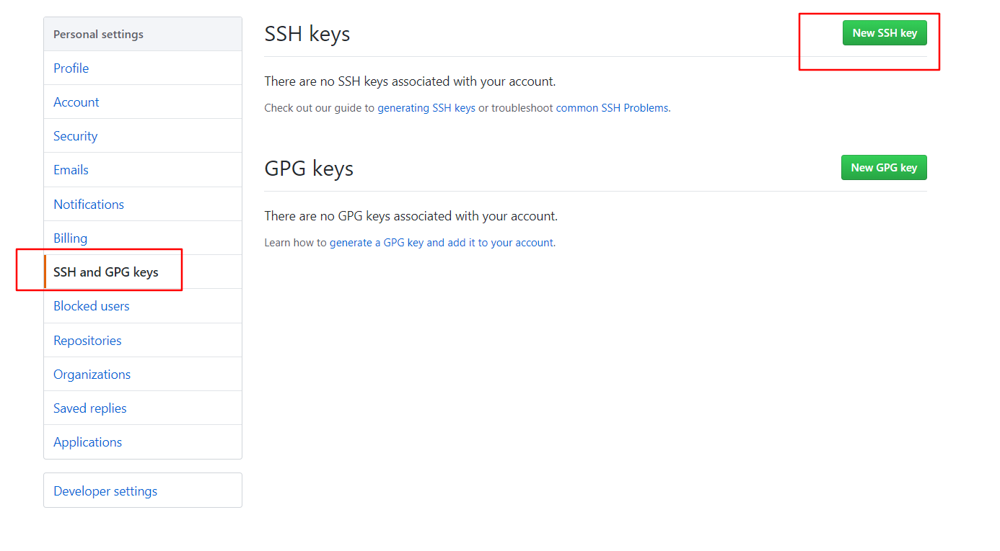
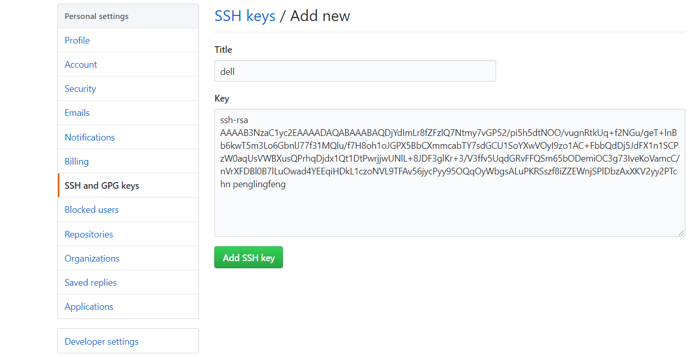

# GIt

## 一,命令行操作

### 1,本地库初始化 init

```
$ git init
Initialized empty Git repository in E:/test1/.git/

plf@DESKTOP-SRQTHA2 MINGW64 /e/test1 (master)
```

执行 `git init`,会在当前目录创建一个空的本地库，作为`.git`的隐藏文件夹，master为主分支

### 2,设置签名 config

用于标记不同的程序员，不会给你真的发邮件，只是做一个标记

分为系统级别和项目级别，一个全局，一个局部，就近原则

```
$ git config --global user.name penglingfeng
$ git config --global user.email plf1995@qq.com
```

通过git config 来设置属性，如果带了参数  --global  则为全局,全局配置会在user目录下的`.gitconfig`下

### 3,查看状态 status

通过 git status 查看

```
$ git status
On branch master

No commits yet

Untracked files:
  (use "git add <file>..." to include in what will be committed)

        index.html
        static/

nothing added to commit but untracked files present (use "git add" to track)
```

这里显示有未追踪的文件，因为这两个文件没有在本地库也没有在暂存区

### 4,追踪文件  add

通过 git add 文件名  添加到暂存区，暂存区的文件会被追踪

```
$ git add static/
warning: LF will be replaced by CRLF in static/css/app.1141489cfeca164dcca2708362998ec5.css.
```

后面的警告是表示换行符的改变，因为linux和windows的换行符不一致

重新查看状态

```
$ git status
On branch master

No commits yet

Changes to be committed:
  (use "git rm --cached <file>..." to unstage)

        new file:   index.html
        new file:   static/css/app.1141489cfeca164dcca2708362998ec5.css
```

暂存区现在已经有了新的文件

撤回   使用  git rm --cached  文件名  ,可以把暂存区的文件移除

### 5,提交文件 commit

通过 git commit 文件名 提交，会进入一个界面

```l
# Please enter the commit message for your changes. Lines starting
# with '#' will be ignored, and an empty message aborts the commit.
#
# On branch master
#
# Initial commit
# Changes to be committed:
#       new file:   index.html
#
# Untracked files:
#       static/
#
~
~
~
~
~
~
~
~
~
E:/test1/.git/COMMIT_EDITMSG[+] [unix] (14:32 23/09/2018)              13,1 全
```

通过vim编辑器来记录提交时的信息，i 键进入编辑模式，编辑好后 按esc 退出编辑模式，输入`:wq`保存

```
$ git commit index.html
[master (root-commit) 1be6ac2]  plf first commit index.html
 1 file changed, 1 insertion(+)
 create mode 100644 index.html
```

查看状态,表示没有要提交的文件

```
$ git status
On branch master
nothing to commit, working tree clean
```

修改一个文件后，再次查看,发现有被修改的文件

```
$ git status
On branch master
Changes not staged for commit:
  (use "git add <file>..." to update what will be committed)
  (use "git checkout -- <file>..." to discard changes in working directory)

        modified:   index.html

no changes added to commit (use "git add" and/or "git commit -a")
```

再次提交,可以先放到暂存区，也可以不放  使用  -m ""  带入消息参数，可以不进入vim编辑器

```
$ git commit -m "2update plf" index.html
[master 1aa2b6b] 2update plf
 1 file changed, 1 insertion(+), 1 deletion(-)
```

### 6,查看日志  log

git log 完整显示

```
$ git log
commit 1aa2b6be36a3ce434275e881b4be7b871d42f170 (HEAD -> master)
Author: penglingfeng <plf1995@qq.com>
Date:   Sun Sep 23 14:53:56 2018 +0800

    2update plf
```

单行显示

```
$ git log --pretty=oneline
1aa2b6be36a3ce434275e881b4be7b871d42f170 (HEAD -> master) 2update plf
8669420822edd43827d54fe7a7bf7986ba847564 update index plf
```

简单

```
$ git log --oneline
1aa2b6b (HEAD -> master) 2update plf
8669420 update index plf
```

移动几步  HEAD@{步数}

```
$ git reflog
1aa2b6b (HEAD -> master) HEAD@{0}: commit: 2update plf
8669420 HEAD@{1}: commit: update index plf
```

### 7,版本回退  reset

**基于索引** 

HEAD 表示当前版本，相当于一个指针，指向不同的版本

通过git reset --hard  索引值  ,进行回退，索引值通过日志查看，部分即可

```
$ git reset --hard 1aa2b6b
HEAD is now at 1aa2b6b 2update plf
```

其他参数

--hard  会移动本地库，暂存区，工作区

--mixed  会移动本地库，暂存区

--soft   只移动本地库

### 8,文件比较  diff

修改一个文件后 ,使用 git diff 文件名  ,直接使用会与暂存区的文件进行比较

```
$ git diff index.html
diff --git a/index.html b/index.html
index 1705f0a..cd81958 100644
--- a/index.html
+++ b/index.html
@@ -5,7 +5,7 @@
 <link href=/test1/static/css/app.1141489cfeca164dcca2708362998ec5.css rel=stylesheet>
 </head>
 <body>
-       <p>aaaaa</p>
+       <p>aaaaa bbb</p>
        <div id=app></div>
        <script type=text/javascript src=/test1/static/js/manifest.a798c06deef289079d80.js></script>
        <script type=text/javascript src=/test1/static/js/vendor.b8580e1294724b76ff58.js></script>


```

或者指定本地库的版本进行比较   使用  git   diff    版本索引  文件名  ,

```
$ git diff 1be6ac2 index.html
diff --git a/index.html b/index.html
index b845c7d..cd81958 100644
--- a/index.html
+++ b/index.html
@@ -1 +1,14 @@
-<!DOCTYPE html><html><head><meta charset=utf-8><title>test1</title><link href=/test1/static/css/app.1141489cfeca164dcca2708362998ec5.css rel=stylesheet></head><body><div id=app></div><script type=text/javascript src=/test1/static/js/manifest.a798c06deef289079d80.js></script><script type=text/javascript src=/test1/static/js/vendor.b8580e1294724b76ff58.js></script><script type=text/javascript src=/test1/static/js/app.09f1b4f2824b4b0c63b7.js></script></body></html>
\ No newline at end of file
+<!DOCTYPE html><html>
+<head>
+<meta charset=utf-8>
+<title>test1</title>
+<link href=/test1/static/css/app.1141489cfeca164dcca2708362998ec5.css rel=stylesheet>
+</head>
+<body>
+       <p>aaaaa bbb</p>
+       <div id=app></div>
+       <script type=text/javascript src=/test1/static/js/manifest.a798c06deef289079d80.js></script>
+       <script type=text/javascript src=/test1/static/js/vendor.b8580e1294724b76ff58.js></script>
+       <script type=text/javascript src=/test1/static/js/app.09f1b4f2824b4b0c63b7.js></script>
+</body>
+</html>
\ No newline at end of file

```

### 9,分支管理 branch

一个项目默认会有一个主分支master，

**创建分支**  git  branch 分支名

```
$ git branch feature_a
```

**查看分支** git branch -v

```
$ git branch -v
  feature_a 62937e6 aaaa
* master    62937e6 aaaa
```

**切换分支** git checkout 分支名

```
$ git checkout feature_a
Switched to branch 'feature_a'
```

**合并分支** git merge 分支名

先在b分支上提交一个新创建的文件,再切换到主分支 ，执行命令的当前分支是要接受修改的分支

```
$ git merge feature_a
Updating 62937e6..499da58
Fast-forward
 aa.txt | 2 ++
 1 file changed, 2 insertions(+)
 create mode 100644 aa.txt
```

**解决冲突** 

在主分支下修改aa.txt文件,保存提交，切换到b分支下修改同样的文件不同的地方，保存提交,并在b分支下合并主分支,

此时会进入合并状态 plf@DESKTOP-SRQTHA2 MINGW64 /e/test1 (feature_a|MERGING)

```
$ git merge master
Auto-merging aa.txt
CONFLICT (content): Merge conflict in aa.txt
Automatic merge failed; fix conflicts and then commit the result.
```

此时会提示conflict(冲突),要修改并提交才能完成合并

进入 aa.txt文件,如下  <<<HEAD到======之间为当前分支修改的代码，====到>>>master  为要被合并进来的分支

```
fffffffffff
aaaaaaa
<<<<<<< HEAD
fffffffffff
=======
mmmmmmmmm
>>>>>>> master
~

```

直接修改，把多余的符号删掉，修改成我们想要的状态,修改好后执行 git add,表示解决冲突

```
$ git add aa.txt         解决冲突的文件
```

完成合并 执行commit

```
$ git commit
[feature_a ca4597f] Merge branch 'master' into feature_a merge aaa
```

或者  git merge --abort  撤销合并

## 二，远程库

### 1,创建远程库

注册github帐号，create  a new repository  ，先别点初始化README,  完成创建

### 2,远程库别名 remote add

由于远程库的地址太长，设置别名,`git remote add 别名 远程库地址`,

```
$ git remote add testgg https://github.com/plf1528389316/testgg.git
```

### 3,推送代码 push

使用  git push  远程库地址/别名   分支名

```
$ git push testgg feature_a
Enumerating objects: 37, done.
Counting objects: 100% (37/37), done.
Delta compression using up to 8 threads.
Compressing objects: 100% (32/32), done.
Writing objects: 100% (37/37), 174.25 KiB | 3.96 MiB/s, done.
Total 37 (delta 5), reused 0 (delta 0)
remote: Resolving deltas: 100% (5/5), done.
remote:
remote: Create a pull request for 'feature_a' on GitHub by visiting:
remote:      https://github.com/plf1528389316/testgg/pull/new/feature_a
remote:
To https://github.com/plf1528389316/testgg.git
 * [new branch]      feature_a -> feature_a

```

### 4,克隆代码 clone

使用 git clone 地址

```
$ git clone https://github.com/plf1528389316/testgg.git
Cloning into 'testgg'...
remote: Counting objects: 37, done.
remote: Compressing objects: 100% (27/27), done.
remote: Total 37 (delta 5), reused 37 (delta 5), pack-reused 0
Unpacking objects: 100% (37/37), done.
```

克隆会在当前目录创建新的文件项目并拥有所有配置

### 5,添加成员

别的用户克隆代码后修改提交到本地库，是无法推送到远程库的，需要远程库的主人添加成员，成员同意才能推送代码

在github中进入项目，点击settings  , 选择collaborators (合作者),输入对方的github帐号,add，复制邀请链接发给对方

对方接受邀请，就是你的合作者，就可以推送代码了

### 6,拉取 pull fetch

pull = fetch + merge

由于别的成员修改了代码并提交到远程库中，而我们的本地库没有，所以从远程库中拉取代码

使用 `git fetch 远程库地址/别名  分支名  `,

```
$ git fetch testgg feature_a
remote: Counting objects: 3, done.
remote: Compressing objects: 100% (3/3), done.
remote: Total 3 (delta 0), reused 3 (delta 0), pack-reused 0
Unpacking objects: 100% (3/3), done.
From https://github.com/plf1528389316/testgg
 * branch            feature_a  -> FETCH_HEAD
   ca4597f..92d54c2  feature_a  -> testgg/feature_a
```

拉取下来但是本地并没有合并，切换到拉取的分支查看远程库代码

```
$ git checkout testgg/feature_a 
```

切换回原来的分支,执行**合并**

```
$ git merge testgg/feature_a
Updating ca4597f..92d54c2
Fast-forward
 aa.txt | 1 +
 1 file changed, 1 insertion(+)
```

合并后本地库已经有了远程库的代码了

使用pull 的话相当于一次执行fetch和merge

```
$ git pull testgg feature_a
```

远程协同开发时，需要先拉取下来解决冲突，再推送

### 7,跨团队协作 fork

点击fork即可拷贝一份同样的代码到自己的远程库

修改提交推送到自己的远程库中，新建并发送pull request ，请求,主人觉得没问题，即可merge

### 8,SSH免密

打开git-bash,执行以下命令

```
$ ssh-keygen -t rsa -C penglingfeng
```



后面直接选择默认值回车，



会在用户目录生成`.ssh`目录，文本打开pub文件，ctrl+A ctrl+C,复制ssh-key

到github上打开settings



粘贴刚复制的key，自定义一个title，添加




## 三，Eclipse中操作

### 1,初始化本地库

项目右键=>Team=>share project=>选择git

选中use or create repository in parent folder in project

点击项目后，点击create repository，然后勾选项目，点击fiinish

### 2,忽略文件

`ctrl 3`打开 naviigator视图，可以查看全部文件，会有eclipse的配置文件，与我们开发没用关系，但是协同开发时，大家用的ide不一致，这些配置文件肯定会冲突

打开官方提供的gitignore,`https://github.com/github/gitignore/blob/master/Java.gitignore`,在用户目录下创建

Java.gitignore 文件,并添加eclipse的相关文件

```
# Compiled class file
*.class

# Log file
*.log

# BlueJ files
*.ctxt

# Mobile Tools for Java (J2ME)
.mtj.tmp/

# Package Files #
*.jar
*.war
*.nar
*.ear
*.zip
*.tar.gz
*.rar

# virtual machine crash logs, see http://www.java.com/en/download/help/error_hotspot.xml
hs_err_pid*

.classpath
.project
.settings
target
```

在.gitconfig中添加配置文件路径,路径要用正斜杠

```
[user]
	name = penglingfeng
	email = plf1995@qq.com
[core]
	excludesfile=C:/Users/plf/Java.gitignore
```

重启eclipse,右键项目，team，commit，已经没有被忽略的文件了

### 3,追踪文件

新的文件没有在暂存区，会显示`?`,右键项目team，add to index ,即可添加到暂存区

### 4,提交文件

在暂存区的文件可以提交，右键项目team=>commit,写入日志消息记录，点击commits,即可提交

可以直接使用快捷键  `ctrl # `,进行提交，不在暂存区的文件unstaged changes可以直接拖拽到 staged changes，相当于添加到暂存区，点击commits提交

### 5,推送文件

右键项目team=>remote=>push

输入远程库的地址，会自动检测，输入github的用户名和密码，勾选store in secure store 保存密码,next

点击 Add All Branches Sepc ,检测所有的分支,next，finish,推送成功

### 6,克隆项目

右键工作区=>import=>git=>projects from git =>next=>clone url 

复制远程库的地址，输入github的用户名和密码 next

选择要导入的分支，next

选择你自己的workspace，next

选择import as general project ,选择作为普通项目导入,next,finish

再转为maven项目,右键项目configure =>convert to maven project

### 7,解决冲突

修改代码，提交到本地，点击push branch master推送，会被拒绝rejected，

此时要先拉取pull，

```java
public class Student {

	public void say() {
<<<<<<< HEAD
		System.out.println("local updateaaaaa");
=======
		System.out.println("remote updateaaaaaaaa");
>>>>>>> branch 'master' of https://github.com/plf1528389316/testgit.git
	}
}
```

可以直接修改，也可以使用工具，右键冲突文件team=>merge tool ,打开合并工具

左边是我们的代码，右边是远程库的代码，我们修改我们的代码，保存关闭，文件已经被修改好了

`ctrl #`执行提交commit，拖拽到暂存区，写入日志，点击commits and push，即可一次提交到本地库和远程库

### 8,新建分支

右键项目team=>switch to=>new branch

设置分支名，根据实际情况勾选是否推送到远程库，checkout 为切换分支

## 四，gitlab

