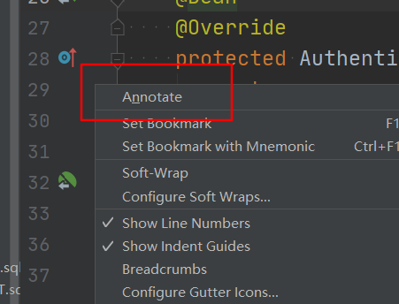
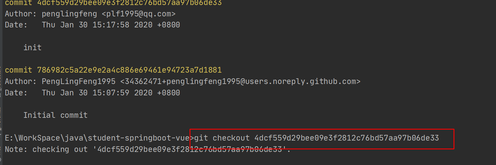
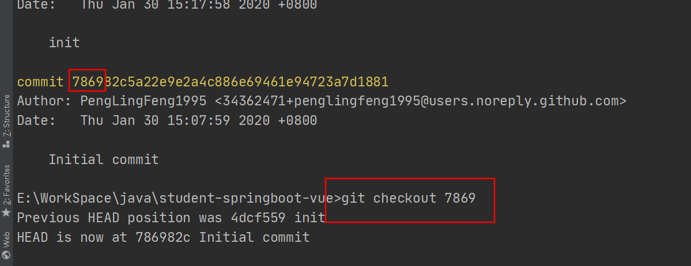
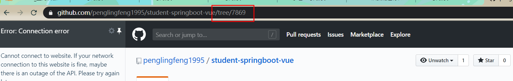

# 扩展

1,idea中点击文件左侧侧栏，勾选annotate,可以查看历史记录。

2,git的最小单元是commit，会生成一个commit id ，记录一个仓库此时的状态。

3,可以直接通过 checkout  加 commit id ，切换到当时的状态

不写全也没关系，只要是从开头是唯一的

4,github 中直接 在路径下 `/tree` 加 commit id 也可进入目标状态，同样不需要打全。

