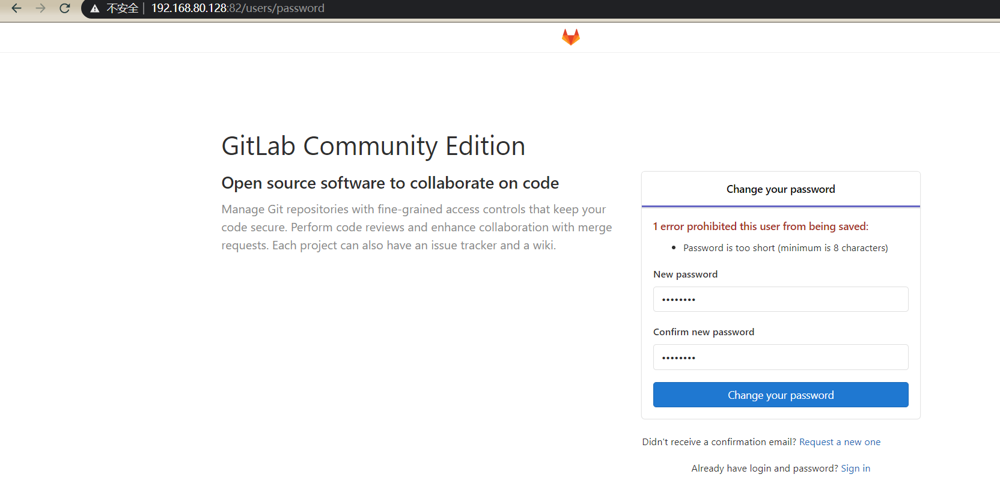
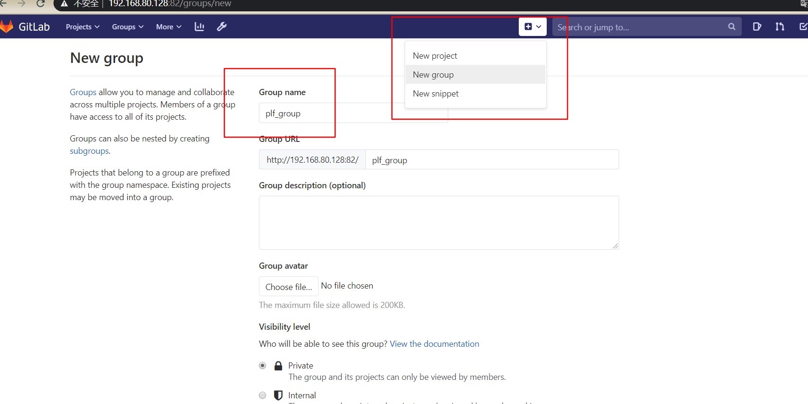
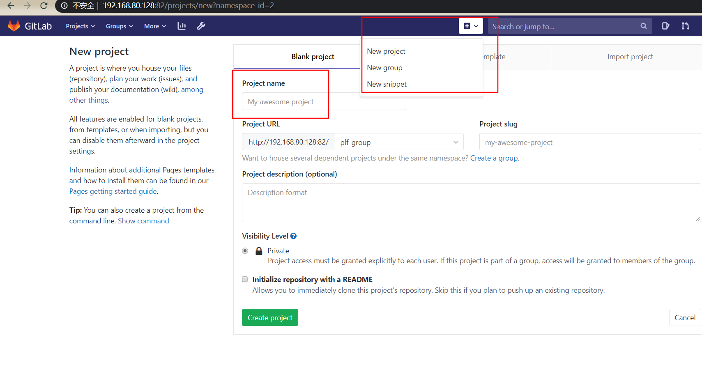
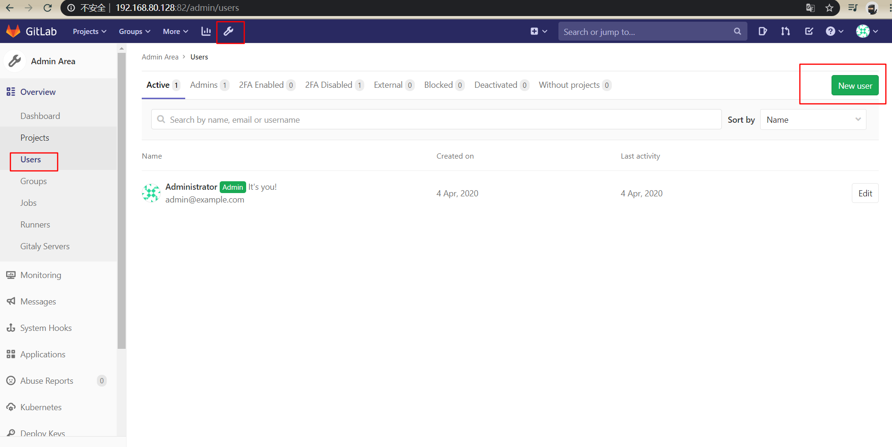
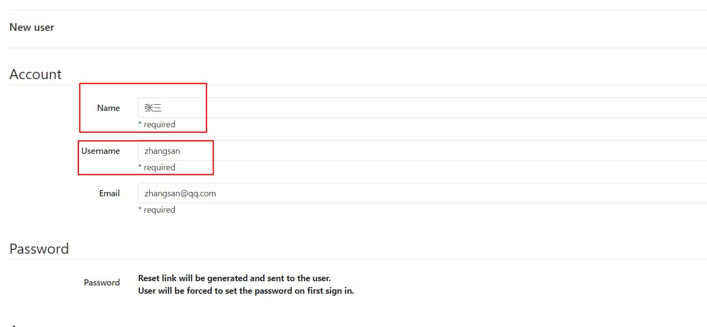
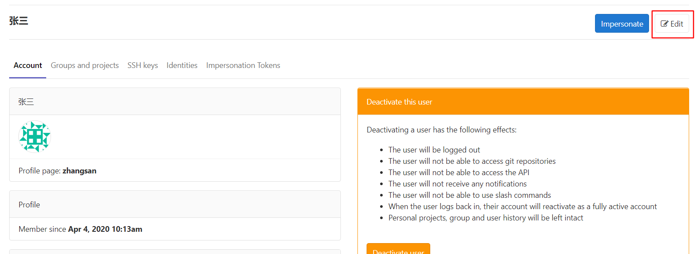
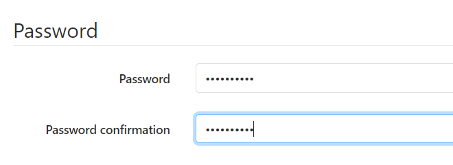
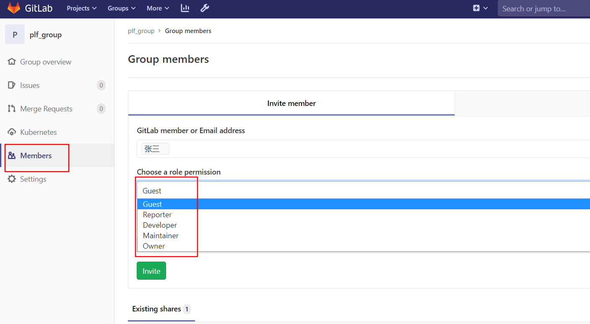

# 安装

1,安装依赖

```bash
yum -y install policycoreutils openssh-server openssh-clients postfix
```

2,启动ssh服务

```bash
systemctl enable sshd && sudo systemctl start sshd
```

3,启动 postfix

```bash
systemctl enable postfix && systemctl start postfix
```

4,防火墙允许 ssh 和 http

```bash
firewall-cmd --add-service=ssh --permanent
firewall-cmd --add-service=http --permanent
firewall-cmd --reload
```

5,下载并安装

```bash
wget https://mirrors.tuna.tsinghua.edu.cn/gitlab-ce/yum/el6/gitlab-ce-12.9.2-ce.0.el6.x86_64.rpm
rpm -i gitlab-ce-12.9.2-ce.0.el6.x86_64.rpm
```

6,修改配置

```bash
vi /etc/gitlab/gitlab.rb
```

修改两处

```
external_url 'http://192.168.80.128:82'
nginx['listen_port'] = 82
```

6,重启gitlab

```bash
gitlab-ctl reconfigure
gitlab-ctl restart
```

7暴露gitlab端口

```bash
firewall-cmd --zone=public --add-port=82/tcp --permanent
firewall-cmd --reload
```

8，访问,若遇到502，考虑是不是有别的应用占用了 8080 或 82 端口。

默认第一次登录会修改 root 帐号的密码。之后使用 root帐号登录。



# 使用

## 创建 group



## 创建 project




## 创建 user



用户 的name主要用于显示，username是帐号



创建好后编辑用户



设置密码，该用户使用该密码第一次登录会强制修改密码



## 邀请用户

进入组的设置中



用户在组中权限分为五种

Guest: 访客，可以创建 issue，发表评论，不能读写仓库。

Reporter: 可以clone ，不能提交，一般为 pm，测试

Developer : 开发者，可以clone，push，普通开发者。

Maintainer : 可以创建项目，添加tag，保护分支，添加成员，核心开发者。

Owner : 可以管理组成员，删除项目，一般为项目组长。