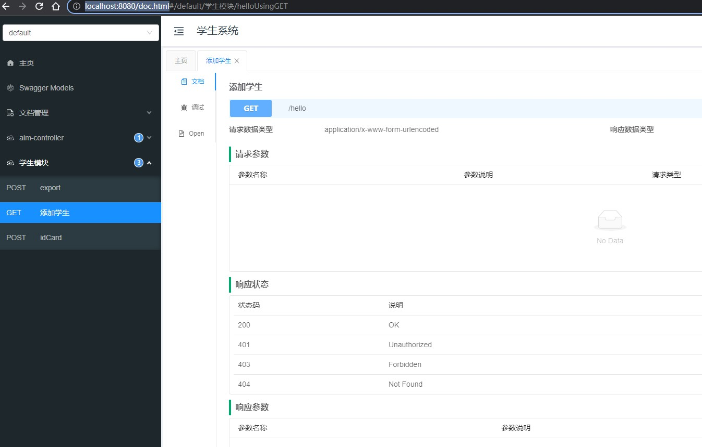

# 概述

knife4j 是一个swagger的ui ，更加好看，易用，可以在页面上调试接口

# 使用

引入依赖

```xml
<dependency>
    <groupId>com.github.xiaoymin</groupId>
    <artifactId>knife4j-spring-boot-starter</artifactId>
    <version>2.0.7</version>
</dependency>
```

注意： 使用Knife4j2.0.6及以上的版本，Spring Boot的版本必须大于等于`2.2.x`

无需再引入swagger，以免依赖冲突

配置类，描述基本信息，及扫码包的路径

```java
import springfox.documentation.spring.web.plugins.Docket;
import springfox.documentation.swagger2.annotations.EnableSwagger2WebMvc;

@Configuration
@EnableSwagger2WebMvc
public class Knife4jConfig {

    @Bean
    public Docket apiDoc() {
        return new Docket(DocumentationType.SWAGGER_2)
                .apiInfo(new ApiInfoBuilder()
                        .title("学生系统")
                        .build())
                .select()
                .apis(RequestHandlerSelectors.basePackage("com.mont.demo"))
                .paths(PathSelectors.any())
                .build();
    }
}
```

进入页面，`http://localhost:8080/doc.html` ，如果配置了  `server.context` 也要拼上。



# 配置

```yml
knife4j:
  enable: true # 必开，开启增强模式，能够使用knife4j更多功能，如增加鉴权
  production: false # 是否是生产环境，设为true，则无法查看接口文档
  basic: 
    enable: true # 开启鉴权，需要输入账号密码才能访问接口文档
    username: admin
    password: 123
```

