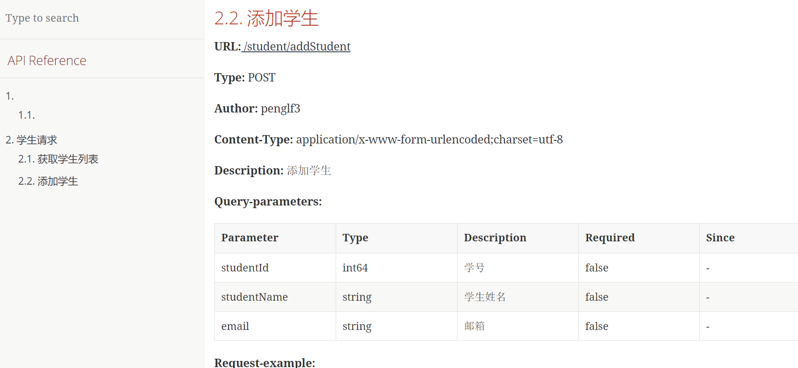

# 概述

[smart-doc](https://gitee.com/smart-doc-team/smart-doc) 是国内开源的api接口文档工具，最大的特点是非侵入性，写注释来生成文档

# 使用

```xml
<plugin>
    <groupId>com.github.shalousun</groupId>
    <artifactId>smart-doc-maven-plugin</artifactId>
    <version>2.0.4</version>
    <configuration>
        <!--指定生成文档的使用的配置文件,配置文件放在自己的项目中-->
        <configFile>./src/main/resources/smart-doc.json</configFile>
        <!--指定项目名称-->
        <projectName>测试</projectName>
    </configuration>
</plugin>
```

添加 maven 插件 ，配置 `smart-doc.json`

```json
{
  "outPath": "E:/temp/doc"
}
```

在我们的 controller 编写` java-doc` 形式的注释

```java
/**
 * 学生请求
 * @author penglf3
 */
@RestController
@RequestMapping("student")
public class StudentController {

    /**
     * 获取学生列表
     * @param pageIndex 分页开始
     * @param pageSize 每页大小
     * @return 学生列表
     */
    @GetMapping("getStudentList")
    public List<Student> getStudentList(Integer pageIndex,Integer pageSize){
        return null;
    }

    /**
     * 添加学生
     * @param student 学生实体
     * @return 学生列表
     */
    @PostMapping("addStudent")
    public String addStudent(Student student){
        return null;
    }
}
```

包括实体类

```java
/**
 * 学生对象实体类
 */
@Data
public class Student {

    /**
     * 学号
     */
    private Long studentId;

    /**
     * 学生姓名
     */
    private String studentName;

    /**
     * 邮箱
     */
    private String email;
}
```

执行命令 

```bash
mvn smart-doc:html
```

然后会在指定目录生成 html 的接口文档



# 更多配置

```json
{
  "serverUrl": "http://127.0.0.1", //服务器地址,非必须。导出postman建议设置成http://{{server}}方便直接在postman直接设置环境变量
  "isStrict": false, //是否开启严格模式
  "allInOne": true,  //是否将文档合并到一个文件中，一般推荐为true
  "outPath": "D://md2", //指定文档的输出路径
  "coverOld": true,  //是否覆盖旧的文件，主要用于mardown文件覆盖
  "createDebugPage": true,//@since 2.0.0 smart-doc支持创建可以测试的html页面，仅在AllInOne模式中起作用。
  "packageFilters": "",//controller包过滤，多个包用英文逗号隔开
  "md5EncryptedHtmlName": false,//只有每个controller生成一个html文件是才使用
  "style":"xt256", //基于highlight.js的代码高设置,可选值很多可查看码云wiki，喜欢配色统一简洁的同学可以不设置
  "projectName": "smart-doc",//配置自己的项目名称
  "skipTransientField": true,//目前未实现
  "sortByTitle":false,//接口标题排序，默认为false,@since 1.8.7版本开始
  "showAuthor":true,//是否显示接口作者名称，默认是true,不想显示可关闭
  "requestFieldToUnderline":true,//自动将驼峰入参字段在文档中转为下划线格式,//@since 1.8.7版本开始
  "responseFieldToUnderline":true,//自动将驼峰入参字段在文档中转为下划线格式,//@since 1.8.7版本开始
  "inlineEnum":true,//设置为true会将枚举详情展示到参数表中，默认关闭，//@since 1.8.8版本开始
  "recursionLimit":7,//设置允许递归执行的次数用于避免一些对象解析卡主，默认是7，正常为3次以内，//@since 1.8.8版本开始
  "allInOneDocFileName":"index.html",//自定义设置输出文档名称, @since 1.9.0
  "requestExample":"true",//是否将请求示例展示在文档中，默认true，@since 1.9.0
  "responseExample":"true",//是否将响应示例展示在文档中，默认为true，@since 1.9.0
  "displayActualType":false,//配置true会在注释栏自动显示泛型的真实类型短类名，@since 1.9.6
  "ignoreRequestParams":[ //忽略请求参数对象，把不想生成文档的参数对象屏蔽掉，@since 1.9.2
     "org.springframework.ui.ModelMap"
   ],
  "dataDictionaries": [{ //配置数据字典，没有需求可以不设置
      "title": "http状态码字典", //数据字典的名称
      "enumClassName": "com.power.common.enums.HttpCodeEnum", //数据字典枚举类名称
      "codeField": "code",//数据字典字典码对应的字段名称
      "descField": "message"//数据字典对象的描述信息字典
  }],
  "errorCodeDictionaries": [{ //错误码列表，没有需求可以不设置
    "title": "title",
    "enumClassName": "com.power.common.enums.HttpCodeEnum", //错误码枚举类
    "codeField": "code",//错误码的code码字段名称
    "descField": "message"//错误码的描述信息对应的字段名
  }],
  "revisionLogs": [{ //文档变更记录
      "version": "1.0", //文档版本号
      "revisionTime": "2020-12-31 10:30", //文档修订时间
      "status": "update", //变更操作状态，一般为：创建、更新等
      "author": "author", //文档变更作者
      "remarks": "desc" //变更描述
    }
  ],
  "customResponseFields": [{ //自定义添加字段和注释，api-doc后期遇到同名字段则直接给相应字段加注释，非必须
      "name": "code",//覆盖响应码字段
      "desc": "响应代码",//覆盖响应码的字段注释
      "ownerClassName": "org.springframework.data.domain.Pageable", //指定你要添加注释的类名
      "value": "00000"//设置响应码的值
  }],
  "requestHeaders": [{ //设置请求头，没有需求可以不设置
      "name": "token",//请求头名称
      "type": "string",//请求头类型
      "desc": "desc",//请求头描述信息
      "value":"token请求头的值",//不设置默认null
      "required": false,//是否必须
      "since": "-"//什么版本添加的改请求头
  }],
  "rpcApiDependencies":[{ // 项目开放的dubbo api接口模块依赖，配置后输出到文档方便使用者集成
        "artifactId":"SpringBoot2-Dubbo-Api",
        "groupId":"com.demo",
        "version":"1.0.0"
   }],
  "rpcConsumerConfig": "src/main/resources/consumer-example.conf",//文档中添加dubbo consumer集成配置，用于方便集成方可以快速集成
  "apiObjectReplacements": [{ // 自smart-doc 1.8.5开始你可以使用自定义类覆盖其他类做文档渲染，非必须
      "className": "org.springframework.data.domain.Pageable",
      "replacementClassName": "com.power.doc.model.PageRequestDto" //自定义的PageRequestDto替换Pageable做文档渲染
  }],
  "apiConstants": [{//从1.8.9开始配置自己的常量类，smart-doc在解析到常量时自动替换为具体的值
        "constantsClassName": "com.power.doc.constants.RequestParamConstant"
  }],
  "responseBodyAdvice":{ //自smart-doc 1.9.8起，ResponseBodyAdvice统一返回设置，可用ignoreResponseBodyAdvice tag来忽略
  		"className":"com.power.common.model.CommonResult" //通用响应体
  },
  "sourceCodePaths": [{ //设置代码路径, 插件已经能够自动下载发布的源码包，没必要配置
      "path": "src/main/java",
      "desc": "测试"
  }]
}
```

