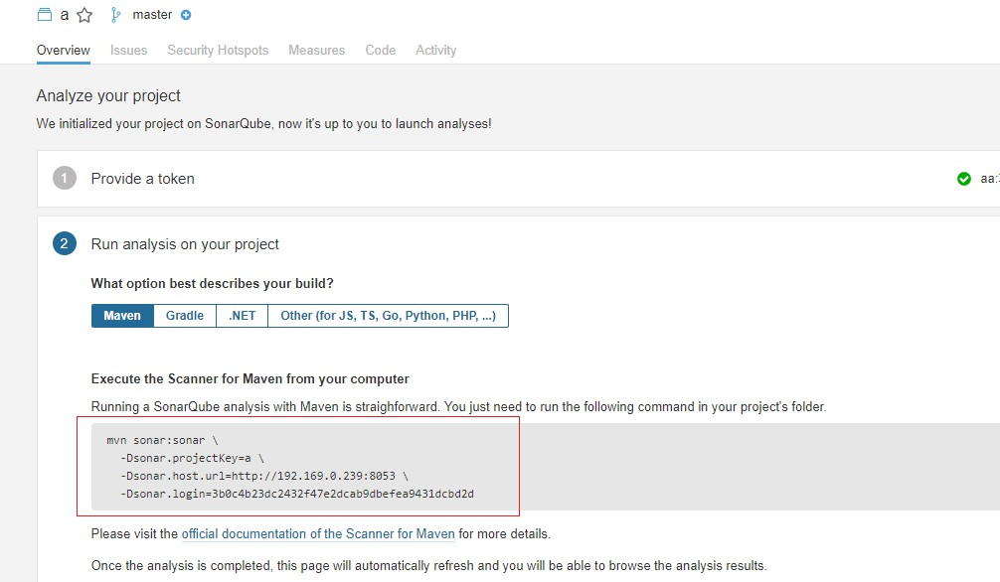

# 概述

sonar 是一款代码质量管理工具， sonarqube是给扫描结果做可视化的平台。

# 安装

1，去官网下载最新的 zip 包，https://www.sonarqube.org/downloads/

2,解压 ,8.2版本依赖 jdk11 的环境

```bash
unzip sonarqube-8.2.0.32929.zip
```

3,创建linux用户  ,因为sonar不允许使用root用户启动,并让sonar作为该目录的拥有者 

```bash
useradd sonar
chown -R sonar sonarqube-8.2.0.32929
```

4,修改配置 `conf/sonar.properties` ，不设置则使用内嵌的数据库

```properties
sonar.jdbc.username=root
sonar.jdbc.password=123456
```

5,启动 ，切换到sonar用户，命令可以为 start , stop ,status

```bash
su sonar sonarqube-8.2.0.32929/bin/linux-x86-64/sonar.sh start
```

6,暴露端口

```bash
firewall-cmd --zone=public --add-port=9000/tcp --permanent
firewall-cmd --reload
```

7,访问目标ip和端口 , 默认端口为 9000 ，可以去 `conf/sonar.properties` 中修改 `sonar.web.port` 参数定义端口

# 配合jenkins

使用`admin/admin`登录 ,进入我的账户，安全，生成一个密钥 c5c202ace8fcdd62ba0b6fb418913837fcc443bc


在jenkins中安装 SonarQube Scanner 插件，然后进入 全局工具设置，设置


进入凭据，添加sonarqube的认证，就是刚才得到的密钥.


然后进入 系统设置，配置 sonarqube server


## 自由风格构建

增加构建步骤，执行 SonarQube scanner


定义构建参数


配置如下

```properties
sonar.projectKey=mp
sonar.projectName=mp
sonar.projectVersion=1.0

sonar.source=.
sonar.exclusions=**/test/**,**/target/**,**/.mvn/**

sonar.java.source=1.8
sonar.java.target=1.8
sonar.java.binaries=target/classes

sonar.sourceEncoding=UTF-8
```

回到 sonarqube，得到结果


在 issue中即可看见问题


## 流水线构建

在项目的根目录下编写 `sonar-project.properties`，内容和之前一样，为了区分可以替换 项目名

在jenkinsfile中添加一个stage，即可

```groovy
stage('sonar project') {
    steps {
        script{
            //这里设置jenkins全局工具里设置的scanner名称
            scannerHome = tool 'sonar1'
        }
        //这里设置系统设置的 sonar server 的名称
        withSonarQubeEnv('sonar'){
            sh "${scannerHome}/bin/sonar-scanner"
        }
    }
}
```

# 配合idea插件

idea安装插件 sonarlint ，并配置 qube地址


在 sonarqube的控制台上创建一个项目，


随后会生成一个 token b8829882a275244982f54c03a589fa0795cb9c61


# 配合maven

sonar上新建一个项目，最后会给你一串mvn命令



安装maven插件，后执行命令即可

```xml
<plugin>
    <groupId>org.sonarsource.scanner.maven</groupId>
    <artifactId>sonar-maven-plugin</artifactId>
    <version>3.6.0.1398</version>
</plugin>
```

> 命令在windows上执行的时候，注意换行符 \  ，要把它去掉，不然带不上后面的参数

# 配合gitlab