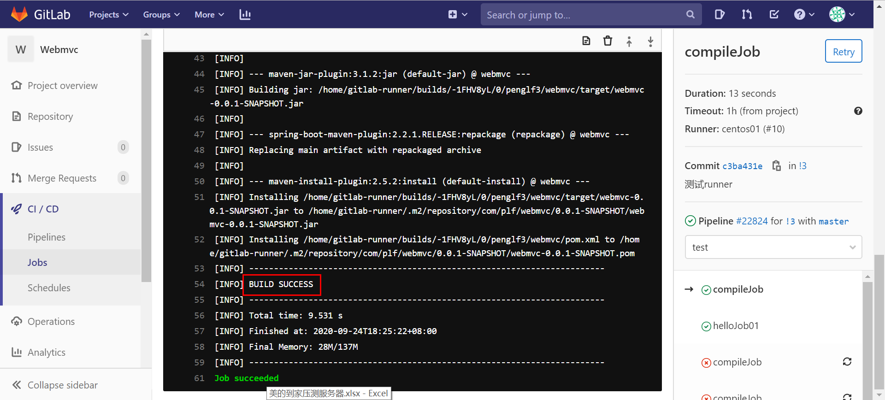
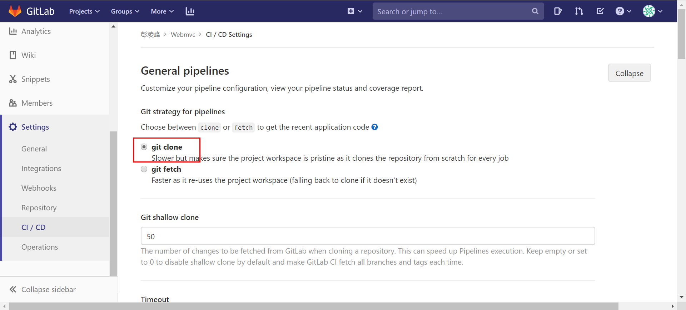
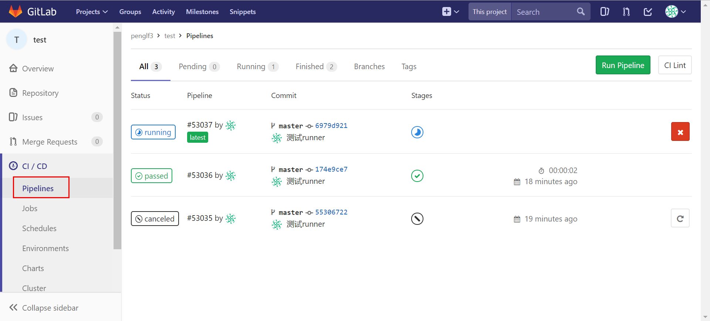
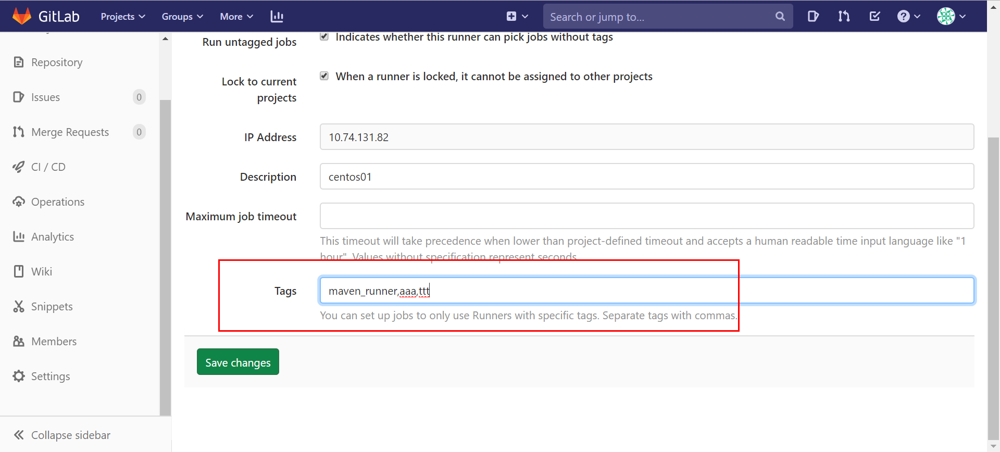
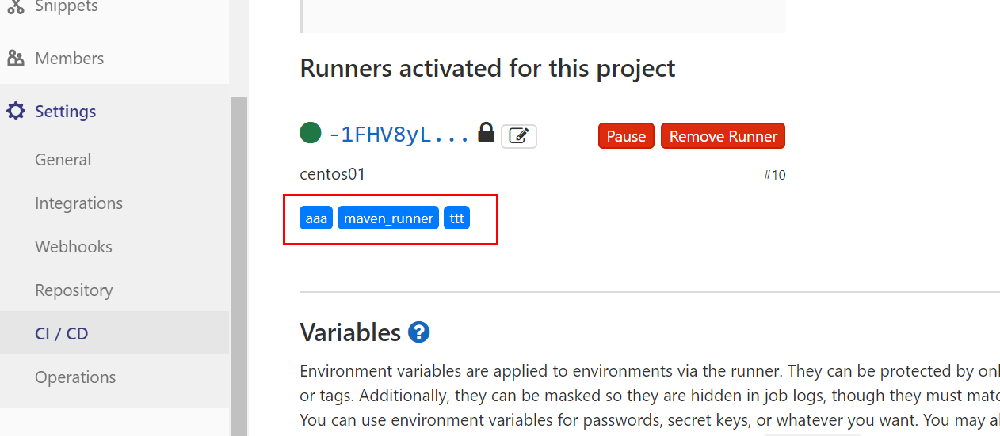

# 概述

gitlab-ci 是 gitlab 平台自带的ci系统，通过  `.gitlab-ci.yml` 文件进行配置，告诉gitlab需要在ci过程中执行什么工作，如何触发任务等，随后 gitlab 会寻找可以执行该任务的 gitlab-runner 来执行这个任务，并把结果记录。

所以官网文档，在 gitlab 上点击右上角的 help 进入。

# 安装 gitlab-runner

[gitlab-runner]( https://docs.gitlab.com/runner/) 官网

这边我们选择linux的rpm包安装，可以选择官网下载，也可以使用[清华镜新](https://mirrors.tuna.tsinghua.edu.cn/gitlab-runner/yum/el7-x86_64/) 

首先需要安装依赖包 git 

安装 gitlab-runner

```bash
rpm -ivh gitlab-runner-13.2.3-1.x86_64.rpm
```

注册 

```bash
sudo gitlab-runner register
```

进入项目中 Settings -> CI/CD -> Runner ，获取到当前服务的 url 和 token 。


执行注册命令，会依次输入 url , token ,description ，tags  进行注册，desc 和 tags 可以不设置，后续也可以在页面上修改 ，注册成功后，选择一个executor 执行器，这里我们选择 shell 执行器，该执行器将直接调用本机的命令。

ex:

```bash
[root@centos01 gitlab-runner]# sudo gitlab-runner register
Runtime platform                                    arch=amd64 os=linux pid=8239 revision=e639e0f3 version=13.2.3
Running in system-mode.

Please enter the gitlab-ci coordinator URL (e.g. https://gitlab.com/):
http://gitlab.xx.com/
Please enter the gitlab-ci token for this runner:
6_1gNexTLyxxxxxxxxx
Please enter the gitlab-ci description for this runner:
[centos01]:
Please enter the gitlab-ci tags for this runner (comma separated):

Registering runner... succeeded                     runner=6_1gNexT
Please enter the executor: docker-ssh+machine, custom, parallels, shell, ssh, docker+machine, docker, docker-ssh, virtualbox, kubernetes:
shell
Runner registered successfully. Feel free to start it, but if it's running already the config should be automatically reloaded!
```

注册成功后，刷新页面，可以查看改runner的状态


一个 runner 可以注册多次，默认直接启动，如果处于未激活的状态可以手动启动。

runner 分为 special runner 和 shared runner 

special runner 仅能当前项目使用，用户自己可以注册

shared runner 所有项目都可以使用，但是只有 gitlab 的系统管理员可以注册

# 配置 ci

在当前项目仓库的根目录中创建文件  `.gitlab-ci.yml` ，gitlab 会自动识别，并默认开启 cicd

当push的时候，会自动执行cicd。

## Job

job 是ci的一个顶级元素，代表一个任务，任务中至少有一个 script 元素，表示要执行的命令

job 的名称可以使用关键字 之外的字，进行自定义。

job可以定义多个。每个任务彼此独立运行。

```yaml
helloJob01:
  script: echo hello

helloJob02:
  script: echo hello222
```

我们可以定义更复杂的任务，如编译maven项目,前提是gitlab-runner 所在机器需要安装 maven，并且能够访问maven仓库。

script 也可以是一个数组，定义多条命令。

script 如果包含特殊符号如 `: > [ ] `等，需要用 单引号或双引号包含命令。

```yaml
compileJob:
  script:
    - echo "开始构建"
    - mvn clean install -Dmaven.test.skip=true
    - echo "构建完成"
```

job执行成功



如果出现以下错误，可能是git or gitlab-runner 的版本问题，或设置问题

```
fatal: git fetch-pack: expected shallow list
fatal: The remote end hung up unexpectedly
```

可以尝试改为 clone 的形式拉代码。



## pipeline 

流水线，当ci触发后，便会执行整个ci过程，这个过程称作流水线

例如，当执行完push操作后，触发的pipeline



点击进入一个流水线可以查看每一个任务的执行情况


点击进入一个任务，或从任务页面进入，可以任务详情，及执行过程


## stages

定义阶段，同一阶段的任务将并行执行，成功执行完一个阶段才开始下一阶段。

通过  顶级元素 `stages` 定义，通常为一个数组，阶段的名称可以自定义。

job 通过 stage 子元素 绑定。

```yaml
stages:
  - aaaa
  - bbbb

helloJob:
  stage: aaaa
  script: echo hello1

helloJob2:
  stage: aaaa
  script: echo hello2

compileJob:
  stage: bbbb
  script:
    - echo "开始构建"
    - mvn clean install -Dmaven.test.skip=true
    - echo "构建完成"
```

ex:


默认情况:

1， 未定义 stages ,则默认有 build , test ,deploy 三个阶段可用。

2，job 未指定 stage，则默认分配为 test 阶段。

## before，after_script

通过 before_script 和 after_script 定义一个任务前后执行的命令，必须是一个数组。

```yaml
compileJob:
  before_script:
    - echo "开始构建"
  after_script:
    - echo "构建完成"
  script:
    - mvn clean install -Dmaven.test.skip=true
```

## only , except 

通过only 指定触发任务的策略，except 排除触发任务的策略。

```yaml
helloJob:
  script: echo hello1
  only:
    - merge_requests
  except:
    - branches
```

以上配置表示，仅当 提交 merge request 时，且不是分支的代码时触发ci。

## default

default 元素用于设置一些默认参数，所有任务将会使用。

```yaml
default:
  before_script:
    - echo 开始任务

helloJob:
  script: echo hello1

compileJob:
  stage: build
  script: mvn clean install -Dmaven.test.skip=true
```

以上任务都会执行 default 下的前置脚本。

## tag

tag的主要功能就是指定任务交给特定的runner来执行，有多个runner的情况，比如部署了maven的机器上的runner负责打包，部署了docker的机器负责部署项目

注册runner时，或者后续从runner编辑页面可用设置runner的tag，多个tag使用逗号分割



此时，该runner已经有了三个tag



一个有tag的runner，只能接受指定了该tag的job ，找不到对应的 runner，任务将进入pending状态

```yaml
helloJob:
  tags:
    - aaa
  script: echo hello3
```


# ci lint

ci文件可以从页面上的 ci lint 按钮进行校验，检查语法是否合规。


点击validate即可校验，在下方查看校验结果


