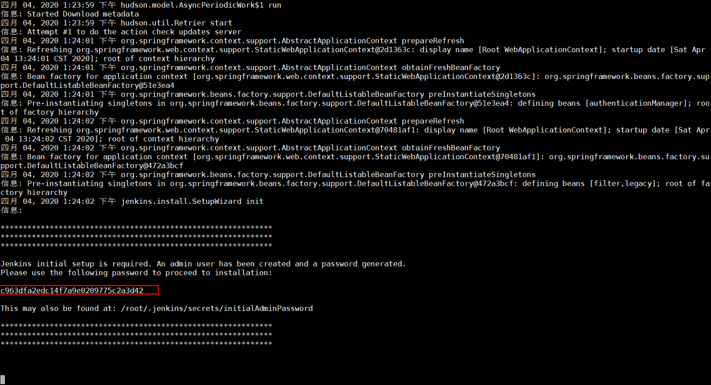
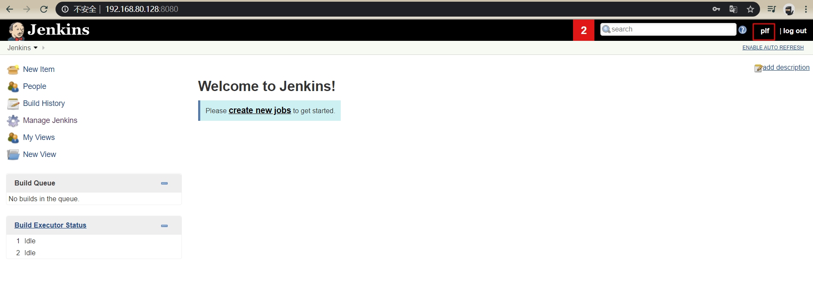
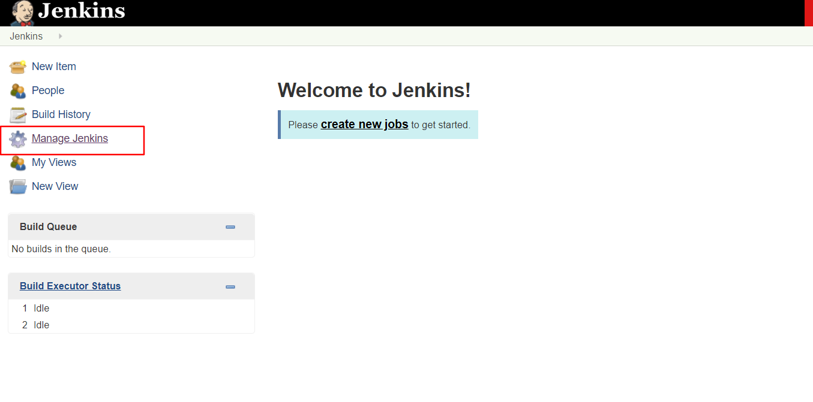
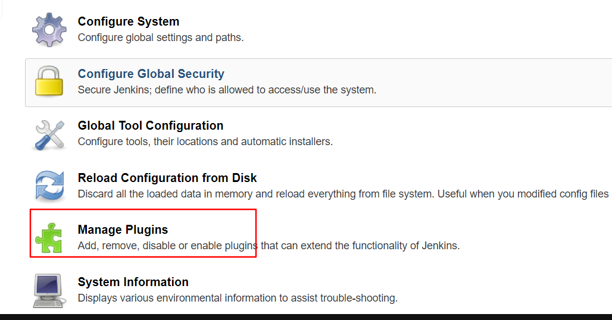
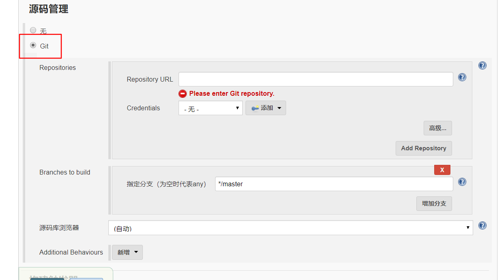
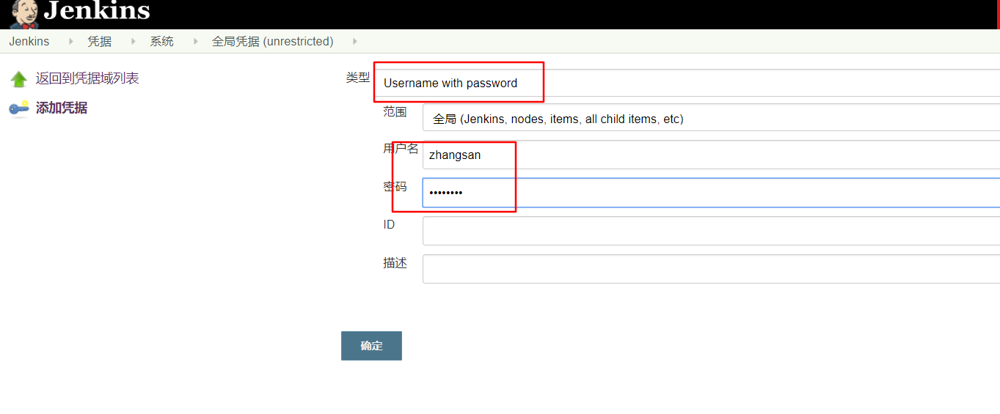

# 概述

jenkins 是一款开源的持续集成工具，实现 CI,CD 等功能。

# 安装

## war包方式

1,下载最新的war包，http://mirrors.jenkins.io/war-stable/latest/jenkins.war

2, 启动 java -jar jenkins.war，可以得到初始密码



3,访问 目标 8080 端口 ,可以看到jenkins正在初始化，jenkins默认会在 `~/.jenkins` 生成配置文件。


4,初始化好后，使用初始密码进入


5,安装插件，选择自己安装，这里不安装任何插件，因为网络问题可能会失败，稍后安装。


6,创建一个用户


7配置实例，这里一般会自动填写，直接过


8,会以刚才创建的用户直接登录，进入主页



9,查询jenkins插件的中国区镜像加速 ，http://mirrors.jenkins-ci.org/status.html#cn

得到 update-center.json的url地址 https://mirrors.tuna.tsinghua.edu.cn/jenkins/updates/update-center.json

或者日本的 http://mirror.esuni.jp/jenkins/updates/update-center.json，日本貌似好用些

进入系统管理



进入插件管理



点击 advance


拉到最后，替换为中国或日本的镜像 ,点击 submit ,然后点击 check now


随后在 avaliable 中搜索插件进行安装 git 插件


## rpm 方式

预备jdk的环境

1,下载安装

```bash
wget https://mirrors.tuna.tsinghua.edu.cn/jenkins/redhat-stable/jenkins-2.190.3-1.1.noarch.rpm
rpm -ivh jenkins-2.190.3-1.1.noarch.rpm
```

2,修改配置文件  

```bash
vi /etc/sysconfig/jenkins
```

修改用户和端口

```
JENKINS_USER="root"
JENKINS_PORT="8888"
```

3，启动jenkins

```bash
systemctl start jenkins
```

4,暴露端口后访问页面

```bash
firewall-cmd --zone=public --add-port=8888/tcp --permanent
firewall-cmd --reload
```

5,获取初始密码

```bash
cat /var/lib/jenkins/secrets/initialAdminPassword
```

6,替换插件

先进入插件管理，点击 avaliable ,等待插件列表加载完成

 进入 `/var/lib/jenkins/updates` ,执行替换

```bash
sed -i 's/http:\/\/updates.jenkins-ci.org\/download/https:\/\/mirrors.tuna.tsinghua.edu.cn\/jenkins/g' /var/lib/jenkins/updates/default.json && sed -i 's/http:\/\/www.google.com/https:\/\/www.baidu.com/g' /var/lib/jenkins/updates/default.json
```

然后把 updates，换成清华的镜像

7.重启 访问 http://192.168.80.128:8888/restart 点击yes

## docker方式

# 插件选择

下载是要点 `下载完成后重启`的方式进行下载

## Git 

使用git插件后，创建项目时，源码管理可以选择git



## Credentials Binding

凭据插件，可以管理一些 gitlab的帐号



## Localization: Chinese

中文插件


