# 创建Git任务

新建任务选择 freestyle


源码管理中设置git仓库，分支，及凭据
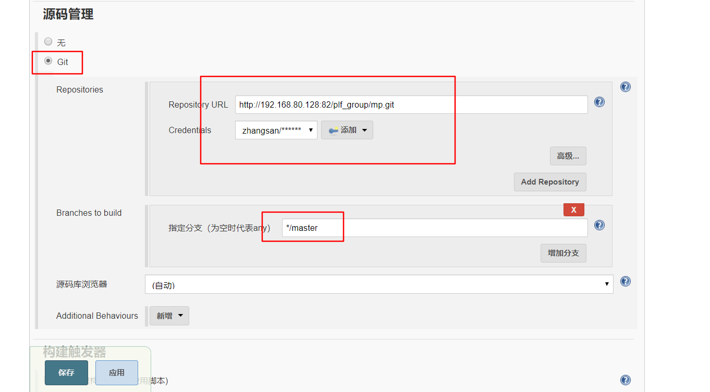

保存

主页上即可看见刚才创建的项目

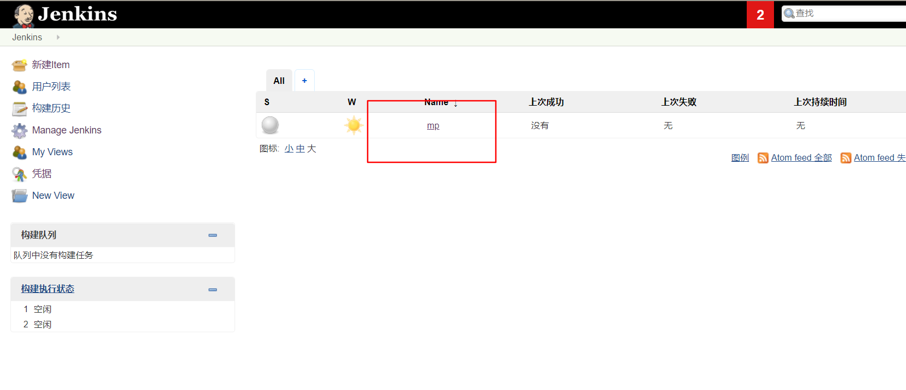

进入项目 点击立即构建

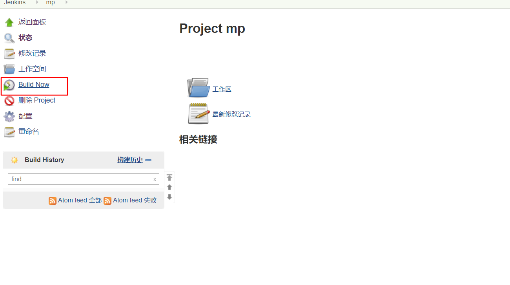

可以看见一次执行结果


进入该次构建任务，查看控制台


观察该次构建，可以发现，进入了 `/var/lib/jenkins/workspace/项目名`,在该目录下通过jenkins执行git命令拉取了代码。

如果 没有 git 命令，则需要在jenkins所在的机器上安装git。

# 创建自由风格项目

通过刚才的任务可以知道，jenkins 想要执行声明命令，所在的机器必须要有该命令

## 安装 maven

下载解压

```bash
wget https://mirrors.tuna.tsinghua.edu.cn/apache/maven/maven-3/3.6.3/binaries/apache-maven-3.6.3-bin.tar.gz
tar -zxvf apache-maven-3.6.3-bin.tar.gz
```

修改 `conf/settings.xml`，设置阿里镜像

```xml
<mirror>
    <id>nexus-aliyun</id>
    <mirrorOf>central</mirrorOf>
    <name>Nexus aliyun</name>
    <url>http://maven.aliyun.com/nexus/content/groups/public</url>
</mirror>
```

设置环境变量

修改 `vim /etc/profile`

```bash
export JAVA_HOME=/java/jdk1.8.0_211
export CLASSPATH=.:$JAVA_HOME/lib/dt.jar:$JAVA_HOME/lib/tools.jar
export PATH=$PATH:$JAVA_HOME/bin
export M2_HOME=/maven/apache-maven-3.6.3
export PATH=$PATH:$M2_HOME/bin
```

激活 `source /etc/profile` ,验证 `mvn -v`

## 全局工具设置

进入 jenkins ，系统管理，Global Tool Configuration

设置jdk


设置 maven


## 系统管理

进入 Configure System 添加三个环境变量。`JAVA_HOME,M2_HOME,PATH+EXTRA`


## 任务设置

在之前创建的任务设置中,选择 shell 的方式执行 maven 的打包命令


立即构建测试,页面上可以看见构建成功


还增加部署的过程,这个build_id不能少

```bash
mvn clean package -Dmaven.test.skip=true
cp target/mp-1.0-SNAPSHOT.jar /app
cd /app
sh stop.sh
BUILD_ID=dontKillMe
sh start.sh
```

其中 `stop.sh` ，获取进程pid，杀掉之前的进程。

```sh
#!/bin/bash
pid=`ps -ef |grep mp.1.0-SNAPSHOT.jar |grep -v grep |awk '{print $2}'`
echo "得到的进程" $pid
if [ -n "$pid" ];then
 echo '杀掉进程' $pid
 kill -9 $pid
fi
```

`start.sh`

```sh
#!/bin/bash
nohup java -jar mp-1.0-SNAPSHOT.jar &
```

# Pipeline 构建

pipeline 也称流水线，该风格通过一个 配置脚本的文件来控制整个 ci 过程，而不是在 ui 界面上设置。

jenkins 使用流水线，首先要 安装 pipeline 插件。

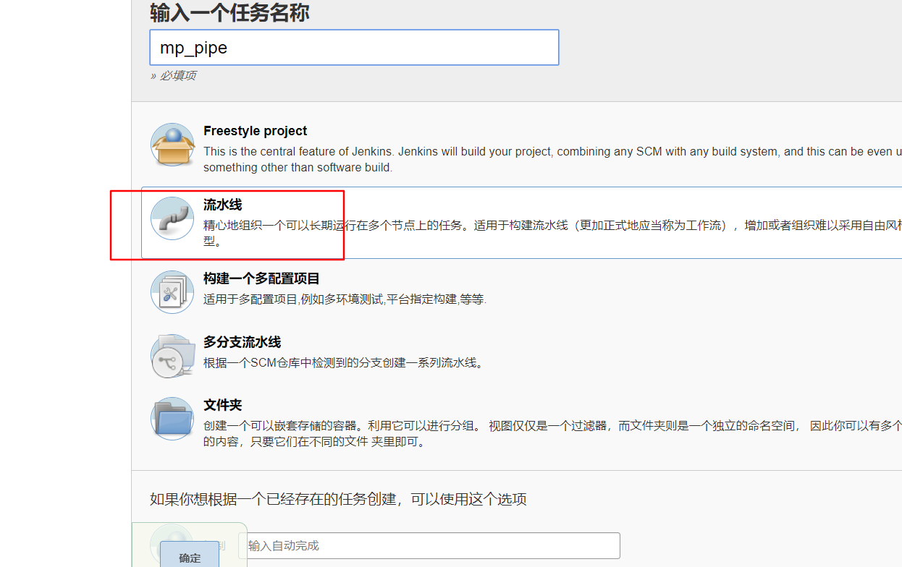

创建项目时选择 pipeline

在配置中，通过编写流水线脚本，来控制整个过程，脚本分为 声明式和脚本式

## 声明式

声明式的案例，可以选择 helloworld


```groovy
pipeline {
   agent any

   stages {
      stage('pull') {
         steps {
            echo 'pull code...'
         }
      }
      stage('build') {
         steps {
            echo 'build project....'
         }
      }
      stage('start') {
         steps {
            echo 'start project'
         }
      }
   }
}
```

通过定义多个阶段 stage , 阶段中有自己的 步骤 steps ,步骤中执行命令等。


流水线的项目，构建结果可以分阶段显示。

### 片段生成

可以点击左下角的 `流水线语法`


有很多 demo ，可以参考并生成脚本


把脚本 cp 至对应的步骤中

```groovy
pipeline {
   agent any

   stages {
      stage('pull code') {
         steps {
            checkout([$class: 'GitSCM', branches: [[name: '*/master']], doGenerateSubmoduleConfigurations: false, extensions: [], submoduleCfg: [], userRemoteConfigs: [[credentialsId: '4a323edf-c525-4ee1-a853-7b46f9b61bb9', url: 'http://192.168.80.128:82/plf_group/mp.git']]])
         }
      }
   }
}
```

普通的 shell 脚本,则选择 以下类型。直接写可能无法被 groovy 语法识别。


可以简写为 `sh '命令'`

```groovy
stage('build project') {
    steps {
        sh 'mvn clean package -Dmaven.test.skip=true'
    }
}
```

### Jenkinsfile

之前都是通过 ui 界面上编写，可以把脚本文件放入代码库，命名为 `Jenkinsfile`


默认都会放在项目的根目录

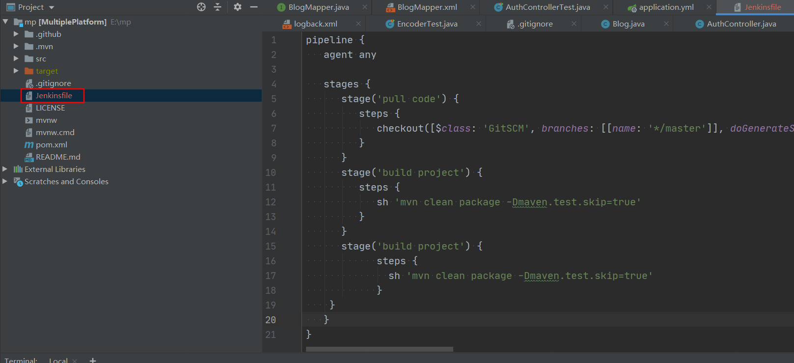


## 脚本式

```groovy
node {
   def mvnHome
   stage('pull') { 
        echo 'pull code'
   }
   stage('build') { 
        echo 'build project'
   }
   stage('start') { 
        echo 'start project'
   }
}
```

以 node 开头，定义 stage

# 触发器

## 远程触发

可以通过配置一个身份令牌，


当请求这个地址时，即可触发构建 ,例如`http://192.168.80.128:8888/job/mp_pipe/build?token=666`

## 关联项目

可以关联一个项目，当目标项目构建完成，当前项目自动构建

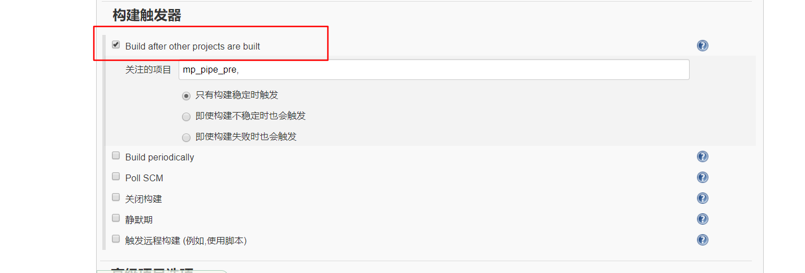

## 定时构建

通过一个 cron 表达式进行定时任务的构建。


## 轮询 SCM

同样是定时任务，定时去扫描 目标代码库，如果有更新，则触发构建。项目比较大时，性能差。


## webhook

通过一个钩子绑定代码库，当代码库有提交时，则触发构建。

需要根据代码库的平台安装插件，比如用的gitlab，则会安装 gitlab 和 gitlab hook 两个插件。

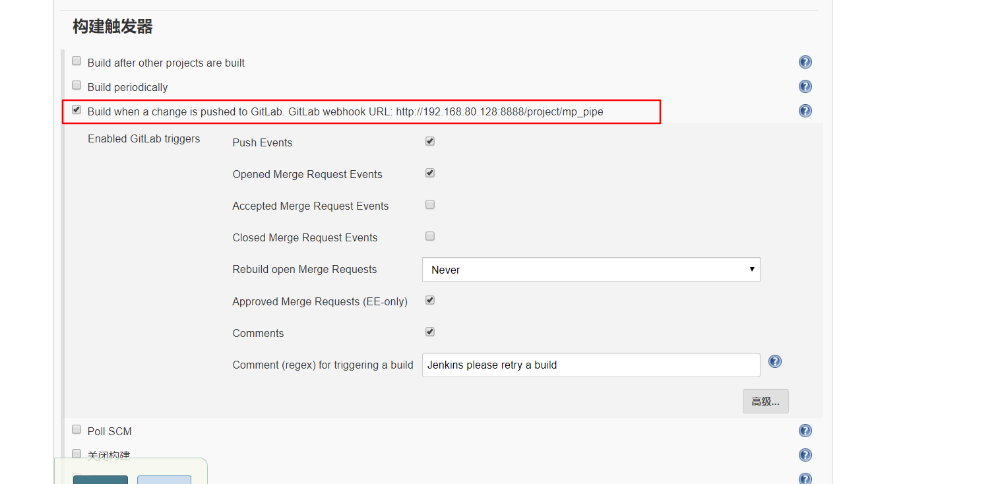

然后进入 jenkins 的 configure system 中，取消勾选 gitlab下的end point


gitlab 平台的管理员需要 开启webhook

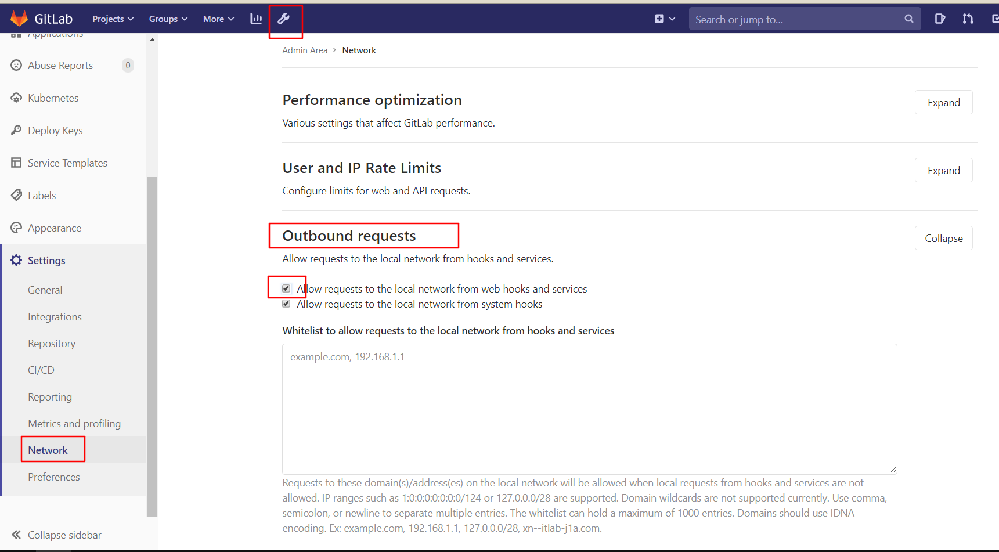

然后在项目中设置 wehook

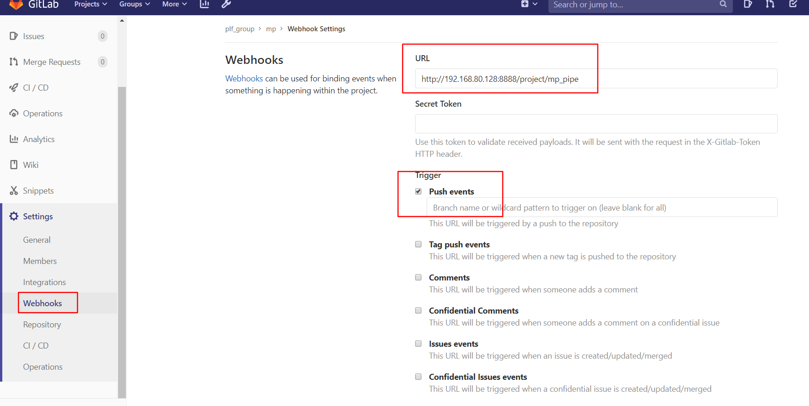

创建好后，可以测试一个 push 事件，收到 200响应码，则触发了构建


后续，只要提交代码就能触发构建。

# 参数化构建

在构建配置中，勾选 使用参数，可以配置参数名称和默认值。

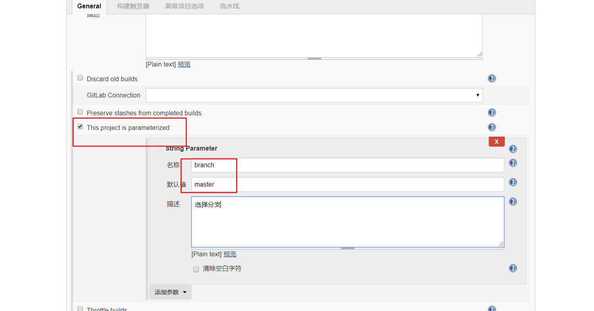

而在 配置脚本中,使用 `${参数名}`使用参数

```groovy
stage('pull code') {
    steps {
        checkout([$class: 'GitSCM', branches: [[name: '*/${branch}']],...])
    }
}
```

而此时，已经没有了立即构建的选项，而是变成了使用参数构建，填写参数即可构建

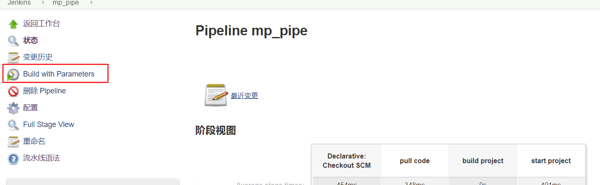

# 发送邮件

