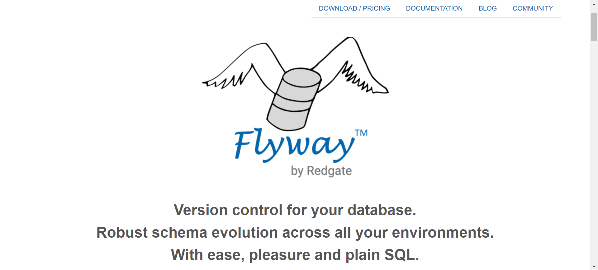
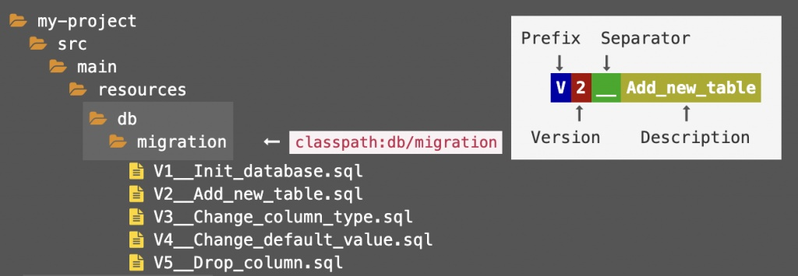

# Flyway 是什么？

[Flyway](https://flywaydb.org/) 是一款数据库版本控制工具，使用最简单直接的sql，构建一套健壮的模式，横跨所有环境。



## 好处

软件是一个不断迭代的过程，我们的代码由 git ,svn 来管理，其他中间件 如 mq ，redis 配置好部署起来就行，但是db不光要部署，还涉及到版本的修改，今天新建个表，而这些版本化的更新，如果没有一套工具来管理，可能就像这样：

更新的sql，没有集中管理，聊天工具直接发出去了。

好一点的情况，项目中建了个目录集中放版本更新的sql，项目上线的时候交给运维来执行。

使用了flyway之后：

1，可以管理每个版本的数据库变化

2，可以从头初始化数据库，明确知道当前数据库处于什么版本，以确定的方式从任何版本迁移到最新版本。

3，自动完成数据库的升级，无需人肉运维

# 如何使用

```xml
<dependency>
    <groupId>org.flywaydb</groupId>
    <artifactId>flyway-core</artifactId>
    <version>6.1.3</version>
</dependency>
```



在指定目录编写迁移sql脚本

## 原生api

创建 Flyway 实例 ,  调用 migrate 方法进行迁移。

```java
public static void main(String[] args) {
    Flyway flyway = Flyway.configure().dataSource(url,username,password).load();
    flyway.migrate();
}
```

## spring 

配置 Flyway 的bean，初始化方法指定 migrate ，随 spring 容器启动进行迁移

```java
@Bean(initMethod = "migrate")
public Flyway flyway(DataSource dataSource){
    return Flyway.configure().dataSource(dataSource).locations("flyway").load();
}
```

## spring boot

```yaml
spring:
  datasource:
    driver-class-name: com.mysql.cj.jdbc.Driver
    url: jdbc:mysql://192.168.24.130:3306/ci2
    username: root
    password: 123456
```

只需要配置好 DataSource 即可，spring boot 会 [自动配置](https://docs.spring.io/spring-boot/docs/2.2.5.RELEASE/reference/html/howto.html#howto-execute-flyway-database-migrations-on-startup) Flyway 的bean，默认寻找`classpath:db/migration` 下的sql脚本，并调用 migrate 方法。

# 工作原理

默认情况，flyway会去查找有没有 `flyway_schema_version` 这张表，如果没有则会创建，然后扫描类路径`classpath:db/migration`下的sql脚本，会按照版本号进行排序，按顺序执行，当一条迁移sql执行完成后，对应的记录表则会记录对应的版本。


当再次执行flyway的时候，会查找当前到什么版本了，对比出需要执行的sql脚本，进行迁移。

## 命名规范

开头以大写的  `V` 作为前缀，接着是数字组成的版本号，多个层级使用 `.` 进行分割，两个 脚本的直接的版本，会按层级依次比较，如 `2.1.3` 是 `1.1`  之后的版本 ，然后是双下划线 `__` ，接这条sql的名称，名称可以使用大小写和下划线，为了直观，通常会按行为命名 ,如 `CREATE_STUDENT` ，对应的文件内容也应该是对应的  建表行为。后缀为 `.sql` 。

```
V<Version>__<Name>.sql
```

例如： `V2.0.202011170946__CREATE_STUDENT.sql` 


## 脚本执行失败

迁移执行失败，记录表会产生一条失败的记录，需要调用 repair 方法，对记录表进行修复，该方法会删除掉失败的记录

在 spring boot 中可以实现 `FlywayMigrationStrategy` ,来去覆盖默认的迁移行为

```java
@Component
public class FlywayInit implements FlywayMigrationStrategy {

    @Override
    public void migrate(Flyway flyway) {
        flyway.repair();
        flyway.migrate();
    }
}
```

# 常用配置

## 基于已存在的数据库

默认情况下，Flyway 期望数据库在没有历史记录表的时候是一个空数据库，如果已经存在其他表，则会初始化失败。

需要修改配置，基于开启基线模式，会基于之前的版本开始迁移，默认会给基线版本标记为 1 版本，可以修改这个默认的标记版本号，否则可能会与我们的定义的 `V1__a.sql` 冲突，自定义的sql不会执行。

```yaml
spring:
  flyway:
    baseline-on-migrate: true
    baseline-version: 0
```

## 多分支并行开发

多分支并行开发的场景下，就会出现多个代码版本同时使用同一个数据库的情况，虽然不提倡，flyway默认也是希望一个版本一个版本依次开发，但是出于资本的压力，还是需要实现这个特性。比如：当前本地脚本还在3.2，数据库的记录表已经到了4.0。 记录表中记录了  3.2 ,4.0 此时我想再执行一条 3.3 ，此时顺序会乱，等等一系列的问题。

```yaml
spring:
  flyway:
    ignore-future-migrations: true
    ignore-missing-migrations: true
    ignore-ignored-migrations: true
    out-of-order: true
```

`ignore-future-migrations`  : 忽略未来的迁移，比如  当前本地只有1.0，2.0版本，但是记录表已经执行到了 3.0 ，该选项设置为 true ，则会忽略，并提示一个警告。true 也是默认值

`ignore-missing-migrations` : 忽略缺失的迁移，比如 本地脚本 只有 1.0， 3.0 版本，但是记录表中有 1.0，2.0，3.0 ，中间有个 2.0 的版本在本地缺失了，开启 true 则会忽略，默认值为 false。

`ignore-ignored-migrations` :  忽略 被忽略的迁移，本地的脚本是 1.0，2.0，3 .0 ，但是记录表中只记录了 1.0，3.0，其中本地 2.0 存在且低于当前版本，且没有执行过，此时校验会不通过，设置为 true ，则会忽略掉 本地多出来的迁移。

`out-of-order` : 允许乱序执行迁移脚本， 本地的脚本是 1.0，2.0，3 .0 ，但是记录表中只记录了 1.0，3.0，其中本地 2.0 存在且低于当前版本，且没有执行过，开启乱序执行，则会继续执行这个 2.0 而不是忽略。执行完成记录表的顺序为 1.0，3.0 ，2.0

## 多环境使用占位符

针对于不同环境的数据库，有些表名或数据的值会不一样，可以抽离到配置文件中，使用占位符替换

```yaml
spring:
  flyway:
    placeholders:
      appKey: qqqq
```

使用  `${key}` 来使用一个占位符，类似于el表达式

```sql
insert into t_student(id,s_name) values (1,'${appKey}');
```

## 修改默认路径和默认表名

可以自定义目录和历史记录表的名称

```yaml
spring:
  flyway:
    table: flyway_schema_history
    locations: classpath:db/migration
```

## 指定更新到的版本

```yaml
spring:
  flyway:
    target: 2.1
```

通过 `target` 指定需要执行到的版本，版本号需要是已存在的。

特殊值：`current` 当前架构表的最高版本  。  `latest` 迁移文件的最新版本(默认模式)。

## 关闭文件checksum校验

默认情况，会提前计算本地每个文件的 checksum 值，和已执行过的迁移进行对比，如果不一致则会报错。主要是防止已经执行过的sql脚本，又做了更改。关闭则不校验，建议保持默认的开启状态。

```yaml
spring:
  flyway:
    validate-on-migrate: false
```


