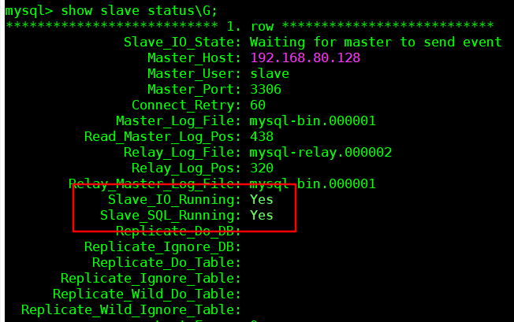

# 一主一从

主数据库， 编辑 `vim /etc/my.cnf`  添加

```properties
server-id=1
log-bin=mysql-bin
binlog-do-db=testdb
binlog_format=STATEMENT
```

从数据库配置

```properties
server-id=2
relay-log=mysql-relay
```

重启 mysql

```bash
systemctl restart mysqld
```

主数据库添加用户 slave

```bash
GRANT REPLICATION SLAVE ON *.* TO 'slave'@'%' IDENTIFIED BY '123456qwer_';
```

查看 master 状态,得到 log-file 和 position

```bash
show master status;
```

从数据库连接主数据库 ，如果之前连过，先重置，`stop slave`  ,`reset master`

```bash
CHANGE MASTER TO MASTER_HOST='192.168.80.128',
MASTER_USER='slave',
MASTER_PASSWORD='123456qwer_',
MASTER_LOG_FILE='mysql-bin.000001',
MASTER_LOG_POS=438;
```

启用主从复制

```bash
start slave;
```

查看状态 

```bash
show slave status\G;
```

这两项为 yes 即成功



创表测试

## 通过mycat

设置 dataHost 的balance属性

```
0:不启用读写分离，全部发到 writeHost 
1:读请求发送到 readHost 和 备用的 writeHost，通常用于双主双从
2:读请求随机分发
3:读请求发送到readHost
```

验证，`insert into testdb.t1(sName) value (@@hostname);` 读写分离不识别 `@@hostname` ，主从会不一致


# 双主双从

两条 主机 互为备机，其中之一挂了，另一个负责写请求。即便恢复，也为备机。

各自拥有一个从机。

