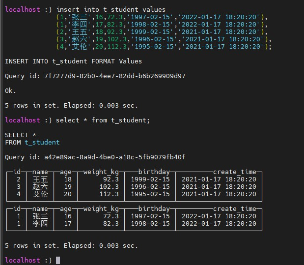

# 数据类型

### 整型

int8   -128-127  ，相当于byte

int16 ：short

int32：int

int64：long

无符号整型：

表示不带 + - 正负，

UInt8 : 0-255 ,UInt16,UInt32,UInt64

### 浮点型

Float32：相当于 float

Float64： 相当于double

### 布尔

没有，一般用 Uint8，使用0和1表示

### Decimal

有符号的浮点数，可以保持精度。

Decimal(p,s) ：p为有效位数，s为小数位数

Decimal32(s) ：有效位数 9位，括号内为小数位数，比如 Decimal32(3)，保留3位小数，整数部分就有6位

Decimal64(s)：有效位数 18位，

Decimal128(s)：有效位数 38位，

### 字符串

String：任意长度

FixedString(N)：固定长度，不够字符，会补充空字节填充，超出会报错。

### 枚举

不在枚举范围无法插入，可以优化存储空间

Enum8：用 String = Int8 描述

Enum16：用 String = Int16 描述

### 时间

Date：年-月-日

Datetime：年-月-日 时:分:秒

Datetime64：年-月-日 时:分:秒.毫秒

### 数组

Array(T)：T为类型

例如：查询一个数组，并获取类型名称

```sql
select array(1,2,3) as x,toTypeName(x);
select ['a','b','c'] as b,toTypeName(b)
```

# 表引擎

创建表的时候必须指定指定表引擎，决定如何存储数据：读写的位置，支持哪些查询，并发数据访问，索引，多线程，数据复制参数。

## TinyLog

列文件的形式，保持在磁盘，无并发，无索引，用于练习测试。

## Memory

内存型，重启数据会消失，无索引，性能高

## MergeTree

合并树，常用，ClickHouse中最强大的引擎，支持索引和分区。

```sql
create table t_student(
 	id UInt32,
 	name String,
 	age UInt32,
 	weight_kg Decimal(4,1),
 	birthday Date,
 	create_time Datetime
) engine = MergeTree
  partition by toYYYYMMDD(create_time)
  primary key(id)
  order by (id,birthday);
```

插入实例

```sql
insert into t_student values 
(1,'张三',16,72.3,'1997-02-15','2022-01-17 18:20:20'),
(1,'李四',17,82.3,'1998-02-15','2022-01-17 18:20:20'),
(2,'王五',18,92.3,'1999-02-15','2021-01-17 18:20:20'),
(3,'赵六',19,102.3,'1996-02-15','2021-01-17 18:20:20'),
(4,'艾伦',20,112.3,'1995-02-15','2021-01-17 18:20:20');
```

 查询

```sql
select * from t_student;
```




### 分区

可选属性，有分区可以降低扫描的范围，优化查询速度，使用命令行会分区显示，使用数据库工具等则不会。

数据插入后会在临时分区，过十多分钟后，会执行合并，合入主分区

### 主键

可选，提供一级索引，但是没有唯一约束，主键必须是排序字段的前缀字段，采用稀疏索引，间隔一段数据才记录索引，记录更少的索引，定位更多的数据。

### 排序（必选）

必选，按照指定的字段顺序排序。

### 二级索引

因为主键可以重复，如果主键大量重复，主键索引效果不明显，此时可以建立二级索引

### TTL

提供数据的生命周期

## ReplacingMergeTree

根据排序字段去重的MergeTree，合并的过程执行去重，不会跨分区去重。

## SummingMergeTree

聚合的MergeTree，会按照order by 的字段做group by，对指定的聚合字段进行聚合，同样是合并分区时聚合，不能跨分区