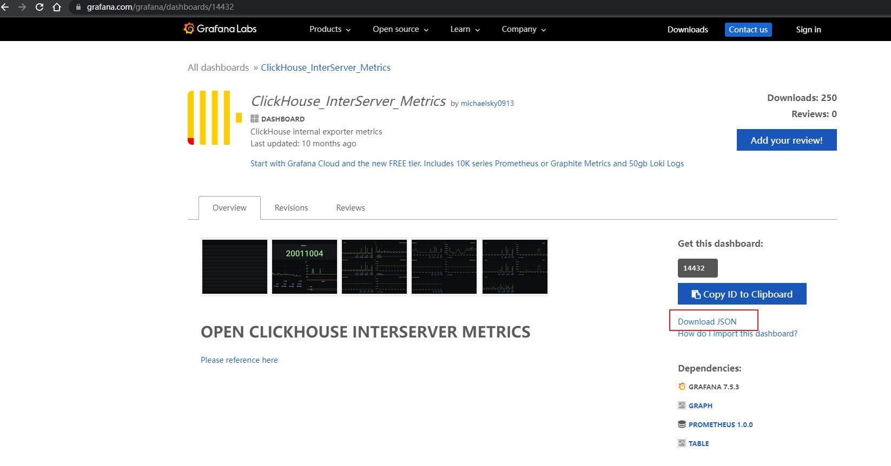
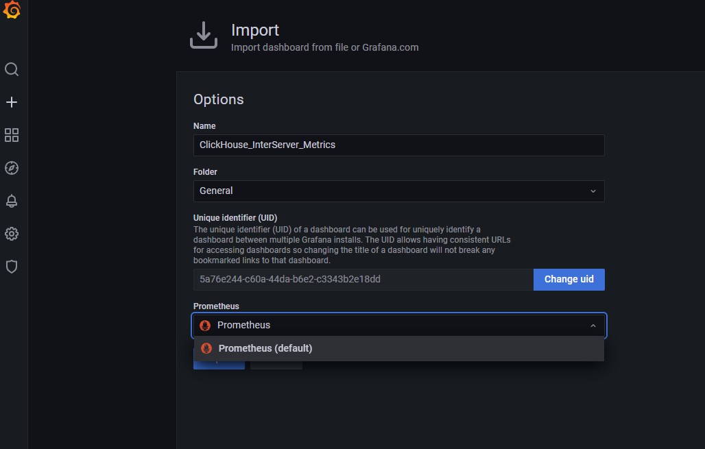

# prometheus

clickhouse提供了 prometheus 的监控端口，可以很好的通过prometheus来监控

一，开启prometheus监控端口

编辑 config.xml ，放开注释

```xml
<prometheus>
    <endpoint>/metrics</endpoint>
    <port>9363</port>

    <metrics>true</metrics>
    <events>true</events>
    <asynchronous_metrics>true</asynchronous_metrics>
    <status_info>true</status_info>
</prometheus>
```

重启，并暴露 9363 端口

访问 `http://localhost:9363/metrics`  验证是否成功

二，部署prometheus

https://prometheus.io/

下载并解压 `prometheus-*.tar.gz` 

编辑配置文件 prometheus.yml，配置一个job，注意严格控制缩进格式

```yml
- job_name: "clickhouse01"
    static_configs:
      - targets: ["localhost:9363"]
```

直接启动

```bash
./prometheus --config.file=prometheus.yml
```

 或者 后台启动，并暴露 9090 端口

```bash
nohup ./prometheus --config.file=prometheus.yml > ./prometheus.log 2>&1 &
```

访问 `http://localhost:9090/` 验证


即可查看我们配置的clickhouse 和 默认配置的监控自己


三，安装grafana

https://grafana.com/

下载 `grafana-enterprise-8.4.2.linux-amd64.tar.gz` ，解压

后台启动，并暴露 3000 端口

```bash
nohup ./bin/grafana-server web > ./grafana.log 2>&1 &
```

访问 `http://localhost:3000` ，默认的账户名密码为 admin/admin，初次会要求修改密码，也可直接跳过

然后需要我们创建一个数据来源，这里我们选择 prometheus


配置prometheus数据源


然后创建仪表盘，可以自己创建也可以导入模板

进入官方模板网站 https://grafana.com/grafana/dashboards/ ，找到合适的模板下载json格式的配置



然后导入模板配置


选择刚配置的数据源，保存



即可在 dashboard 中看见我们配置的仪表盘


