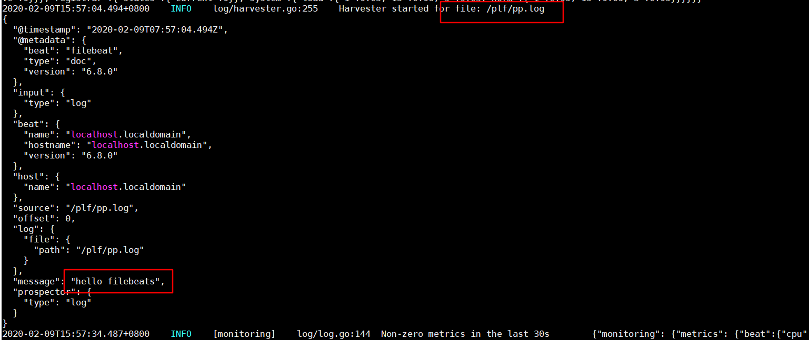

# 概述

beats 是用于采集数据的，有各种 beat 可选，如 FIleBeat。

# Filebeat

用于采集日志文件的 beat ，<https://www.elastic.co/cn/beats/filebeat> 

旧版本下载  <https://www.elastic.co/downloads/past-releases> 

解压后。编写配置文件 xx.yml ，指定采集的路径，并输出到控制台。

```yaml
filebeat.inputs:
- type: log
  enable: true
  paths:
   - /plf/*.log
output.console:
  pretty: true
  enable: true
```

启动 filebeat ,使用刚才的配置文件

```bash
./filebeat -e -c flog.yml
```

当我们对目标文件进行写入时

```bash
echo "hello filebeats" >> pp.log
```

filebeat 会监听到



## 输出到 es

配置 output ,指定 es 的 ip

```yaml
filebeat.inputs:
- type: log
  enable: true
  paths:
   - /plf/*.log
output.elasticsearch:
  hosts: ["192.168.80.128"]
```

继续更新文件

es 会建立 filebeat-版本-日期 的索引，类型为 doc ，查询数据。

```http
POST http://192.168.80.128:9200/filebeat-6.8.0-2020.02.09/doc/_search
```

## 读取 nginx 日志

设置好 nginx 日志的路径

```yaml
filebeat.inputs:
- type: log
  enable: true
  paths:
   - /usr/local/nginx/logs/*.log
output.elasticsearch:
  hosts: ["192.168.80.128"]
```

## 使用 module

查看当前开启和关闭的 modules

```bash
./filebeat modules list
```

开启 nginx module ，想关闭则使用 disable

```bash
./filebeat modules enable nginx
```

编辑 modules.d/nginx.yml 文件

```yaml
- module: nginx
  access:
    enabled: true
    var.paths: ["/usr/local/nginx/logs/access.log*"]
  error:
    enabled: true
    var.paths: ["/usr/local/nginx/logs/error.log*"]
```

编辑 配置文件，不再指定路径，直接指定 modules

```yaml
filebeat.inputs:
output.elasticsearch:
  hosts: ["192.168.80.128"]
filebeat.config.modules:
  path: ${path.config}/modules.d/*.yml
  reload.enable: false
```

使用 modules 后，会对原本的字符串做解析，分成各种字段。

```json
 "_source": {
     "offset": 91952,
     "nginx": {
         "access": {
             "referrer": "http://192.168.80.128/index.html",
             "response_code": 502,
             "remote_ip": "192.168.80.1",
             "method": "GET",
             "user_name": "-",
             "http_version": "1.1",
             "body_sent": {
                 "bytes": 494
             },
```

# Metricbeat

用于采集性能指标


