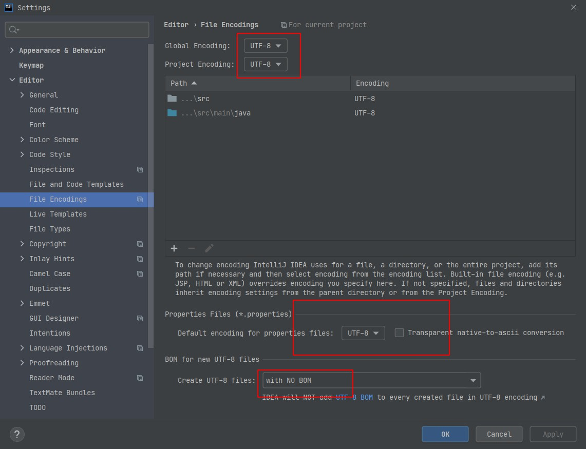

# 设置

idea的settings，<kbd>ctrl</kbd> + <kbd>alt</kbd> + <kbd>s</kbd>   打开，但是光改只会影响当前项目，还需改 File > New Projects Settings 来变更后续新项目

##   File Encodings

Editor > File Encodings 来设置文件编码，统一设置 `UTF-8`  

properties 文件 也是设置 `UTF-8` ,  不要勾选后面的 ascii 转码，否则会在别的平台打开，中文会显示 unicode 码

最后选择   `NO BOM` ，BOM 会影响初 windows 外的其他系统。

# 快捷键

