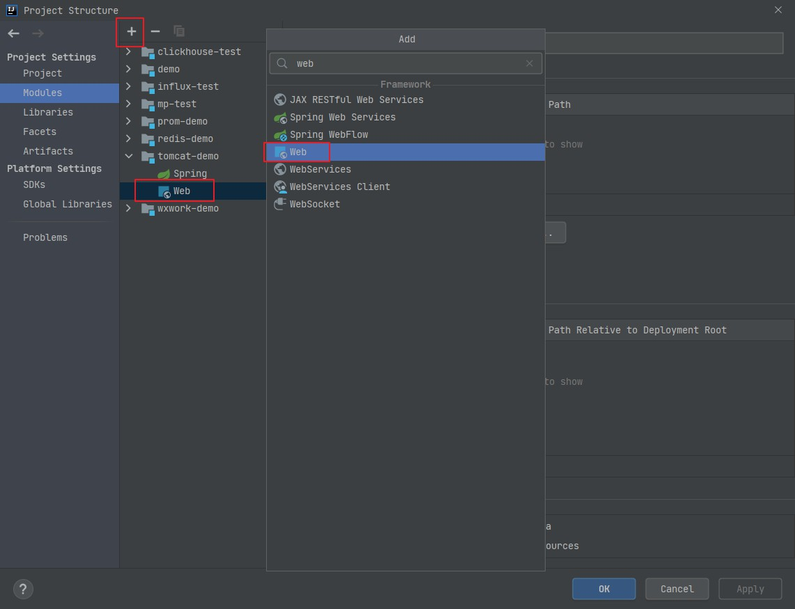

# 设置

idea的settings，<kbd>ctrl</kbd> + <kbd>alt</kbd> + <kbd>s</kbd>   打开，但是光改只会影响当前项目，还需改 File > New Projects Settings 来变更后续新项目

##   File Encodings

Editor > File Encodings 来设置文件编码，统一设置 `UTF-8`  

properties 文件 也是设置 `UTF-8` ,  不要勾选后面的 ascii 转码，否则会在别的平台打开，中文会显示 unicode 码

最后选择   `NO BOM` ，BOM 会影响初 windows 外的其他系统。


# 快捷键

# 创建 maven web项目

1,新建项目，不使用模板


2, 设置war形式打包，pom中添加

```xml
<packaging>war</packaging>
```

3,找到项目的web设置，如果没有则添加一个



4, 点击 + 号新建 web.xml


位置需要设置下， 中间补充下  src\main\webapp


点击 apply ，ok 退出即可

5, 在webapp目录下 ， 新建 jsp 页面测试


6, 添加 tomcat 


设置tomcat目录，及默认的端口等


7, 添加项目部署到tomcat ， 设置 context ，通常就是项目名


8, 启动tomcat ，即可打开默认的项目的 index 页面


