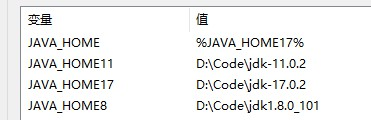

# 概述

## 1.java语言特性

java是一种面向对象的语言，由sun公司开发，后卖给oracle

**三个版本**

JavaSE：开发桌面应用swing，不如传统的c，c++

JavaEE，开发web应用

JavaME,手机java程序,被安卓和ios取代

java现在主要开发用于后台web开发，安卓，大数据

**基本概念**

类，对象

特性：封装，继承，多态

**跨平台**

java文件被编译为class文件，运行在不同平台的JVM（java虚拟机）中

## 2.环境搭建

**JDK**：提供开发工具及运行环境（JRE）

**JRE**：java的运行环境,包含了jvm

**安装** : 下载jdk ，可以去 官网 下载 https://www.java.com/zh-CN/download/

不过这个是oracle 的jdk，商用的话是要收费的，更推荐免费的 openjdk，https://jdk.java.net/archive/

**环境变量**：添加环境变量，JAVA_HOME 设置值为java的目录

​		在path中添加 %JAVA_HOME%/bin

可以配置多个版本的jdk ， 新建对应版本的JAVA_HOMExx，把JAVA_HOME 指向对应的版本即可



输入 `java -version`确认是否安装完成

```bash
C:\Users\plf>java -version
java version "1.8.0_171"
Java(TM) SE Runtime Environment (build 1.8.0_171-b11)
Java HotSpot(TM) 64-Bit Server VM (build 25.171-b11, mixed mode)
```

java核心机制：

1，java虚拟机 :jvm用于运行java程序，不同的操作系统安装不同的jvm，而jvm统一执行class文件，实现一次编译，各处运行

2，垃圾回收机制:对不再使用的内存进行回收，由虚拟机自动回收

java的特点

1，面向对象

2，健壮性 ：垃圾回收机制，异常处理

3，跨平台 ：jvm机制

## 3.HelloWorld

创建`HelloWorld.java`

```java
public class HelloWorld {

    public static void main(String[] args) {
        System.out.println("Hello world");
    }
}
```

`javac HelloWorld.java` 编译 :编译的时候要加后缀

`java HelloWorld  `         运行：运行的时候不用加后缀

## 4.注释

单行注释:

```java
//单行注释
```

多行注释:

```java
/*
* 多行注释
* */
```

文档注释:

可以使用javadoc 文件名在当前文件夹下生成html文档，还可以被ide工具读取，用于代码提示

```java
/**
 * 文档注释  
 * @version 1.0
 * */
```

