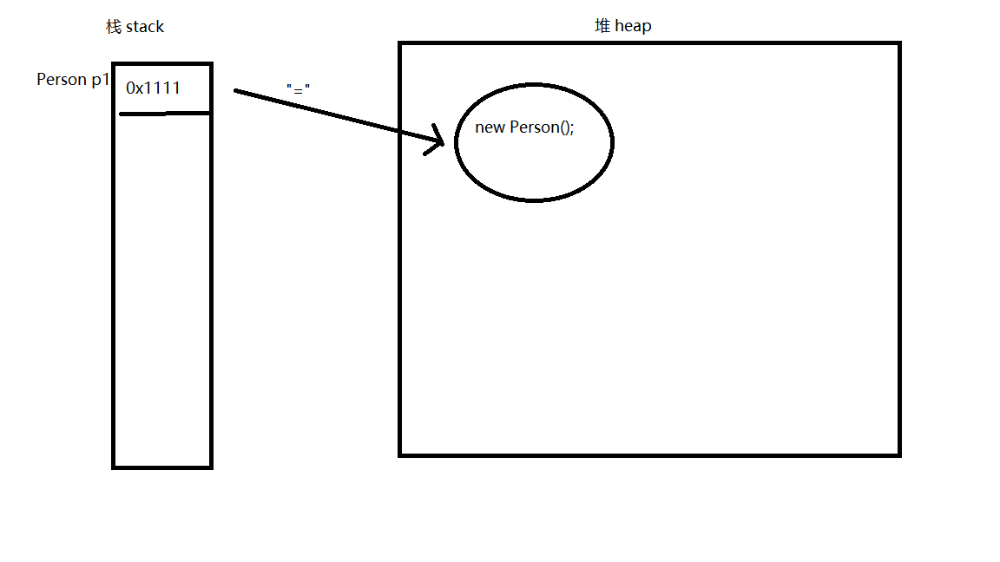

# 面向对象

区别于面向过程，面向过程，在于怎么做，以函数为单位。面向对象在于谁去做，以对象为单位

三大特点：继承，封装，多态

## 类和对象 

类 Class 就是对一类事物的抽象描述，就好比汽车设计图

对象 Object 是实际存在的事物，也称实例，就好比汽车

类包括属性，方法，代码块，构造器

通过new关键字创建对象，通过`.` 的方式调用属性和方法

每个对象都是相互独立的，各自的非静态属性发生改变，不会相互影响

**声明属性**

语法:`[修饰符] 数据类型 标识符 [= 初始值]` 

当对象被创建时，属性会自动使用默认值进行初始化,

数值类型的初始值为0,布尔为false，char为`\u0000`(空字符), 对象类型为null

```java
public class BinaryTest {
    
    public String name="zz";
}
```

**声明方法**

语法:   `[修饰符] 返回值类型 方法名([参数类型 参数名...]){代码块}`

```java
public class BinaryTest {

    public void hello(String name){
        System.out.println(name);
    }
}
```

使用`return`关键字返回结果值，如果没有返回值，则返回值类型为`void`

示例

定义一个类

```java
public class Person {

    //定义属性，不初始化，默认为null
    String name;
    //定义属性并初始化
    int age=10;

    //无参数，又返回值的方法
    int getAge(){
        return age;
    }
    //无参数，无返回值的方法
    void sayName(){
        System.out.println( "i am "+name);
    }
    //有参数，有返回值的方法
    int add(int x,int y){
        return x+y;
    }
    //有参数，无返回值的方法
    void hello(String name){
        System.out.println("hello "+name);
    }
}

```

使用类

```java
 public static void main(String[] args) {
     //通过new关键字，创建对象
     Person p1 = new Person();
     //给对象的属性赋值
     p1.name="张三";

     //调用方法
     p1.sayName();//i am 张三
     //调用有返回值的方法，并接收返回值
     int age=p1.getAge();
     System.out.println(age);//10
     //调用有参数的方法，传入参数
     String name="李四";
     p1.hello(name);//hello 李四
     //调用有参数有返回值的方法
     System.out.println(p1.add(2,3));//5
 }
```

**内存解析**

当使用 `Person p1`的时候，会在栈（stack）内存中创建引用，当使用`new Person()`的时候，会在堆（heap）内存中创建实例当使用`=`连接的时候，会使栈中的引用指向堆内存的实例



```java
//在栈中创建引用，但是没有指向任何实例
Person p1;
//在堆中创建对象，没有被引用的匿名对象
new Person().sayName();
//在栈中创建引用，在堆中创建实例，并用引用指向实例
Person p2=new Person();
```

## 封装 private

private关键字属于权限修饰符，可以修饰类的成员，被修饰的成员，将不能被外部直接访问

通常会提供`get`和`set `方法来访问属性

```java
public class Person {

    private String name;

    public String getName() {
        return name;
    }

    public void setName(String name) {
        this.name = name;
    }
}
```

## 构造方法 constructor

1，使用new关键字调用构造方法

2，默认会提供一个无参数的public构造方法

3，当编写了构造方法，就不会提供默认的构造方法

4，构造方法不声明和return返回值，返回值就是当前正在构造的对象

5，构造方法名和类名一致

6，构造方法可以有多个

```java
public class Person {

    public Person() {
        System.out.println("正在构造");
    }
}
```

## 方法重载 overload

一个类中有多个同名方法称为重载

1, 参数列表不能相同

2，返回值可以相同，也可以不相同

3, 构造方法可以重载

```java
public class Person {
    
    int max(int a,int b){
        return a>b?a:b;
    }

    String max(int a,int b,int c){
        return c+""; 
    }
}
```

## this

this在普通方法中表示，调用当前方法的对象。

在构造方法中，表示当前正在构造的对象;

可以在构造方法中调用`this()` 来调用重载的构造方法，此用法`this()`必须在第一行

```java
public class Person {

    private String name;
    private int age;

    public Person() {
    }

    public Person(String name) {
        this();
        this.name = name;
    }

    public Person(String name, int age) {
        this(name);
        this.age = age;
    }

    public String getName() {
        return name;
    }

    public void setName(String name) {
        this.name = name;
    }
}
```

## 参数传递  param

传值 ：八大基本数据类型的传递，在方法内部改变，不会影响当前值

传引用 ：对象类型进行传递的时候，指向的还是同一堆空间的实例，在方法中改变实例的属性，方法外部会受影响

## 包 package   import

包可以对类进行管理和分类，对应文件夹

语法`package 包名`, 语句要写在第一行，包名通常要小写

默认导入`java.lang`的包，其他的包需要使用`import`关键字导入,可以使用`*`通配符导入包的所有类

```java
package com.plf.model;

import java.time.LocalDateTime;

public class Person {

    public static void main(String[] args) {
        LocalDateTime now = LocalDateTime.now();
        System.out.println(now);
    }
}
```


