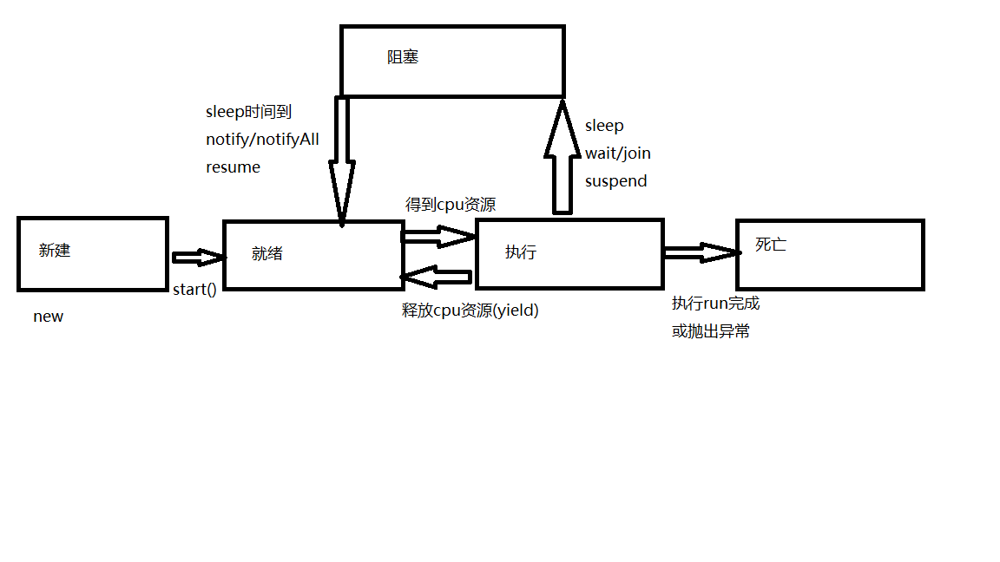

# 多线程

## 概念

进程是一个程序的运行

线程是一个进程的一条执行路径

## 创建线程

### 继承Thread类

继承`Thread`类，重写`run`方法

```java
public class SubJob extends Thread {

    @Override
    public void run() {
        System.out.println("线程执行----");
    }
}
```

启动线程

创建线程对象，调用`start`方法，启动线程,一个线程对象只能执行一次`start`方法

多线程的任务，不要使用junit测试

```java
public static void main(String[] args) {
    SubJob subJob = new SubJob();
    subJob.start();
}
```


### 实现Runnable接口

实现`Runnable`接口，重写`run`方法

```java
public class SubJob2 implements Runnable {
    @Override
    public void run() {
        for (int i = 0; i <= 100; i++) {
            System.out.println(Thread.currentThread().getName()+":"+i);
        }
    }
}
```

执行

```java
SubJob2 subJob2 = new SubJob2();
new Thread(subJob2).start();
```

Thread也是Runnable的子类

```java
public
class Thread implements Runnable {
```


## 线程方法

### 获取当前线程

```java
Thread.currentThread()
```

### 线程名称

线程对象`.getName()`,`.setName(str)`

默认名称为`Thread-x`,x从0开始

```java
private static int threadInitNumber;

public Thread() {
    init(null, null, "Thread-" + nextThreadNum(), 0);
}

private static synchronized int nextThreadNum() {
    return threadInitNumber++;
}
```

通过`setName`自定义设置线程名称

```java
SubJob subJob = new SubJob();
subJob.setName("子线程1");
subJob.start();
```

### yield

**不可靠**，释放当前cpu资源，下一次执行和其他线程一起抢cpu资源，也取决与cpu的内核数

```java
@Override
public void run() {
    for (int i = 0; i <= 100; i++) {
        if (i%10==0){
            Thread.yield();
        }
        System.out.println(Thread.currentThread().getName()+":"+i);
    }
}
```

### join

在A线程中，调用B线程的join方法，会等待B线程执行完，再执行A线程

```java
public static void main(String[] args) throws Exception {
    SubJob subJob = new SubJob();
    subJob.setName("子线程1");
    subJob.start();
    for (int i = 0; i <= 100; i++) {
        if (i == 20){
            subJob.join();
        }
        System.out.println(Thread.currentThread().getName()+":"+i);
    }
}
```

### isAlive

判断线程是否存活

```java
System.out.println(subJob.isAlive());
```

### sleep

当前线程睡眠x毫秒,便会暂停执行

```java
Thread.sleep(5000);
```

### 线程优先级

最大,`Thread.MAX_PRIORITY`  =10

默认，`Thread.NORM_PRIORITY`=5

最小，`Thread.MIN_PRIORITY`=1

获取优先级

```java
System.out.println(subJob.getPriority());
```

设置优先级,只能为`1~10`的整数

```java
subJob.setPriority(9);
```

线程优先级会让线程再争夺cpu资源的时候，有不同的优先级，取决于cpu的内核数，**不可靠**

## 生命周期

`Thread.State`内部枚举类列出了线程的声明周期



**新建**

线程对象已经创建，还没执行start方法

**就绪**

调用start方法，等待系统资源执行run方法

**运行**

执行run方法

**阻塞**

被挂起或暂停，等待执行run方法

**死亡**

线程执行完成，或被提前终止

## 线程同步

当多个线程，处理同一资源时，会造成资源不同步的问题

```java
public class SubJob2 implements Runnable {

    int c = 0;

    @Override
    public void run() {
        for (int i = 0; i <= 100; i++) {
            if (c < 100) {
                System.out.println(Thread.currentThread().getName() + ":" + c++);
            }
        }
    }
}
```

启动三个线程,执行时会出现重复或错误

```java
public static void main(String[] args) throws Exception {
    SubJob2 subJob2 = new SubJob2();
    new Thread(subJob2).start();
    new Thread(subJob2).start();
    new Thread(subJob2).start();
}
```

**同步代码块**

语法`synchronized(锁){//需要被同步的代码,通常为操作共享数据代码}`

锁也称同步监视器，由一个对象充当，那个线程获取到锁，就有机会执行同步代码块的内容

想要保证代码同步，需要保证锁对象唯一

```java
public class SubJob2 implements Runnable {

    int c = 0;

    @Override
    public void run() {
        for (int i = 0; i <= 100; i++) {
            if (c < 100) {
                synchronized (this) {
                    System.out.println(Thread.currentThread().getName() + ":" + c++);
                }
            }
        }
    }
}

```

**同步方法**

在方法的修饰符加上`synchronized`,锁为`this`

```java
public class SubJob2 implements Runnable {

    int c = 0;

    @Override
    public synchronized void run() {
        for (int i = 0; i <= 100; i++) {
            if (c < 100) {
                System.out.println(Thread.currentThread().getName() + ":" + c++);
            }
        }
    }
}
```

使用继承的方式，new了三个对象，而this不是同一个对象

使用实现的方式，创建一个Runnable对象，三个线程使用同一个锁也就是Runnable对象

## 死锁


## 线程通信

使用wait方法可以暂停当前线程，并释放锁，直到被唤醒，使用notify可以唤醒一个线程，notifyAll唤醒所有

这三个方法属于Object的方法，只能在同步代码中调用，

```java
public class SubJob2 implements Runnable {

    int c = 0;

    @Override
    public void run() {
        while (true){
            synchronized (this){
                notify();
                if(c<100){
                    System.out.println(Thread.currentThread().getName()+":"+c);
                    c++;
                }else {
                    break;
                }
                try {
                    wait();
                } catch (InterruptedException e) {
                    e.printStackTrace();
                }
            }

        }
    }
}
```

执行,实现交替打印

```java
SubJob2 subJob2 = new SubJob2();
new Thread(subJob2).start();
new Thread(subJob2).start();
```

