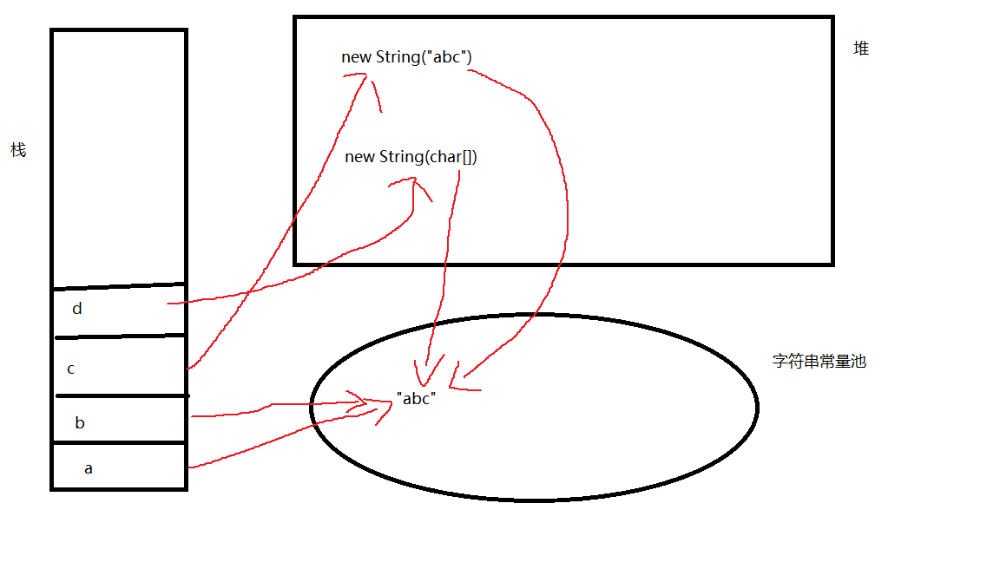

# 常用类

## String

### 创建方式

```java
String a="a";
String b=new String("cc");
String c=new String(new char[]{'a','c','b'});
```

### 内存解析

String由于是会被经常使用的一个类，会设计一个字符串常量池，来复用重复的字符串

```java
@Test
public void test1() {
    String a="abc";
    String b="abc";
    String c=new String("abc");
    String d=new String(new char[]{'a','b','c'});

    System.out.println(a==b);//t
    System.out.println(a.equals(b));//t
    System.out.println(a==c);//f
    System.out.println(a.equals(c));//t
    System.out.println(a==d);//f
    System.out.println(a.equals(d));//t
}
```

对象类型使用`==`比较的是地址，Object默认的`equals`方法就是`==`,但是String重写了equals方法，使其比较字符串内容



a和b都直接指向常量池，而c和d会指向堆空间的对象，再指向常量池

### 常用方法

这些方法会产生新的字符串，不会改变原字符串

```java
 String a = "a,b,c";

//获取长度
int length = a.length();
System.out.println(length);//5

//获取指定下标的字符
char charAt = a.charAt(2);
System.out.println(charAt);//b

//比较
int compareTo = a.compareTo("bd");
System.out.println(compareTo);//-1

//获取指定字符的下标
int a1 = a.indexOf("b");
System.out.println(a1);//2

//是否以什么开始
boolean startsWith = a.startsWith("a");
System.out.println(startsWith);//true

//截取，截头不截尾
String substring = a.substring(2);
System.out.println(substring);//b,c

//替换
String replace = a.replace(",", "");
System.out.println(replace);//abc

//指定字符串，移除该字符串，剩余部分成数组
String[] split = a.split(",");
System.out.println(Arrays.asList(split));//[a, b, c]

//去前后空格
String trim = a.trim();
System.out.println(trim);

//转为byte数组
byte[] bytes = a.getBytes();//97,44,98,44,99,
for (byte aByte : bytes) {
    System.out.print(aByte + ",");
}

//转为char数组
char[] chars = a.toCharArray();
for (char aChar : chars) {
    System.out.print(aChar);
}

//追加
String concat = a.concat(",d");
System.out.println(concat);//a,b,c,d

//判断包含
boolean contains = a.contains("b,");
System.out.println(contains);//true

//判断是否为空字符串，前提为不是null
boolean empty = a.isEmpty();
System.out.println(empty);//false

//转大写
String toUpperCase = a.toUpperCase();
System.out.println(toUpperCase);//A,B,C
```


## StringBuffer,StringBuilder

代表可变的字符串

```java
StringBuilder sb=new StringBuilder("abc");
sb.append(1);
sb.delete(1,2);
sb.insert(0,2);
System.out.println(sb);
```

StringBuffer功能类似，但是线程安全，所有方法都加了同步，损失性能


## Date

获取当前时间戳,1970年1月1日0点0分0秒到现在的毫秒数

```java
long currentTimeMillis = System.currentTimeMillis();
System.out.println(currentTimeMillis);
```

得到时间对象

`java.util.Date`可以得到当前时间(带时区)

```java
Date date = new Date();
System.out.println(date);//Sat Jul 27 17:04:46 CST 2019
```


**DateFormat**

可以指定一个格式，来对时间对象和字符串之间的转换

```java
String pattern="yyyy-MM-dd HH:mm:ss";
SimpleDateFormat format = new SimpleDateFormat(pattern);

//时间转字符串
String dateStr = format.format(new Date());
System.out.println(dateStr);//2019-07-27 17:09:15

//字符串转时间
Date date2 = format.parse("2008-12-22 17:34:43");
System.out.println(date2);//Mon Dec 22 17:34:43 CST 2008
```

**Calendar**

日历类

```java
Calendar calendar = Calendar.getInstance();
System.out.println(calendar);
```

## BigDecimal

直接进行小数的计算可能会出现精度问题

```java
double a=0.7;
double b=10;
System.out.println(a/b);//0.06999999999999999
```

使用BigDecimal来进行精确计算

可以控制保留多少位，和保留方式,`BigDecimal.ROUND_HALF_UP`为四舍五入

```java
double a=0.7;
double b=10;
System.out.println(a/b);//0.06999999999999999

BigDecimal b1 = new BigDecimal(a);
BigDecimal b2 = new BigDecimal(b);

BigDecimal divide = b1.divide(b2);
System.out.println(divide);//0.06999999999999999555910790149937383830547332763671875

BigDecimal divide1 = b1.divide(b2, BigDecimal.ROUND_HALF_UP);
System.out.println(divide1);//0.0699999999999999955591079014993738383054733276367188

BigDecimal divide2 = b1.divide(b2, 4, BigDecimal.ROUND_HALF_UP);
System.out.println(divide2);//0.0700
```

