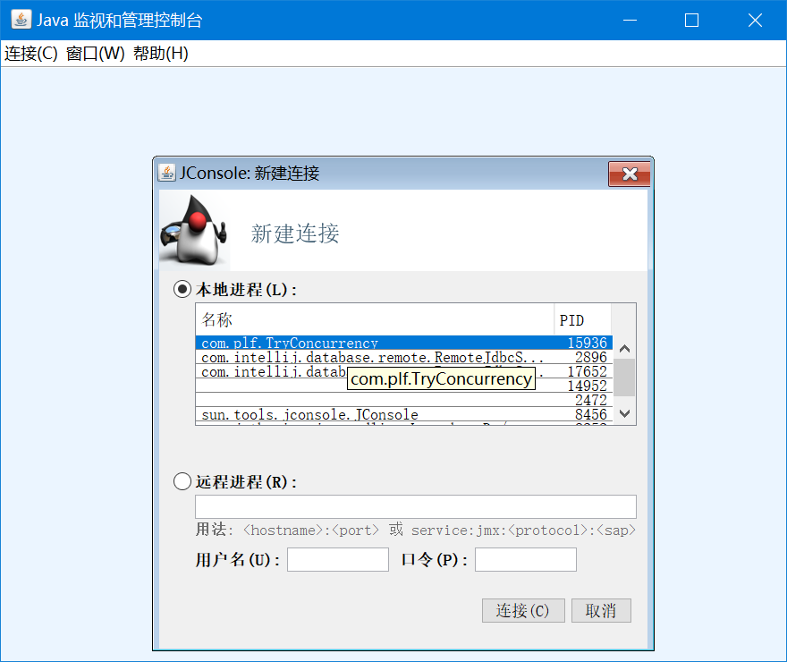
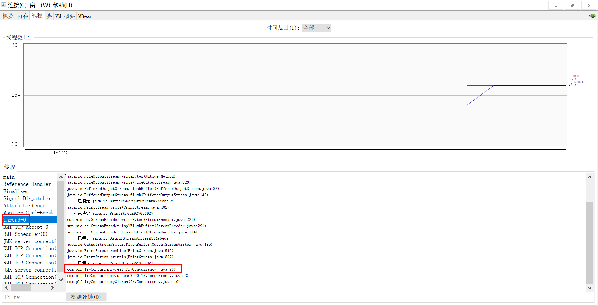
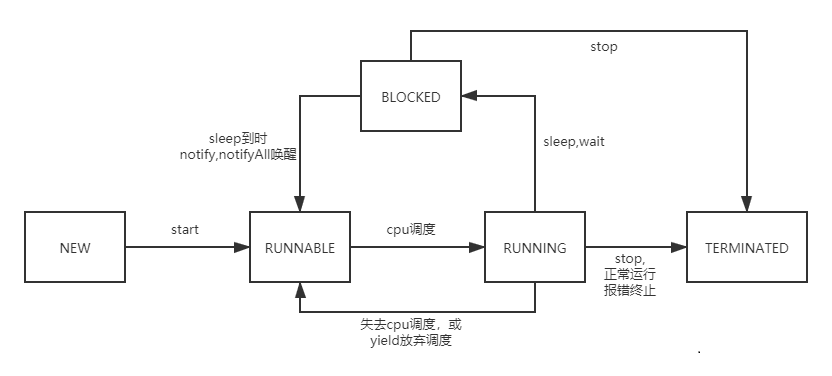

# 概念

一个计算机任务是一个进程，一个进程至少包含一个线程。

单核cpu，通过时间钟快速轮转调度，伪装成了多线程并行执行。真正的多线程存在于多核cpu。

# 快速启动一个线程

```java
new Thread(){
    @Override
    public void run() {
        eat();
    }
}.start();
```

继承Thread类，或使用匿名内部类，重写 run 方法，run方法中代码将被线程执行。

调用 start 方法，才是启动一个线程。

# 使用 jconsole

在命令行中启动

```bash
jconsole
```

连接我们需要查看的进程，也就是main方法所在的类



进入线程面板



其中 main 线程就是主线程，而 Thread-0 就是我们之前新建的线程。还要其他的线程，如垃圾回收，RMI等

# 线程的生命周期



## NEW

新建状态，调用了 `new Thread()` ，创建了 线程对象，但是还没有启动。

可以调用 `start()` 进入 RUNNABLE 状态

## RUNNABLE

可运行状态，线程对象 调用了 `start` 方法后，没有立即运行，而是等待cpu的调度。

一般情况下，RUNNABLE 只能意外终止，或进入RUNNING状态。

## RUNNING

运行状态，此时cpu正在执行 run方法中的代码。

可以调用 stop 方法，进入TERMINATED状态。

调用 wait ,sleep 方法，等待锁，或执行某个阻塞的IO操作，进入 BLOCKED状态。

调用 yield放弃cpu执行权，或cpu本身轮询调度放弃执行，进入RUNNABLE状态。

## BLOCKED

阻塞状态，此时线程会暂停执行。

可以调用 stop 进入 TERMINATED状态。

阻塞的io操作结束，sleep到时间，被 notify/notifyAll 唤醒，获取到锁，阻塞过程被打断（其他线程调用interrupt）等操作会进入 RUNNABLE 状态。

## TERMINATED

终止状态，线程已经结束，无法改变状态，整个生命周期结束。

调用 stop ，正常运行结束，运行出错终止，JVM瘫痪等都会进入该状态。

一个线程只能被启动一次，再次启动会抛出异常。

# 模板模式

模板模式，就是父类提供一个模板，子类重写需要定制的方法。

其中Thread的run方法被重写，执行 start 方法时，调用被重写的run方法。

