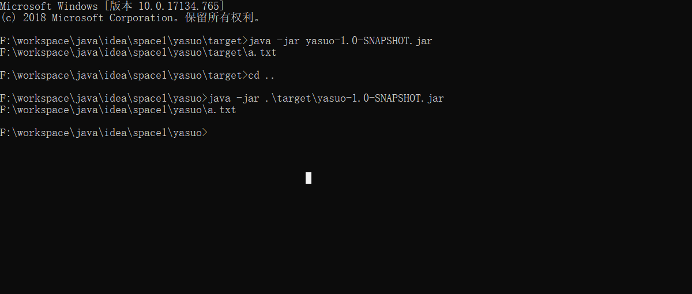

# IO流

## File

File类的对象代表一个文件或者文件夹

```java
File file=new File("a.txt");
```

### 相对路径

当前jvm启动的路径，可用`System.getProperty("user.dir")`获取

```java
public class Hello {
    //返回一个文件的绝对路径
    public static String say(){
        File file=new File("a.txt");
        return file.getAbsolutePath();
    }
}
```

1，main方法中使用，相当于当前项目根路径，一般由ide控制

```java
public static void main(String[] args) {
    System.out.println(Hello.say());
}
```

以上得到`F:\workspace\java\idea\space1\a.txt`，space1是当前项目，类在zoe模块下

2，在maven中使用junit，路径为模块根路径，也是pom文件所在的位置，由maven控制

```java
@Test
public void test1() throws Exception {
    System.out.println(Hello.say());
}
```

得到`F:\workspace\java\idea\space1\zoe\a.txt`,与以上不同的是，会在模块下

3,在maven中使用tomcat7插件启动war包，为模块根路径，同上，本质上也是由maven控制

```java
@Override
protected void doPost(HttpServletRequest req, HttpServletResponse resp) throws ServletException, IOException {
    resp.getWriter().println(Hello.say());
}
```

得到`F:\workspace\java\idea\space1\zoe\a.txt`,

4,打成war包，在tomcat中启动，为tomcat的bin目录

代码同上,得到`F:\CodeSoft\apache-tomcat-8.5.30\bin\a.txt`

5,打出jar包，使用命令运行，路径为java命令执行时所在的目录

在不同位置执行时，目录皆不同



总结：在哪里使用的java命令，就是jvm启动位置，相对路径就在那里

### 绝对路径

从系统根目录开始到具体位置

unix: 斜杠 `/`

```java
 File file2=new File("/a.txt");
```

windows:反斜杠 `\`

```java
File file=new File("D:\\a.txt");
```

java是跨平台的语言，其实可以混着写，也没关系

```java
 File file=new File("D:\\src/a.txt");
```

不放心可以使用File类提供的属性`File.separator`,代表文件分隔符

### 常用方法


