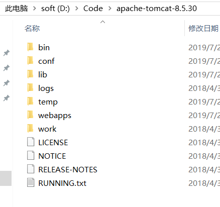
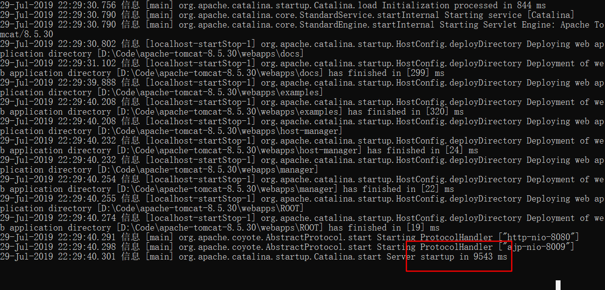
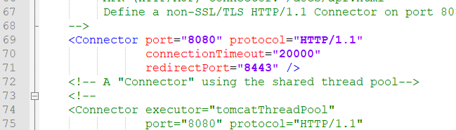
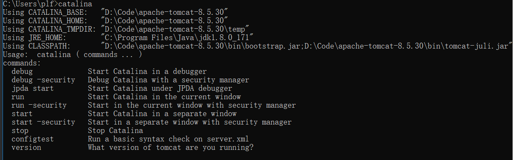

# javaWeb 概述

javaWeb 由一组servlet，jsp，html，类，静态资源构成，运行在实现了servlet规范的servlet容器中

## servlet容器

为javaWeb提供运行环境，如tomcat

<http://tomcat.apache.org/>    进入tomcat官网下载tomcat

### 目录结构



bin : 可执行文件，启动和关闭等

conf：tomcat配置文件

lib：tomcat提供的库，比如servlet-api,jsp-api

logs：tomcat的运行日志

temp：临时文件夹

webapps：web应用，自带了一组应用，我们开发的应用也要放进去才能运行

work：编译后的jsp文件

### 运行tomcat

设置java环境，双击`bin/startup.bat`



打开浏览器，进入<http://localhost:8080/> , 可以看到tomcat的介绍网页，启动成功

### 关闭tomcat

双击`bin/shutdown.bat`,关闭tomcat

### 修改默认端口

tomcat的默认端口为8080，如果被占用，需要我们修改端口

打开`conf/server.xml`,找到协议为http的连接，修改port属性为想要的端口



### 环境变量

如果不想每次都进入bin目录，可以设置环境变量

添加环境变量`CATALINA_HOME`为tomcat的bin所在的目录

添加`%CATALINA_HOME%\bin`到`path`

可以直接在cmd中执行`catalina`可以看到支持的命令

比如`catalina start`开启，`catalina stop`关闭



### 配置tomcat用户

添加以下配置到`conf/tomcat-users.xml`中，即可使用指定的用户名密码管理tomcat

```xml
<role rolename="manager-gui"/>
<user username="tomcat" password="s3cret" roles="manager-gui"/>
```

## web项目标准目录结构

myweb                  web项目的根路径，所有资源都在这里面

|--WEB-INF           web项目的功能，外部不能直接访问

|--|--classes           类路径，包含类和资源

|--|--lib                   第三方jar包

|--|--web.xml          web项目配置文件

|--index.jsp            web项目的页面，提供给外部访问