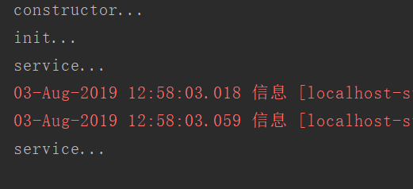
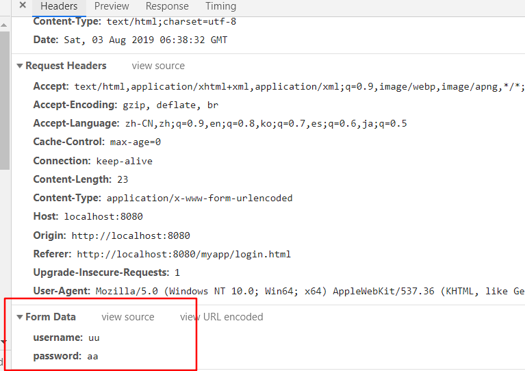
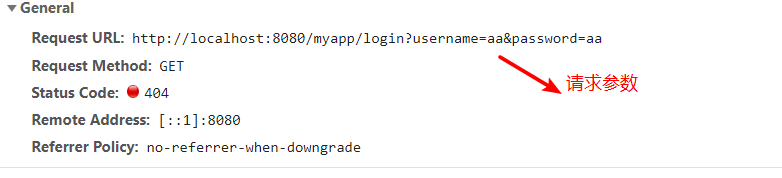
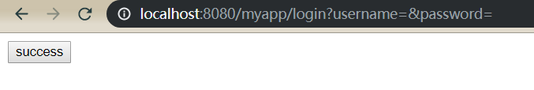
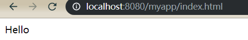

# Servlet

servlet运行在servlet容器中，用于客户与服务端的通信，用户请求servlet容器提供的服务，容器再调用servlet的方法

## 创建servlet

实现`Servlet`接口，实现方法

```java
package com.plf.myapp.servlet;

import javax.servlet.*;
import java.io.IOException;

public class StudentServlet implements Servlet {

    public StudentServlet() {
        System.out.println("constructor...");
    }

    @Override
    public void init(ServletConfig servletConfig) throws ServletException {
        System.out.println("init...");
    }

    @Override
    public ServletConfig getServletConfig() {
        System.out.println("getServletConfig...");
        return null;
    }

    @Override
    public void service(ServletRequest servletRequest, ServletResponse servletResponse) throws ServletException, IOException {
        System.out.println("service...");
    }

    @Override
    public String getServletInfo() {
        System.out.println("getServletInfo...");
        return null;
    }

    @Override
    public void destroy() {
        System.out.println("destroy...");
    }
}

```

## 映射servlet

在`web.xml`中配置，注册servlet，并映射一个url地址，其中`/`代表web应用的根目录

一个servlet可以有多个servlet-mapping

```xml
<?xml version="1.0" encoding="UTF-8"?>
<web-app xmlns="http://xmlns.jcp.org/xml/ns/javaee"
         xmlns:xsi="http://www.w3.org/2001/XMLSchema-instance"
         xsi:schemaLocation="http://xmlns.jcp.org/xml/ns/javaee http://xmlns.jcp.org/xml/ns/javaee/web-app_4_0.xsd"
         version="4.0">
    
    <servlet>
        <servlet-name>studentServlet</servlet-name>
        <servlet-class>com.plf.myapp.servlet.StudentServlet</servlet-class>
    </servlet>
    <servlet-mapping>
        <servlet-name>studentServlet</servlet-name>
        <url-pattern>/student</url-pattern>
    </servlet-mapping>
    
</web-app>
```

启动servlet容器，访问   <http://localhost:8080/myapp/student>   ,可以看到控制台的打印



通过构造方法创建了servlet对象，调用了init方法，每次访问url的时候，都会调用service方法

当关闭servlet容器时，会调用destroy方法


## servlet生命周期

1，constructor，当第一次访问servlet的时候，才调用

2，init，创建好实例后立即调用一次

3，service，每次请求的都会调用

4，destroy，容器关闭时调用一次


## 指定加载时机

通过在注册servlet的时候加上`load-on-startup`参数,指定加载时机

负数：第一次请求时创建serlvet

0或正数：随容器一起创建，数值越小，优先级创建

```xml
<servlet>
    <servlet-name>studentServlet</servlet-name>
    <servlet-class>com.plf.myapp.servlet.StudentServlet</servlet-class>
    <load-on-startup>1</load-on-startup>
</servlet>
<servlet-mapping>
    <servlet-name>studentServlet</servlet-name>
    <url-pattern>/student</url-pattern>
</servlet-mapping>
```


## url通配符

可以使用`*`当做通配符，符合格式都可以访问对应的servlet

1，直接写`*.xx`,不加`/`,如`*.action`，`*.do`

2，以`/`开头，以`/*`结尾，不能加后缀，如`/*`，`/xx/*`

```xml
<servlet>
    <servlet-name>studentServlet</servlet-name>
    <servlet-class>com.plf.myapp.servlet.StudentServlet</servlet-class>
    <load-on-startup>1</load-on-startup>
</servlet>
<servlet-mapping>
    <servlet-name>studentServlet</servlet-name>
    <url-pattern>/student</url-pattern>
</servlet-mapping>
<servlet-mapping>
    <servlet-name>studentServlet</servlet-name>
    <url-pattern>*.do</url-pattern>
</servlet-mapping>
<servlet-mapping>
    <servlet-name>studentServlet</servlet-name>
    <url-pattern>/*</url-pattern>
</servlet-mapping>
<servlet-mapping>
    <servlet-name>studentServlet</servlet-name>
    <url-pattern>/cc/*</url-pattern>
</servlet-mapping>
```

其他用法，如`/*.do`都会报错，导致初始化失败，斜杠和后缀不能同时存在

```bash
Caused by: java.lang.IllegalArgumentException: Invalid <url-pattern> [/*.do] in servlet mapping
```

## ServletConfig

在init方法中会传入该对象的实例，可以获取初始化参数，和servletContext

```xml
<servlet>
    <servlet-name>studentServlet</servlet-name>
    <servlet-class>com.plf.myapp.servlet.StudentServlet</servlet-class>

    <init-param>
        <param-name>studentName</param-name>
        <param-value>张三</param-value>
    </init-param>
    <init-param>
        <param-name>studentAge</param-name>
        <param-value>12</param-value>
    </init-param>
    
    <load-on-startup>1</load-on-startup>
</servlet>
<servlet-mapping>
    <servlet-name>studentServlet</servlet-name>
    <url-pattern>/student</url-pattern>
</servlet-mapping>
```

我们这里指定，init-param，在init方法中获取

```java
@Override
public void init(ServletConfig servletConfig) throws ServletException {
    //获取所有的参数名称
    Enumeration<String> initParameterNames = servletConfig.getInitParameterNames();
    while (initParameterNames.hasMoreElements()){
        String element = initParameterNames.nextElement();
        System.out.println("name:"+element);
    }
	
    //通过参数名称获取参数值
    String studentName = servletConfig.getInitParameter("studentName");
    System.out.println("studentName:"+studentName);

    //获取servletName
    String servletName = servletConfig.getServletName();
    System.out.println("servletName:"+servletName);

    //获取servletContext
    ServletContext servletContext = servletConfig.getServletContext();

    System.out.println("init...");
}
```

## ServletContext

context意为上下文，代表整个web应用

在web.xml中配置`context-param`

```xml
<context-param>
    <param-name>jdbcUsername</param-name>
    <param-value>root</param-value>
</context-param>

<context-param>
    <param-name>jdbcPassword</param-name>
    <param-value>123456</param-value>
</context-param>

<servlet>
    <servlet-name>studentServlet</servlet-name>
    <servlet-class>com.plf.myapp.servlet.StudentServlet</servlet-class>
    <load-on-startup>1</load-on-startup>
</servlet>
<servlet-mapping>
    <servlet-name>studentServlet</servlet-name>
    <url-pattern>/student</url-pattern>
</servlet-mapping>
```

通过servletConfig获取servletContext


```java
@Override
public void init(ServletConfig servletConfig) throws ServletException {
    //获取servletContext
    ServletContext servletContext = servletConfig.getServletContext();
    //同样的方式，获取context-param
    String jdbcUsername = servletContext.getInitParameter("jdbcUsername");
    Enumeration<String> initParameterNames = servletContext.getInitParameterNames();

    //得到项目路径   
    String contextPath = servletContext.getContextPath();
    System.out.println("contextPath:"+contextPath);//myapp

    //得到运行时，文件的绝对路径
    String realPath = servletContext.getRealPath("a.txt");
    System.out.println("realPath:"+realPath);//D:\Code\apache-tomcat-8.5.30\webapps\myapp\a.txt

    //得到项目路径下的资源文件，开发时在webapp，运行时直接在项目下
    InputStream sis = servletContext.getResourceAsStream("jdbc.properties");

    //通过类加载器得到资源文件，开发时在resources，运行时在classes
    ClassLoader classLoader = this.getClass().getClassLoader();
    InputStream cis = classLoader.getResourceAsStream("jdbc.properties");

    System.out.println("init...");
}
```

## HTTP协议

超文本传输协议,(hypertext transfer protocol)的缩写，是TCP/IP协议中的应用层协议

请求方式

GET ：直接访问某个url的时候为get请求，表单提交的默认方式，参数内容有大小限制

POST ：指定form表单的method为post

我们在webapp下编写`login.html`

```html
<!DOCTYPE html>
<html lang="en">
<head>
    <meta charset="UTF-8">
    <title>Title</title>
</head>
<body>
    <form action="login" method="post">
        username:<input type="text" name="username"/>
        password:<input type="text" name="password"/>
        <button type="submit">登录</button>
    </form>
</body>
</html>
```

使用post请求，请求参数会封装在form data中



将method改成get,参数会封装在url后面，以`?`开始，键值使用`=`连接,多个参数用`&`隔开



## ServletRequest

以上请求传入参数，会调用service方法时，封装在ServletRequest中

```xml
<!DOCTYPE html>
<html lang="en">
<head>
    <meta charset="UTF-8">
    <title>Title</title>
</head>
<body>
    <form action="login">
        用户名:<input type="text" name="username"/>
        密码:<input type="text" name="password"/>
        爱好:<input type="checkbox" name="hobby" value="sing">唱
        <input type="checkbox" name="hobby" value="dance">跳
        <input type="checkbox" name="hobby" value="rap">rap
        <input type="checkbox" name="hobby" value="basketball">篮球
        <button type="submit">登录</button>
    </form>
</body>
</html>
```

请求的表单

后端接收参数

```java
@Override
public void service(ServletRequest request, ServletResponse response) throws ServletException, IOException {
    //通过参数名称接收单值参数，如文本框
    String username = request.getParameter("username");
    System.out.println("username:"+username);
    //接收多值参数，如复选框
    String[] hobbys = request.getParameterValues("hobby");
	
    //得到所有参数名称，键值对
    Enumeration<String> parameterNames = request.getParameterNames();
    Map<String, String[]> parameterMap = request.getParameterMap();
}
```

同样可以获取servletContext

```java
ServletContext servletContext = request.getServletContext();
```

可以转换为HttpServletRequest,获取到更多的信息

```java
@Override
public void service(ServletRequest request, ServletResponse response) throws ServletException, IOException {
    HttpServletRequest httpRequest= (HttpServletRequest) request;

    // GET ,获取请求方式
    String method = httpRequest.getMethod();

    //   /login   获取servlet路径
    String servletPath = httpRequest.getServletPath();

    // /myapp     获取上下文路径
    String contextPath = httpRequest.getContextPath();

    // http://localhost:8080/myapp/login
    StringBuffer requestURL = httpRequest.getRequestURL();

}
```

## ServletResponse

封装了响应信息，用于给用户响应

得到打印流，可以直接输出给浏览器,并且可以输出html代码

```java
@Override
public void service(ServletRequest request, ServletResponse response) throws ServletException, IOException {
    PrintWriter out = response.getWriter();
    out.println("<button>success</button>");
}
```

浏览器请求得到



转换为HttpServletResponse,还可以重定向到其他url

```java
@Override
public void service(ServletRequest request, ServletResponse response) throws ServletException, IOException {
    HttpServletResponse httpResponse=(HttpServletResponse)response;
    httpResponse.sendRedirect("index.html");
}
```

并且地址栏中的url也会发生改变



## GenericServlet

大多数情况，都不会使用到service以外的其他方法，继承GenericServlet，简化开发，只需重写service方法

```java
package com.plf.myapp.servlet;

import javax.servlet.GenericServlet;
import javax.servlet.ServletException;
import javax.servlet.ServletRequest;
import javax.servlet.ServletResponse;
import java.io.IOException;

public class PersonServlet extends GenericServlet {

    @Override
    public void service(ServletRequest request, ServletResponse response) throws ServletException, IOException {
        String username = getInitParameter("username");
        ServletConfig servletConfig = getServletConfig();
        ServletContext servletContext = getServletContext();
    }
}

```

GenericServlet是Servlet和ServletConfig的子类,我们可以直接调用父类的方法

```java
public abstract class GenericServlet 
    implements Servlet, ServletConfig, java.io.Serializable
{
```

## HttpServlet

最常用的方式

当我们需要根据请求方法，产生不同的行为，每次都需要转换类型，这时候可以继承HttpServlet

重写doGet,doPost方法,入参已经自动转换为HttpServletRequest，HttpServletResponse

```java
package com.plf.myapp.servlet;

import javax.servlet.ServletException;
import javax.servlet.http.HttpServlet;
import javax.servlet.http.HttpServletRequest;
import javax.servlet.http.HttpServletResponse;
import java.io.IOException;

public class TeacherServlet extends HttpServlet {

    @Override
    protected void doGet(HttpServletRequest req, HttpServletResponse resp) throws ServletException, IOException {
        doPost(req,resp);
    }

    @Override
    protected void doPost(HttpServletRequest req, HttpServletResponse resp) throws ServletException, IOException {
        resp.sendRedirect("index.html");
    }
}

```


