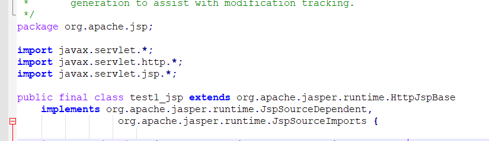
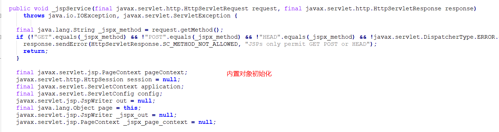
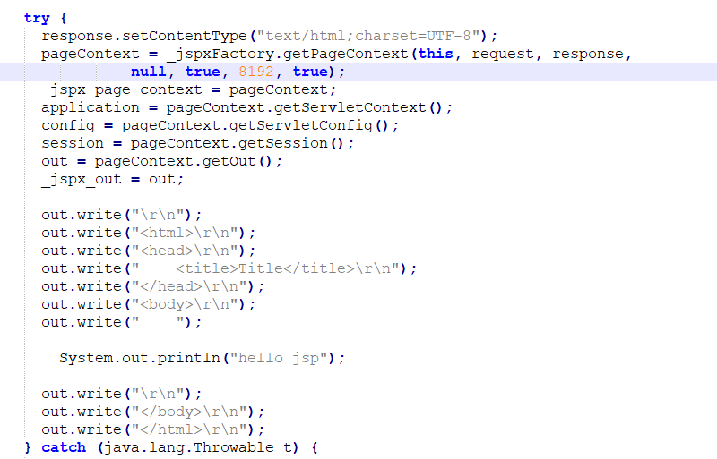

# JSP

servlet可以给请求返回响应，响应可以直接打印一个html页面，并嵌入动态内容，但是泰国繁琐，所以有了jsp

jsp类似与html的模板文件，可以编写java代码

## 创建

在webapp下创建test1.jsp，启动服务，访问jsp，路径和访问html一样，可以看到控制台的打印

在`<% %>`中编写java代码

```jsp
<%@ page contentType="text/html;charset=UTF-8" language="java" %>
<html>
<head>
    <title>Title</title>
</head>
<body>
    <%
        System.out.println("hello jsp");
    %>
</body>
</html>

```

## 本质

运行在tomcat时，当第一次访问jsp时，会被编译成java文件，本质也是servlet，

再被编译成class文件,在`tomcat/work`目录下

比如在`D:\Code\apache-tomcat-8.5.30\work\Catalina\localhost\myapp\org\apache\jsp`路径下



属于`org.apache.jsp`包，会用`_`代替`.`命名类

在对应的_jspService方法中，会完成内置对象的初始化



html内容会使用write打印，java内容会进行语法解析



## 内置对象

由编译后的jsp自动声明，可直接使用

### request

直接使用`request`获取参数,访问 <http://localhost:8080/myapp/test1.jsp?username=zs>  传入参数

```jsp
<%
    String username = request.getParameter("username");
    System.out.println(username);
%>
```

### response

几乎不用

### pageContext

代表当前页面上下文,可以获取其他内置对象

### session

HttpSession的实例，代表一次会话

### application

是ServletContext实例，代表整个应用上下文

```jsp
    <%
        String contextPath = application.getContextPath();
        System.out.println(contextPath);
    %>
```

### config

ServletConfig对象，几乎不用

```jsp
<%
    String servletName = config.getServletName();
    System.out.println(servletName);//jsp
%>
```

### out

是JspWriter的实例，可以调用write方法，打印到页面上，可以打印html代码

```jsp
    <%
        out.write("<h1>hello</h1>");
    %>
```

### page

直接指向this，是Object类型，只能用Object的方法，几乎不用

### exception

需要在页头声明为errorPage，才能使用，产生错误会跳转到该页面

```jsp
<%@ page contentType="text/html;charset=UTF-8" language="java" %>
<%@ page isErrorPage="true" %>
<html>
<head>
    <title>Title</title>
</head>
<body>
    <%
        exception.printStackTrace();
    %>
</body>
</html>
```

## 语法

### jsp表达式

用于输出java对象到页面上

使用`<%= 变量名 %>`,输出

```jsp
    <%
        String str="hello jsp";
    %>

    <%=str%>
```

### jsp代码片段

java代码写在`<% %>`中，多个代码片段可以链接嵌套，可以相互访问

访问 <http://localhost:8080/myapp/test1.jsp?age=19>  

```jsp
<body>
    <%
        Integer age = Integer.valueOf(request.getParameter("age"));
    %>

    <%
        if(age<18){
    %>
    <h1>未成年人</h1>
    <%
        }else {
    %>
    <h1>成年人</h1>
    <%
        }
    %>

</body>
```

### jsp声明

如果有方法要声明，使用`<%! %>`中，编译时会作为类成员,代码片段可以调用，不常用

```java
<body>

    <%!
        private void test(){
            System.out.println("test declare");
        }
    %>

    <% test();%>

</body>
```

### jsp注释

区别与html注释，html注释并不会影响java片段执行

```jsp
<%-- jsp注释--%>
<!--html注释-->
```

## 域对象

pageContext,request,session,application,这四个对象被称为域对象，都拥有设置属性的方法,set/getAttribute

pageContext:属性作用于当前页面

request:作用于当次请求

session:一次会话

application：整个web应用

## 重定向与转发

重定向:响应给浏览器，让浏览器访问指定地址，是客户端行为 ，浏览器地址改为重定向后的地址

```java
@Override
protected void doPost(HttpServletRequest request, HttpServletResponse response) throws ServletException, IOException {

    response.sendRedirect("index.html");
}
```

转发:通过request获取请求调度器，转发到目标地址，同时携带request和response，服务器行为，浏览器地址不会改变

```java
@Override
protected void doPost(HttpServletRequest request, HttpServletResponse response) throws ServletException, IOException {

    request.getRequestDispatcher("index.html").forward(request,response);
}
```

