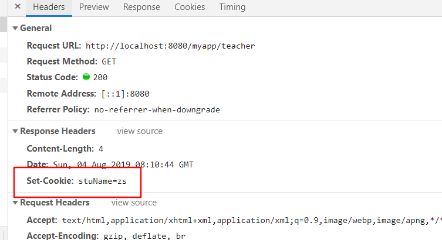
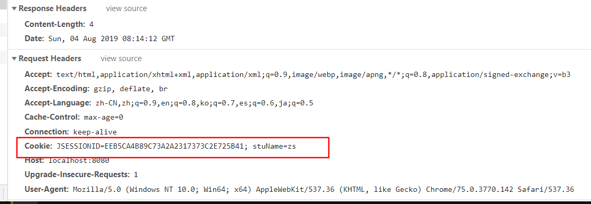

# cookie

http协议是**无状态**的协议，服务器无法识别是不是同一个浏览器

需要有额外方法去识别浏览器，去跟踪用户

当浏览器去访问服务器时，服务会在响应头中附带cookie文件，后续每次浏览器再次访问这个这个服务都在请求头中携带cookie

## 使用

通过请求获取所有cookie，因为会带一个默认cookie用于保存sessionid，所以长度要大于1

创建cookie，使用response添加

```java
 @Override
protected void doPost(HttpServletRequest request, HttpServletResponse response) throws ServletException, IOException {

    Cookie[] cookies = request.getCookies();
    if (cookies!=null && cookies.length>1){
        for (Cookie cookie : cookies) {
            System.out.println(cookie);
        }
    }else {
        System.out.println("创建cookie");
        Cookie cookie = new Cookie("stuName","zs");
        response.addCookie(cookie);
    }

    PrintWriter out = response.getWriter();
    out.println("zz");
}
```

当浏览器第一次访问服务器时,会在响应头中接收cookie，并保存

\

第二次访问服务器时，会在请求头中携带cookie



### 持久化

通过设置最大生命，来控制

默认情况下随浏览器关闭消失，设置一个持续时长，可以持久化存贮

设置为负数，不保存

为0，立即删除cookie

正数，以秒为单位保存

```java
cookie.setMaxAge(3600);
```

