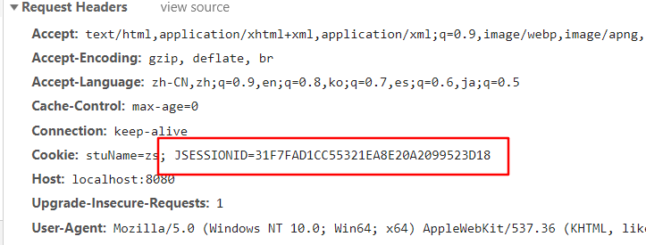

# session

session代表一次会话，浏览器打开，到关闭浏览器，称为一次会话

session是服务器端保存用户信息的方案，

当第一次请求服务器时，服务器会从cookie中获取sessionid，如果没有，则生成一个sessionid保存到cookie中，同时创建HttpSession对象的实例，一个sessioid对应一个HttpSession对象,可以保存用户信息

通过`session.getId`获取sessionid

```java
@Override
protected void doPost(HttpServletRequest request, HttpServletResponse response) throws ServletException, IOException {

    HttpSession session = request.getSession();
    String id = session.getId();
}
```



session保存在服务器的内存中，集群的话，需要解决session一致性的问题

## 路径问题

