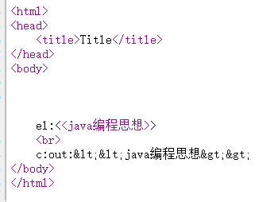
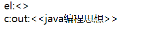

# el表达式

会从四大域对象中获取属性，语法`${}`

没有指定作用域的话，会由小到大的范围搜索，即先从page，再到request，再到session,最后时application

```jsp
<%@ page contentType="text/html;charset=UTF-8" language="java" %>
<html>
<head>
    <title>Title</title>
</head>
<body>
    ${username}
    ${pageScope.username}
    ${requestScope.username}
    ${sessionScope.username}
    ${applicationScope.username}
</body>
</html>
```

# jstl表达式

标签库包含多种，比如core,i18n,sql,xml,其中使用最多的就是core标签库

## 引入依赖

tomcat本身不提供这些依赖，不需要加provided作用域

```xml
<dependency>
    <groupId>javax.servlet</groupId>
    <artifactId>jstl</artifactId>
    <version>1.2</version>
</dependency>
```

## 导入c标签

在jsp页面开头中添加

```jsp
<%@ taglib prefix="c" uri="http://java.sun.com/jsp/jstl/core" %>
```

## 使用

### c:out

用于输出，可以自动转换特殊符号

```jsp
<%@ taglib prefix="c" uri="http://java.sun.com/jsp/jstl/core"  %>
<%@ page contentType="text/html;charset=UTF-8" language="java" %>

<html>
<head>
    <title>Title</title>
</head>
<body>

    <%
        request.setAttribute("book","<<java编程思想>>");
    %>

    el:${book}
    <br>
    c:out:<c:out value="${book}"/>
</body>
</html>

```



使用el表达式的话，特殊符号不会被转义，而使用c:out标签特殊符号可以被转义

### c:set

可以向指定域对象，设置属性，以上可以改写成

```jsp
<body>

    <c:set var="book" value="<<python入门>>" scope="request"/>

    el:${book}
    <br>
    c:out:<c:out value="${book}"/>
</body>
```

### c:if

在test属性中，输入判断表达式，结果为true，则显示标签内的内容,但是无法实现`if else`的效果

```jsp
<c:set var="age" value="17" scope="page"/>

<c:if test="${pageScope.age>18}">
    成年了
</c:if>

<c:if test="${pageScope.age<18}">
    未成年人
</c:if>
```

### c:choose

在c:choose中可使用when和otherwise,实现if else的效果

```jsp
<c:set var="age" value="33" scope="page"/>

<c:choose>
    <c:when test="${50<pageScope.age}">
        老年人
    </c:when>
    <c:when test="${30<pageScope.age}">
        中年人
    </c:when>
    <c:when test="${18<pageScope.age}">
        青年人
    </c:when>
    <c:otherwise>
        未成年人
    </c:otherwise>
</c:choose>
```

### c:foreach

通过遍历，迭代标签内的内容

```jsp
<c:forEach var="item" begin="0" end="10">
    ${item}
</c:forEach>
```

遍历对象集合

```jsp
<%
List<Student> students=new ArrayList<Student>();
students.add(new Student("1","张三"));
students.add(new Student("2","李四"));
students.add(new Student("3","王五"));
request.setAttribute("students",students);
%>

<table>
    <thead>
        <tr>
            <td>学号</td>
            <td>姓名</td>
        </tr>
    </thead>
    <tbody>
        <c:forEach var="student" items="${requestScope.students}">
            <tr>
                <td>${student.id}</td>
                <td>${student.name}</td>
            </tr>
        </c:forEach>
    </tbody>
</table>
```

### c:redirect

将直接重定向到指定页面

```jsp
<c:redirect url="index.html"/>
```

### c:import

包含一个页面

```jsp
<c:import  url="index.html"/>
```

 直接包含


