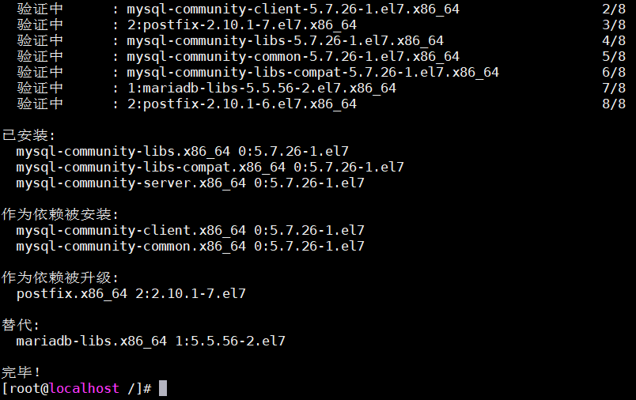
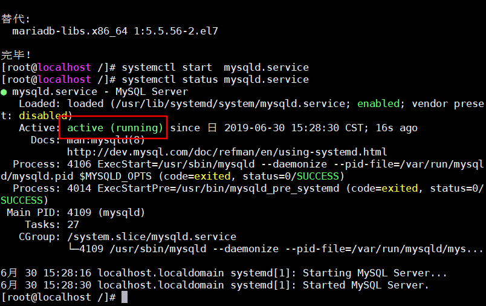
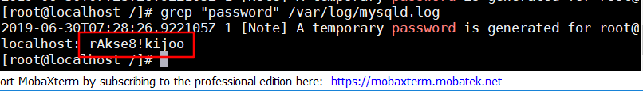
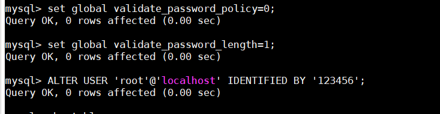
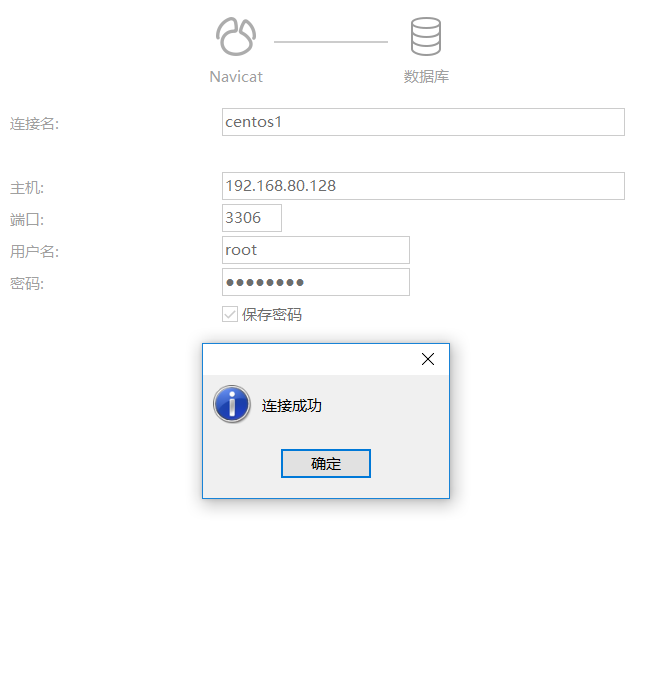

## centos7 

### mysql

在线安装

1,指定yum源

```bash
wget -i -c http://dev.mysql.com/get/mysql57-community-release-el7-10.noarch.rpm
```

2,安装依赖

```bash
yum -y install mysql57-community-release-el7-10.noarch.rpm
```

3,安装mysql服务

```bash
yum -y install mysql-community-server
```

三步执行完后,会替换掉原来的mariadb



4,启动mysql服务

```bash
systemctl start  mysqld.service
```

5,查看mysql状态

```bash
systemctl status mysqld.service
```

显示为active（running）为成功



6,得到mysql的root用户初始密码

```bash
grep "password" /var/log/mysqld.log
```



7,进入数据库,复制刚才的密码

```bash
mysql -uroot -p
```

8,修改root密码

先修改密码安全等级，之后就可以设置为简单密码

```bash
set global validate_password_policy=0;
set global validate_password_length=1;
```

然后修改密码

```bash
ALTER USER 'root'@'localhost' IDENTIFIED BY '123456';
```



exit 退出

9,移除之前的yum源，避免自动更新

```bash
yum -y remove mysql57-community-release-el7-10.noarch
```

10,开启远程访问

进入mysql

```bash
grant all privileges on *.* to 'root'@'%' identified by '123456' with grant option;
```

刷新后退出

```bash
flush privileges; 
```

11,防火墙开放端口

```bash
firewall-cmd --zone=public --add-port=3306/tcp --permanent
```

刷新

```bash
firewall-cmd --reload
```

12,然后就可以使用工具连接




