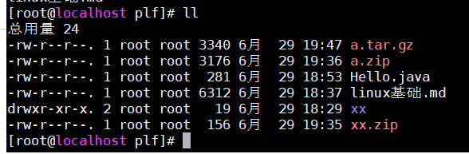

# linux

linux是一种开源免费的操作系统，创始人是linus，常用于做服务器

## 发行版本

redhat(红帽)，ubuntu(乌班图)，CentOS，debain(蝶变)，Suse

## 安装VMware

下载vmware12，安装

## 安装centos

### 创建空间

1，进入vmware主页，点击创建新的虚拟机

2，选择   典型 ，next

3，选择      稍后安装操作系统，next

4，选择     linux，选择centos64位，next

5，自定义虚拟机的名称和安装位置，next

6，选择磁盘大小20g，勾选拆分成多个磁盘文件next

7，自定义硬件不管，finish，虚拟机空间创建完成

### 网络连接说明

点击`编辑虚拟机设置`,选择网络适配器，可以看到三种虚拟机连接模式,**一般选择nat**

1,桥接模式，此虚拟机可以与其他局域网下的电脑通讯，但是虚拟机过多，容易造成ip冲突

2,Nat模式，会在windows产生另一个ip，与当前windows的ip不在同一个网段，而这个ip和虚拟机的ip处于同一个网段，

虚拟机通过网络地址转换可以访问局域网和外网，但是外面不能访问虚拟机，也不会造成ip冲突

3,仅主机模式，linux系统不能访问局域网和外网

### 安装系统

1,点击虚拟机设置，选择cd/dvd

2,使用iso镜像文件，找到centos的iso文件 ,确定

3.开启此虚拟机

4,选择install centos 7 ，选择中文，选择**GNOME桌面**，后面会比较方便设置网络，命令也多一些

5,为root根用户设置密码，再创建一个新用户,等待安装完成

## linux的目录结构

`.` 当前目录

`..` 上级目录

`/` 作为系统的根目录

`~` 作为当前用户的用户目录

`/bin` 系统的常用命令，有cp ，ls等命令

`/sbin` 高权限用户的命令

`/dev`  系统的硬件，有cpu，disk等硬件

`/etc` 存放系统配置文件

`/root` 根用户的家目录

`/home` 其他用户的家目录，每创建一个用户都会在这里面创建文件夹

`/lib` 静态库

`/media` 映射cd、dvd，u盘等

`/mnt` 临时挂载别的文件系统

`/opt` 用户安装软件的地方

`/proc` 内核

`/sys` 系统文件

`/srv` 服务service

`/boot` 系统的引导程序

`/tmp` 临时文件夹

`/var` 变量文件，通常放日志

`/usr` 用户的文件

## 命令

### 帮助

`man 命令`  : 列出帮助命令，按q退出

`help 命令` : 

`info 命令` :

### 文件与目录

pwd : 查看当前目录

ls [目录]: 列出目录内容

​	-a :包括隐藏文件

​	-l : 详细信息，可简写为 `ll`

cd  目录:切换目录

mkdir  目录名 : 创建目录

​	-p :多级目录

rmdir 目录名: 删除空目录

touch 文件名... : 创建空文件

cp 指定文件 目标目录 ： 复制文件

​	-r : 递归拷贝整个文件夹

rm : 删除文件

​	-r :递归删除

​	-f :强制删除,不提示

mv  文件名  文件名or目录：移动文件或重命名

### 查看文件

cat 文件名:  查看文件全部内容

​	-n 显示行号

tac 文件名：反向查看文件全部内容，与cat类似

more 文件名: 一页页反动，全屏显示，并分页查看，enter下一行，空格下一页

​			ctrl b 上一页，`ctrl f` 下一页 ,q 退出

less 文件名 :分页显示，懒加载，鼠标滚动浏览,q退出

​					pageDown: 向下翻页    pageUp : 向上翻页

​				/关键字 ： 向下查询这个关键字     ?关键字  ： 向上查询关键字     n  : 重复前一个查询

head 文件名: 显示文件开头部分,默认10行

​	-n 数字: 指定行数

tail 文件名: 显示文件结尾部分，默认10行

   -n 数字 ：指定行数

​	-[数字]f : 实时追踪文件更新，默认10行 ，可以指定行数  ，适用于查看日志文件

echo 内容: 输出到控制台,可以输出变量,ex:`echo $PATH`

### 查找

`find  [目录] [选项]` : 查找文件

grep 字符: 过滤查找，与管道符号 `|` 配合使用

​	-i :忽略大小写

​	-n :显示行号

### 压缩

gzip 文件名: 压缩文件 ,格式为gz ,不保留原文件

gunzip 文件名 :解压文件

zip  压缩后的文件名，格式zip, 要压缩的目录or文件 : 压缩

unzip 压缩包 :解压,

tar  : 格式 .tar.gz,通过不同的参数决定打包还是解压

​	-c  产生tar文件

​	-x 解压tar文件

​	-v 显示详情

​	-f 指定压缩后的文件名

​	-z 打包时同时压缩

ex :压缩

```bash
tar -zcvf a.tar.gz Hello.java  linux基础.md
```

解压

```bash
 tar -zxvf a.tar.gz
```


### 软连接

相当于快捷方式

`ln -s 文件or目录 链接名`  :创建软链接

### 输出重定向

`命令 > 文件名` ： 将输出覆盖到目标文件

`命令 >> 文件名` :  追加到目标文件

### 编辑

所有的linux都有vi编辑器，vim是一个vi的增强版

**一般模式**：可以使用快捷键,打开一个文档的默认模式

在一般模式通过`h左`，`j下`，`k上`，`l右`，来移动光标,因为远古时期的键盘没有方向键

`x`删除单个字符       `0`定位行首       `$` 行尾       `b`单词首字母   `e`单词尾字母 

`w`下一个单词首字母   `gg`文件的开头    `G`文件的结尾    数字+`G`跳转到第几行

d 命令可以和上面的命令配合，删除指定的内容，比如 `d0`删除到结尾

`dd`删除当前行     

配合数字可以重复命令，比如`3l` 向右移动3次

`u` 撤销最后次修改    `U`撤销整行的修改    `ctrl r` 恢复撤销

`p` 粘贴，删除的东西都会存在暂存区，通过p粘贴

`y` 复制，配合定位命令, 比如ye，拷贝当前单词

`r`替换,按下r，再按字符替换

`%`在括号上按，跳转到另一个对应的括号

`v`进入可视模式，移动光标可以选择内容

`<<` 反缩进 ，`>>`缩进  可以配合数字，如`3>>`可以把后面三行一起缩进

`/`向后搜索，输入`/abc`回车，搜索abc字符   `?`向前搜索   特殊字符用反斜杠转义`\`

**插入模式**：按`a`或`i`或`o`，进入该模式，可以输入内容,按`esc`退出

aoi的区别是进入插入模式的光标位置的区别，一般用`i`,

**命令行模式**：按`:`进入命令行模式，保存退出等命令

`wq` 保存并退出

`w 文件名`   另存为

`q!`  不保存强制退出

`nohl`  去除高亮

`!shell` 叹号加可以执行系统命令，回车回来，比如  `!ls /`显示根目录

`set number` 显示行号

### 关机 

```bash
shutdown -h now        立即关机
shutdown -h  1         1分钟后关机
shutdown -r now        立即重启
halt                   关机
reboot                 重启
logout                 注销当前用户
```

### 查看信息

history :查看执行过的命令

!数字: 执行编号为xx的命令

date :查看时间

cal : 查看日历

`cat /proc/version` : 查看内核版本

top : 查看当前机器的使用情况，cpu，内存等

### 权限

权限分为三种

r ：读 =4

w : 写 =2

x : 执行 =1

通过ll可以查看文件详情



第一个字符代表文件类型 ，- 为文件 ，d为文件夹，l为链接

然后是三组rwx权限，分别为所有者， 所在组，其他组, -表示没有权限

后面的数字，如果时文件，代表该文件的硬连接数，如果是dir，表示子目录数

接着是所属用户和用户组

接着的数字，如果是文件代表，文件大小byte。目录则为4096

后续为文件的最后修改时间

**更改权限**

使用 chmod 给用户 u 所有者，g 所在组，o 其他组，a 所有人修改权限

使用 `+ - =`的方式

`chmod u=rwx,o=rw ok.txt` 设置所有者为rwx，其他组为rw

`chmod u-x ok.txt` 给所有者减去x权限

`chmod g+w ok.txt` 给所在组增加w权限

还可以使用数字的方式

r=4 ,w=2,x=1  比如 7=4+2+1,就是全部权限

`chmod 777 ok.txt` 给文件全部赋予7的权限

### 用户管理

linux默认会有一个超级用户root，还有其他用户，用户至少属于一个用户组，root用户属于root组

每一个用户登录进来都会进入用户目录（家目录），位置为`~`

 root用户的家目录为`/root`,其他用户的家目录在`/home/用户名`下

命令操作 ：

`useradd 用户名` :添加用户

如果不指定用户组，会同时创建和用户名同名的用户组，并添加到用户组

`passwd 用户名` :设置密码

`userdel 用户名` :删除用户

​	-r 并删除家目录

`id 用户名` :查询用户

得到用户id，组id，组名称

`su - 用户名` :切换用户

高权限切换低权限不需要密码

`exit `    重新会到原来的用户

`who am i ` 查看当前用户

`groupadd 组名`  :添加用户组

`groupdel 组名 ` :删除用户组

`useradd -g 组名 用户名` :创建用户指定组

`usermod -g 组 用户名` :修改用户组

`chown  用户名 文件名` : 修改文件所有者

`chgrp 组名 文件名` : 修改文件所在组

`chown 用户名:组名 file` 同时修改所有者和所在组，加上`-R`可以时目录递归更改

### 任务调度

crontab [opts]

options:

-l :查看

-e ：编辑

使用cron表达式 加 要执行的任务命令

分钟(0-59) 小时(0-23) 天(1-31)  月(1-12) 周(0-7),可以使用`*`代表所有

-r ：删除

### 磁盘

`lsblk`：查看分区 。 -f  查看类型

`df -h`: 查看磁盘

### 网络

centos7:

`netstat -tlunp` : 查看本地监听的端口

`iptables-save` 查看防火墙开放的端口

暴露新的端口并重载

```bash
firewall-cmd --zone=public --add-port=80/tcp --permanent
firewall-cmd --reload
```

查看占用该端口的进程

`lsof -i:8082`

修改 hosts 并激活

```bash
sudo vi /etc/hosts
sudo /etc/init.d/network restart
```

`ping ip`    : 检测一个网络是否通

`telnet ip port` :检测一个主机的端口是否可用

### 进程

ps [opts] ： 查看进程

opts:

通常与grep搭配使用

`ps -ef|grep tomcat` 查看tomcat运行

`kill pid` ：停止进程。`-9`强制停止

### 服务

centos6:service 服务名  [start,stop,restart,reload,status]

centos7:systemctl   [start,stop,restart,reload,status] 服务名

例如

`systemctl status firewalld` 查看防火墙状态

`netstat -anp` 监控网络状态

### 软件包

rpm是redhat packages manager,一种安装包管理器，后被广泛应用

`rpm -ivh` 安装rpm包

`rpm -qa |grep firefox` 查询已安装的rpm

`rpm -e firefox` 删除rpm包

yum 基于rpm，可以从指定服务器上下载安装，并自动处理依赖关系

`yum list |grep jdk` 查询软件

`yum install firefox`,下载并安装，默认最新版本

