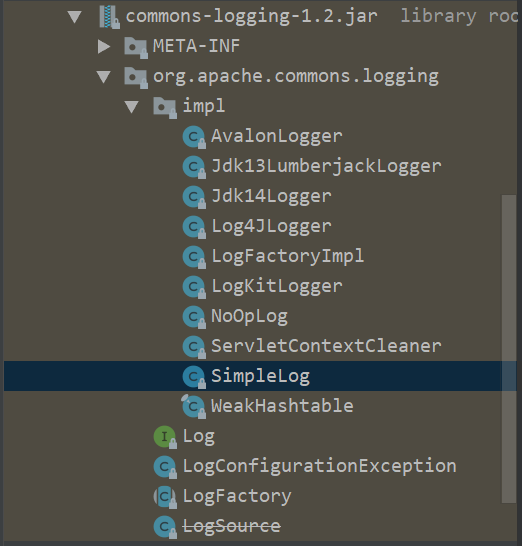

# Commons-logging

## 1,引入依赖

```xml
<dependency>
    <groupId>commons-logging</groupId>
    <artifactId>commons-logging</artifactId>
    <version>1.2</version>
</dependency>
```

## 2, 使用接口

```java
import org.junit.Test;

import org.apache.commons.logging.Log;
import org.apache.commons.logging.LogFactory;

public class JCLTest {

    private static final Log LOG= LogFactory.getLog(JCLTest.class);

    @Test
    public void test1(){
        LOG.info("jcl测试");
        LOG.error("异常",new Exception("jcl---"));
    }
}
```

## 3,原理



`org.apache.commons.logging.LogFactory`会去通过反射动态查找有没有`Log4j`相关的类，如果成功，则使用`Log4JLogger`作为默认的`Log`接口的实现，去调用`Log4j`的实现，如果没有，则去查找jul相关的类，如果是jdk1.4以下的版本，不存在jul相关的类，则使用默认的SimpleLog，打印日志到控制台

Log4j>JUL>Default