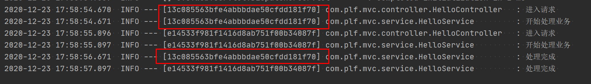

## 引入依赖

logback是slf4j的典型实现，需要与slf4j配合使用

会自动依赖实现 `logback-core` ,和接口`slf4j-api`

```xml
<dependency>
    <groupId>ch.qos.logback</groupId>
    <artifactId>logback-classic</artifactId>
    <version>1.2.3</version>
</dependency>
```

## 配置

如果不写配置文件，会使用默认配置，classpath下编写`logback.xml`

```xml
<?xml version="1.0" encoding="utf-8" ?>
<configuration>
    <appender name="STDOUT" class="ch.qos.logback.core.ConsoleAppender">
        <encoder>
            <pattern>%d{yyyy-MM-dd HH:mm:ss.SSS} %5p --- [%15.15t] %-40.40c{40} : %m %n</pattern>
        </encoder>
    </appender>

    <root level="info">
        <appender-ref ref="STDOUT"/>
    </root>
</configuration>
```

直接使用slf4j的接口

### configuration

配置文件以一个`<configuration>` 作为根节点,根节点有如下个属性

**debug** : 默认为false，设置为true可以看见logback的配置过程信息，不会影响日志等级，如果配置文件不是良好的配置文件，也会打印配置过程的日志

**scan**: 默认为false，开启扫描，默认一分钟扫描一次，自动重新加载logback配置文件

**scanPeriod**: 扫描周期, 默认单位毫秒

```xml
<?xml version="1.0" encoding="utf-8" ?>
<configuration debug="true" scan="true" scanPeriod="30 seconds">

</configuration>
```

configuration节点可以包含，n个appender元素，n个logger元素，一个root元素


### logger

logger元素有如下属性

**name** : 必选，指定logger的名称

**level** : 可选，指定日志等级，默认继承父logger

**additivity**: 可选，是否继承父logger的，默认为true

可以包含多个`appender-ref`,节点，通过ref属性指定appender

```xml
<logger name="com.plf.zoe" level="error" additivity="false">
    <appender-ref ref="STDOUT"/>
</logger>
```

### root

root节点相当于一个logger，无需指定name

### appender

属性如下

name : 设置appender的名称

class : 指定的appender类的全名

可以包含的元素

encoder : 默认为`ch.qos.logback.classic.encoder.PatternLayoutEncoder`,包含pattern节点 ,类名可省略

layout :被encoder替代了

filter :

和对应appender的bean属性 

## 变量

可以通过property节点，引用一个properties文件，使用`${key}`使用

```xml
<property resource="log_config.properties"/>

 <logger name="com.plf.zoe" level="${level}" additivity="false">
     <appender-ref ref="STDOUT"/>
</logger>
```

## Appender种类

### ConsoleAppender

可以把内容输出到控制台

```xml
<appender name="STDOUT" class="ch.qos.logback.core.ConsoleAppender">
    <encoder>
        <pattern>%d{yyyy-MM-dd HH:mm:ss:SSS} logback %m%n</pattern>
    </encoder>
</appender>
```

### FileAppender

输出到文件,需要指定file节点

```xml
<appender name="FILE" class="ch.qos.logback.core.FileAppender">
    <file>timor.log</file>
    <encoder>
        <pattern>%d{yyyy-MM-dd HH:mm:ss:SSS} logback %m%n</pattern>
    </encoder>
</appender>
```

### RollingFileAppender

这个是FileAppender的子类，代表滚动文件，当满足条件是，会改变输出的文件名称，需要同时指定的两个属性，才能正确的触发滚动

`rollingPolicy`:  滚动策略

`triggeringPolicy` : 触发策略 

```xml
<appender name="ROLL" class="ch.qos.logback.core.rolling.RollingFileAppender">
    <file>timor.log</file>
    <rollingPolicy class="ch.qos.logback.core.rolling.FixedWindowRollingPolicy">
        <fileNamePattern>timor.%i.log</fileNamePattern>
        <minIndex>1</minIndex>
        <maxIndex>3</maxIndex>
    </rollingPolicy>
    <triggeringPolicy class="ch.qos.logback.core.rolling.SizeBasedTriggeringPolicy">
        <maxFileSize>5MB</maxFileSize>
    </triggeringPolicy>
    <encoder>
        <pattern>%d{yyyy-MM-dd HH:mm:ss:SSS} logback %m%n</pattern>
    </encoder>
</appender>
```

FixedWindowRollingPolicy 会在触发时，按照index重命名原文件

SizeBasedTriggeringPolicy 会在达到文件大小限制时触发滚动

如果有一个类即实现了RollingPolicy,也实现了TriggeringPolicy,便只需要写一个

```xml
<appender name="ROLL" class="ch.qos.logback.core.rolling.RollingFileAppender">
    <file>timor.log</file>
    <rollingPolicy class="ch.qos.logback.core.rolling.TimeBasedRollingPolicy">
        <fileNamePattern>timor.%d{yyyyMMdd}.log</fileNamePattern>
        <maxHistory>10</maxHistory>
    </rollingPolicy>
    <encoder>
        <pattern>%d{yyyy-MM-dd HH:mm:ss:SSS} logback %m%n</pattern>
    </encoder>
</appender>
```

TimeBasedRollingPolicy 会安装配置的文件格式，按照时间滚动触发，必须要在格式中指点 `%d` ,maxHistory为保留多少个文件

它还有一个子类SizeAndTimeBasedRollingPolicy，增加文件大小的限制,表达式需要增加 `%i `

```xml
<appender name="ROLL" class="ch.qos.logback.core.rolling.RollingFileAppender">
    <file>timor.log</file>
    <rollingPolicy class="ch.qos.logback.core.rolling.SizeAndTimeBasedRollingPolicy">
        <fileNamePattern>timor.%d{yyyyMMdd}.%i.log</fileNamePattern>
        <maxFileSize>10MB</maxFileSize>
        <maxHistory>10</maxHistory>
    </rollingPolicy>
    <encoder>
        <pattern>%d{yyyy-MM-dd HH:mm:ss:SSS} logback %m%n</pattern>
    </encoder>
</appender>
```

## pattern

使用`%通配符`,来指定格式

| 符号       | 含义                            | 可替换为     |
| ---------- | ------------------------------- | ------------ |
| c{length}  | logger名称,可以指定一个限制长度 | lo , logger  |
| d{pattern} | 时间                            | date         |
| m          | 消息主体                        | msg ,message |
| n          | 换行                            |              |
| p          | 日志等级                        | le,level     |
| t          | 线程名                          | thread       |

格式

`-` 左对齐

`.num` 设置最大长度,超出会被截断

`num` 最小长度 ,不够使用空格填充

比如 `%-5p` ,设置日志等级为左对齐，最小5个长度

`%-40.40c{40}`  第一个`-40`表示最小长度不够使用空格填充，前面带`-`表示左对齐，第二个`.40` 表示最大长度超过会被截断，c 为logger名称，`{40}` 为缩写logger名称使其小于指定长度，但是类名始终都会全显示，包名至少一个字符

# MDC

通常在我们的web系统中，都是多线程的，不同线程的日志会交错打印在一起


可以根据线程名称判断，但是线程数量本身有限，简易的做法是从请求进入后设置一个唯一的key来标识这次请求，每条日志都打印这个key，但是参数传递等问题不优雅。

MDC 全称 Mapped Diagnostic Context ，映射诊断环境，类似于一个map，用户可以把相关信息都放入这里面，MDC是基于线程隔离的，子线程默认会继承父线程的MDC。

常见场景，追踪一个请求

进入请求的是，在MDC中设置一个id，来标识这个请求

```java
@GetMapping("hello")
public String hello(){
    String requestId = UUID.randomUUID().toString().replace("-", "");
    MDC.put("requestId", requestId);
    log.info("进入请求");
    return helloService.hello("张三");
}
```

在后续的该线程下的所有调用都会有有这个参数

使用 `%X{}`打印这个值，如 `%X{requestId}`

```xml
<appender name="STDOUT" class="ch.qos.logback.core.ConsoleAppender">
    <encoder>
        <pattern>%d %5p --- [%X{requestId}] %-40.40c{40} : %m %n</pattern>
    </encoder>
</appender>
```

在后续的日志中，可以使用这个唯一的请求来标识这个请求



在查看日志的时候 ，直接 grep 这个 唯一的标识id，就可以知道整个http请求的调用情况。

更优雅的做法是在filter或者 interceptor 实现，还可以打印更多的参数，如userId，url等
