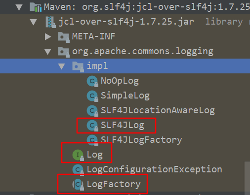

# 日志框架迁移

需求分析

1，当有下面这段代码，已经使用了某种日志实现，由于性能或功能的问题，想要切换日志框架，但是日志类的调用几乎存在于每一个类中，改动起来是个巨大的工作量

2，当使用第三方包的时候，第三方包使用的日志框架和当前项目不一致，比如spring使用commons-logging,如果想要管理所有的三方包的日志打印，需要每个日志框架都写一份配置文件

```java
import org.junit.Test;

import org.apache.log4j.Logger;

public class Log4jTest {

    private static final Logger LOG = Logger.getLogger(Log4jTest.class);

    @Test
    public void test1(){
        LOG.info("log4j测试");
        LOG.error("异常",new Exception("文件不存在"));
    }
}
```

迁移思路，通过各种桥接包，转发到slf4j，由slf4j调用想要的日志实现，先添加`slf4j-api`依赖

## log4j

```xml
<!--        <dependency>-->
<!--            <groupId>log4j</groupId>-->
<!--            <artifactId>log4j</artifactId>-->
<!--            <version>1.2.17</version>-->
<!--        </dependency>-->
<dependency>
    <groupId>org.slf4j</groupId>
    <artifactId>log4j-over-slf4j</artifactId>
    <version>1.7.25</version>
</dependency>
```

先排除掉`log4j`,添加桥接包

## jul

```xml
<dependency>
    <groupId>org.slf4j</groupId>
    <artifactId>jul-to-slf4j</artifactId>
    <version>1.7.25</version>
</dependency>
```

由于jul是jdk自带的，我们没有办法移除，使用转接包，安装handler，转发到slf4j

```java
public class JULTest {

    static {
        SLF4JBridgeHandler.removeHandlersForRootLogger();
        SLF4JBridgeHandler.install();
    }

    @Test
    public void test1(){

        Logger LOG = Logger.getLogger("com.plf.zoe.test.JULTest");
        LOG.log(Level.INFO,"jul测试");
        LOG.log(Level.WARNING,"异常",new Exception("jul---"));
    }
}
```

在程序初始化，使用`SLF4JBridgeHandler`的两个方法，接管jul的handler

## jcl

```xml
<!--        <dependency>-->
<!--            <groupId>commons-logging</groupId>-->
<!--            <artifactId>commons-logging</artifactId>-->
<!--            <version>1.2</version>-->
<!--        </dependency>-->
<dependency>
    <groupId>org.slf4j</groupId>
    <artifactId>jcl-over-slf4j</artifactId>
    <version>1.7.25</version>
</dependency>
```

移除原本的jcl，使用桥接包

## log4j2

```xml
<dependency>
    <groupId>org.apache.logging.log4j</groupId>
    <artifactId>log4j-to-slf4j</artifactId>
    <version>2.11.2</version>
</dependency>
```

加入桥接包

# 实现原理

## xxx-over-slf4j

可以看到包结构如下



包里面提供的接口和原来一致，替换掉原来的包，原来的程序代码不会报错，但是实现被覆盖了，转发到了slf4j

这种模式需要移除原来的包

## xxx-to-slf4j

由于某些原因不能移除包，比如jul，则需要用相对应的模式来转发到slf4j

# 总结

| 日志框架 | 桥接包                                  | 绑定包                                    |
| -------- | --------------------------------------- | ----------------------------------------- |
| log4j    | org.slf4j:log4j-over-slf4j              | org.slf4j:slf4j-log4j12                   |
| jul      | org.slf4j:jul-to-slf4j                  | org.slf4j:slf4j-jdk14                     |
| jcl      | org.slf4j:jcl-over-slf4j                | org.slf4j:slf4j-jcl                       |
| log4j2   | org.apache.logging.log4j:log4j-to-slf4j | org.apache.logging.log4j:log4j-slf4j-impl |

桥接包是将原本的api转发到slf4j，绑定包是slf4j去调用对应的实现

同一个日志框架，不能同时存在这两种包，会造成死循环

有的第三方包依赖了这些包，记得排除

## spring-jcl

在spring4之前的版本，都依赖的commons-logging,在spring5的版本，使用的改造后的`spring-jcl`，改造后的这个类会优先使用log4j2转发到slf4j的模式，然后log4j2,然后slf4j，最后jul