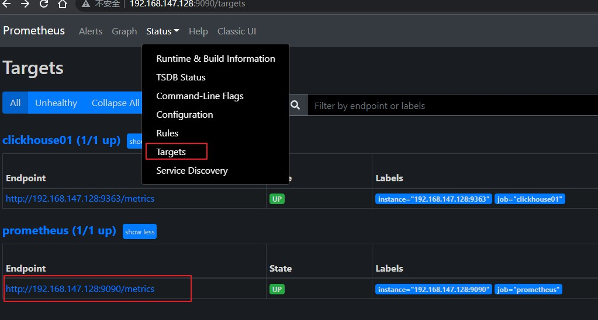

# 概述


# 部署prometheus

https://prometheus.io/

下载并解压 `prometheus-*.tar.gz` 

```yml
# my global config
# 这边是全局配置
global:
  # 抓取周期和评估周期，设置为15s，默认为1分钟
  scrape_interval: 15s # Set the scrape interval to every 15 seconds. Default is every 1 minute.
  evaluation_interval: 15s # Evaluate rules every 15 seconds. The default is every 1 minute.
  # scrape_timeout is set to the global default (10s).

# Alertmanager configuration
# 告警相关的配置，可以部署一个组件 alertmanager ，来关联告警
alerting:
  alertmanagers:
    - static_configs:
        - targets:
          # - alertmanager:9093

# Load rules once and periodically evaluate them according to the global 'evaluation_interval'.
# 加载外部规则文件
rule_files:
  # - "first_rules.yml"
  # - "second_rules.yml"

# A scrape configuration containing exactly one endpoint to scrape:
# Here it's Prometheus itself.
# 拉取指标的配置，默认监控prometheus本身
scrape_configs:
  # The job name is added as a label `job=<job_name>` to any timeseries scraped from this config.
  - job_name: "prometheus"

    # metrics_path defaults to '/metrics'
    # scheme defaults to 'http'.
    # 默认的路径为 /metrics ，协议为 http, 比如下面的指标地址为 http://192.x.x.x:9090/metrics
    static_configs:
      - targets: ["192.x.x.x:9090"]

```

编辑配置文件 prometheus.yml，配置一个job，或者修改默认的job，默认的job监听的就是prometheus本身，注意严格控制缩进格式

```yml
- job_name: "prometheus"
    static_configs:
      - targets: ["192.x.x.x:9090"]
```

直接启动

```bash
./prometheus --config.file=prometheus.yml
```

 或者 后台启动，并暴露 9090 端口

加上 `--web.enable-lifecycle` 参数开启允许通过http接口来控制生命周期，调用接口即可重启，关闭等。

```bash
nohup ./prometheus --config.file=prometheus.yml --web.enable-lifecycle > ./prometheus.log 2>&1 &
```

访问 `http://localhost:9090/` 验证，即可查看我们启动的prometheus界面，及监控的prometheus本身的指标



# 重启

开启 `--web.enable-lifecycle` 后，可以通过调用接口来重启服务，关闭服务。不用去杀进程那种操作了。

```bash
# 重启
curl -X POST http://localhost:9090/-/reload

# 关闭
curl -X POST http://localhost:9090/-/quit
```

