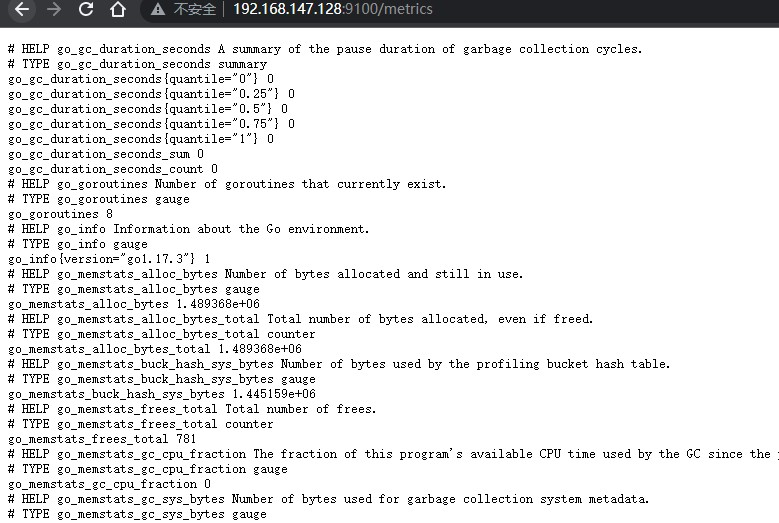
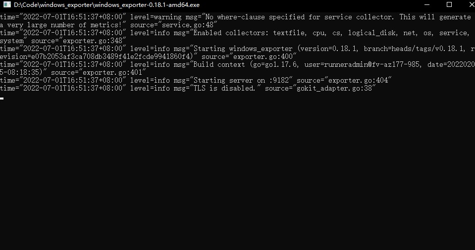

# 概述

之前我们是监控的prometheus本身，如果我们要监控其他服务的指标，如当前主机，mysql，redis 等，就需要exporter去采集数据，暴露一个 `/metrics` 接口，提供给prometheus拉取指标。

常用exporter

* 中间件  

redis  https://github.com/oliver006/redis_exporter

kafka https://github.com/danielqsj/kafka_exporter

* 数据库

mysql https://github.com/prometheus/mysqld_exporter

sqlserver https://github.com/awaragi/prometheus-mssql-exporter 
(只支持2017,2019)

mongodb https://github.com/percona/mongodb_exporter

elasticsearch https://github.com/prometheus-community/elasticsearch_exporter

influxdb https://github.com/prometheus/influxdb_exporter

* 进程服务

jvm https://github.com/prometheus/jmx_exporter

springboot  https://docs.spring.io/spring-boot/docs/current/reference/html/actuator.html#actuator.metrics.export.prometheus

tomcat https://github.com/prometheus/jmx_exporter

nginx https://github.com/nginxinc/nginx-prometheus-exporter


* 系统 

linux https://github.com/prometheus/node_exporter

window https://github.com/prometheus-community/windows_exporter

# node_exporter

我们拿官方的主机监控的 node_exporter 来安装，用来监控一台主机的指标，如内存，cpu等数据

进入官方下载页面，https://prometheus.io/download/  下载 node_exporter

解压后直接启动

```bash
# 直接启动
./node_exporter

# 后台启动
nohup ./node_exporter > ./node_exporter.log 2>&1 &

# 指定端口，指定采集文件
nohup ./node_exporter --web.listen-address=":9100"  --collector.textfile.directory=./cus_textfile  > ./node_exporter.log 2>&1 &
```

默认端口为 9100 ，访问 `http://192.x.x.x:9100/metrics` 即可查看指标



如果想在 prometheus 监控，则关联配置，配置一个job即可

```yml
  - job_name: "nodes"
    static_configs:
      - targets: ["192.168.147.128:9100"]
```

重启 prometheus ，记得开启 `--web.enable-lifecycle` 

```bash
POST http://192.x.x.x:9090/-/reload
```

即可看见页面新增的target

## 自定义指标

当给到的指标不满足需求时，可以指定node_exporter 读取一个目录下指定格式的指标数据，格式为 `指标名{标签} 值`，文件的后缀为prom

ex：

添加脚本os_thread

```bash
#!/bin/bash
echo os_thread_total `ps -eo nlwp | tail -n +2 | awk '{ num_threads += $1 } END { print num_threads }'`
```

添加cron任务

```bash
crontab -e
```

每分钟执行下该脚本，并把结果输出到 *.prom

```bash
* * * * * sh /path/cus_textfile/os_thread > /path/cus_textfile/os_thread.prom
```

这样我们就会得到一个文件 os_thread.prom，每分钟刷新

```
os_thread_total 330
```

重新启动，指定 `--collector.textfile.directory` 目录，会自动读取该目录下的 .prom 文件

```bash
nohup ./node_exporter --collector.textfile.directory=./cus_textfile  > ./node_exporter.log 2>&1 &
```

这样就能输出 自定义的指标 os_thread_total

## 常用指标算法

```
cpu使用率:(1-(sum by(instance) (increase(node_cpu_seconds_total{mode='idle'}[1m]))) / (sum by(instance) (increase(node_cpu_seconds_total[1m]))))*100
内存使用率: (1-(node_memory_MemFree_bytes+node_memory_Cached_bytes+node_memory_Buffers_bytes)/node_memory_MemTotal_bytes)*100
总物理内存：node_memory_MemTotal_bytes/(1024*1024*1024)
已用物理内存：(node_memory_MemTotal_bytes-node_memory_MemFree_bytes-node_memory_Buffers_bytes-node_memory_Cached_bytes)/(1024*1024*1024)
已用虚拟内存：(node_memory_SwapTotal_bytes - node_memory_SwapFree_bytes - node_memory_SwapCached_bytes )/(1024*1024*1024)
磁盘使用率: (1-sum by(instance)(node_filesystem_free_bytes) / sum by(instance)(node_filesystem_size_bytes)) * 100
总磁盘可用：sum by(instance)(node_filesystem_free_bytes) / (1024*1024*1024)
分磁盘可用：sum by (instance,mountpoint)(node_filesystem_free_bytes) / (1024*1024*1024)
inode使用占比：(1-sum by (device,instance)(node_filesystem_avail_bytes) / sum by (device,instance)(node_filesystem_size_bytes)) * 100
文件句柄数：node_filefd_allocated
进程数：node_procs_running 
总线程数(自定义配置)：os_thread_total
开机天数（分钟）：(time()-node_boot_time_seconds) / 60
```

# windows_exporter

下载好对应的 exe，直接运行即可



浏览器打开 地址验证，默认端口为 9182， http://localhost:9182/metrics

默认情况会读取当前目录下的 textfile_inputs 目录下的 .prom 文件，作为自定义指标，每行结尾要有个换行 `\n`

如果没配客户端总是会报错提示没读到文件。

```
my_metric 123

```

## 常用指标算法

```
windows指标

cpu使用率: (1-(sum by (instance)(increase(windows_cpu_time_total{mode="idle"}[1m])))/(sum by (instance)(increase(windows_cpu_time_total[1m]))))* 100
内存使用率: (1-windows_os_physical_memory_free_bytes/windows_cs_physical_memory_bytes)*100
总物理内存：windows_cs_physical_memory_bytes / (1024*1024*1024)
已用物理内存：(windows_cs_physical_memory_bytes-windows_os_physical_memory_free_bytes)/(1024*1024*1024)
已用虚拟内存：(windows_os_virtual_memory_bytes -windows_os_virtual_memory_free_bytes )/(1024*1024*1024)
磁盘使用率: (1-sum by(instance)(windows_logical_disk_free_bytes) / sum by(instance)(windows_logical_disk_size_bytes)) * 100
总磁盘可用：sum by(instance)(windows_logical_disk_free_bytes) / (1024*1024*1024)
分磁盘可用：sum by (instance,volume)(windows_logical_disk_free_bytes)/ (1024*1024*1024)
文件句柄数：process_open_fds{job="windows"}
进程数：windows_os_processes 
总线程数：windows_system_threads 
开机天数（分钟）：(time()-windows_system_system_up_time ) / 60
```


# redis_exporter

## 监控本机redis

直接运行即可，默认端口为9121

```bash
nohup ./redis_exporter > ./redis_ex.log 2>&1 &
```

prometheus对应配置

```yaml
- job_name: redis
  static_configs:
  - targets:
    - x.x.x.x:9121
```

## 多端远程监控

exporter可以独立启动，可以通过 scrape 接口 ，通过 target 参数指定redis的地址

例如 可以 访问 `http://192.169.x.x:9121/scrape?target=192.169.x.x:8116` 就能抓取到指标

9121是exporter的端口地址，target 是 redis 实例的端口地址

我们在 prometheus.yml 中配置，如下即可进行多端抓取

```yaml
- job_name: redis-exporter-multi
  static_configs:
  - targets:
    - 192.169.x.x:8111
    - 192.169.x.x:8112
    - 192.169.x.x:8113
  metrics_path: /scrape
  relabel_configs:
   - source_labels: [__address__]
     target_label: __param_target
   - source_labels: [__param_target]
     target_label: instance
   - target_label: __address__
     replacement: 192.169.x.x:9121
```

> 有关 relabel_configs 的用法，详见 https://prometheus.io/docs/prometheus/latest/configuration/configuration/#relabel_config


## 原理

原理其实是连接上redis，调用 info 命令，查询redis暴露的指标，每项指标内容具体看 `https://redis.io/commands/info/`

```
> info
# Server
redis_version:7.0.2
redis_git_sha1:00000000
redis_git_dirty:0
redis_build_id:cc731c3737d471b4
redis_mode:standalone
os:Linux 3.10.0-1160.el7.x86_64 x86_64
arch_bits:64
monotonic_clock:POSIX clock_gettime
multiplexing_api:epoll
atomicvar_api:atomic-builtin
...
```

## 常用算法

```
启动时长(分钟)： redis_uptime_in_seconds/ 60 
已用内存(MB)：redis_memory_used_bytes / (1024*1024)
10分钟内所有命令执行数(注：会有其他系统命令，如ping)：increase(redis_commands_processed_total[10m])
10分钟内set命令执行数: increase(redis_commands_total{cmd='set'}[10m])
10分钟内get命令执行数:  increase(redis_commands_total{cmd='get'}[10m])
平均输入字节数(byte)：rate(redis_net_input_bytes_total[5m])
平均输出字节数(byte)(注：由于每次抓取监控信息会调用info命令)：rate(redis_net_output_bytes_total[5m])
redis实例key的总数：sum by (instance)(redis_db_keys)
过期key数量：sum by (instance)(redis_expired_keys_total)
未过期的key数量: sum by (instance)(redis_db_keys) - sum by (instance)(redis_expired_keys_total)
10分钟内执行最多10个命令：topk(10, increase(redis_commands_total[10m]))
慢命令:topk(5, redis_commands_duration_seconds_total)
```


# jvm

使用 jmx-exporter 来监控，使用方式为，启动时通过 javaagent 的形式 

配置 jmx-config.yml ，我们这里配置使用小写风格，prometheus是大小写敏感的，而指标通常都是小写。

```yaml
lowercaseOutputLabelNames: true
lowercaseOutputName: true
rules:
- pattern: ".*"
```

把jmx-config.yml 和 jmx_prometheus_javaagent-x.jar 和 程序放在一起， 启动对应的 jar 包程序，参数指定好exporter的端口

```bash
java -jar -javaagent:./jmx_prometheus_javaagent-0.17.0.jar=9001:jmx-config.yml prom-demo.jar
```

访问 `http://localhost:9001/metrics` 即可访问指标页面 

## 原理

原理为，通过 javaagent技术， 相当于做了个程序级的代理，通过 java.lang.management 获取对应指标

```java
import java.lang.management.GarbageCollectorMXBean;
import java.lang.management.ManagementFactory;
import java.lang.management.MemoryMXBean;
import java.lang.management.MemoryUsage;
import java.lang.management.OperatingSystemMXBean;
import java.lang.management.ThreadMXBean;

// 系统，线程，gc
OperatingSystemMXBean operatingSystemMXBean = ManagementFactory.getOperatingSystemMXBean();
ThreadMXBean threadMXBean = ManagementFactory.getThreadMXBean();
List<GarbageCollectorMXBean> garbageCollectorMXBeans = ManagementFactory.getGarbageCollectorMXBeans();
// 内存相关,获取堆内存使用量
MemoryMXBean memoryMXBean = ManagementFactory.getMemoryMXBean();
MemoryUsage heapMemoryUsage = memoryMXBean.getHeapMemoryUsage();
long heapMemoryUsageUsed = heapMemoryUsage.getUsed();
```

## 常用指标

```
jvm指标

应用运行时长(小时): java_lang_runtime_uptime / (1000*60*60)
上次启动时间（时间戳，）：java_lang_runtime_starttime
该进程cpu占有率（%）    : avg_over_time(java_lang_operatingsystem_processcpuload[1m]) * 100
所在系统的cpu占有率（%）：avg_over_time(java_lang_operatingsystem_systemcpuload [1m]) * 100
可用cpu的核心数（个）：java_lang_operatingsystem_availableprocessors 
使用内存（MB）：sum by (instance)(java_lang_memorypool_usage_used) / (1024*1024)
已提交内存（MB）：sum by (instance)(java_lang_memorypool_usage_committed) / (1024*1024)
每分钟gc次数（次）：sum by (instance)(increase(java_lang_garbagecollector_collectioncount[1m]))
每分钟gc消耗的时间（毫秒）：sum by (instance) (increase(java_lang_garbagecollector_collectiontime[1m]))
线程数（个）：java_lang_threading_threadcount 
守护线程数（个）：java_lang_threading_daemonthreadcount
类加载数（个）：java_lang_classloading_loadedclasscount 
```


# tomcat

tomcat同样是用 jmx-exporter ，但是需要额外的一些配置

参考 `https://github.com/prometheus/jmx_exporter/blob/master/example_configs/tomcat.yml`

```yaml
lowercaseOutputLabelNames: true
lowercaseOutputName: true
rules:
- pattern: 'Catalina<type=GlobalRequestProcessor, name=\"(\w+-\w+)-(\d+)\"><>(\w+):'
  name: tomcat_$3_total
  labels:
    port: "$2"
    protocol: "$1"
  help: Tomcat global $3
  type: COUNTER
- pattern: 'Catalina<j2eeType=Servlet, WebModule=//([-a-zA-Z0-9+&@#/%?=~_|!:.,;]*[-a-zA-Z0-9+&@#/%=~_|]), name=([-a-zA-Z0-9+/$%~_-|!.]*), J2EEApplication=none, J2EEServer=none><>(requestCount|maxTime|processingTime|errorCount):'
  name: tomcat_servlet_$3_total
  labels:
    module: "$1"
    servlet: "$2"
  help: Tomcat servlet $3 total
  type: COUNTER
- pattern: 'Catalina<type=ThreadPool, name="(\w+-\w+)-(\d+)"><>(currentThreadCount|currentThreadsBusy|keepAliveCount|pollerThreadCount|connectionCount):'
  name: tomcat_threadpool_$3
  labels:
    port: "$2"
    protocol: "$1"
  help: Tomcat threadpool $3
  type: GAUGE
- pattern: 'Catalina<type=Manager, host=([-a-zA-Z0-9+&@#/%?=~_|!:.,;]*[-a-zA-Z0-9+&@#/%=~_|]), context=([-a-zA-Z0-9+/$%~_-|!.]*)><>(processingTime|sessionCounter|rejectedSessions|expiredSessions):'
  name: tomcat_session_$3_total
  labels:
    context: "$2"
    host: "$1"
  help: Tomcat session $3 total
  type: COUNTER
- pattern: ".*"  #让所有的jmx metrics全部暴露出来
```

创建 tomcat-jmx.yml 内容如上

在 tomat/bin 目录下 ， 编辑文件  `vim setenv.sh`

```sh
CATALINA_OPTS="-javaagent:./jmx_prometheus_javaagent-0.17.0.jar=9078:./tomcat-jmx.yml"
```

>  注：网上很多这一步，直接设置的JAVA_OPTS ，虽然也能带上参数，但是执行`shutdown.sh` 也会带上，会导致关进程时候，会再次执行jmx-exporter，然后会报一个端口占用的错误，虽然还是会关掉，但是会导致一些指标异常，如 java_lang_runtime_uptime 启动时间不会刷新。仔细看了 catalina.sh 的文档注释后，官方建议 不要直接修改这个脚本，而是使用 setenv.sh 去添加变量，CATALINA_OPTS 是启动时相关命令参数，而 JAVA_OPTS 无论什么命令都会加。所以我们这里用 CATALINA_OPTS

然后我们把 jmx_prometheus_javaagent-xxx.jar 和 tomcat-jmx.yml 都复制到 tomcat/bin 目录下，启动 ./startup.sh 即可

## 常用指标

```
tomcat指标
(注:jsp视作一个servlet，模块包含默认docs,example,host-manager等，同时包含了jvm相关指标)
端口: catalina_connector_port
初始化加载servlet耗时：sum by (instance)(catalina_servlet_loadtime)
各模块servlet执行次数（次）：sum by (instance,module)(tomcat_servlet_processingtime_total)
servlet数量； count by (instance)(catalina_servlet_available)
输出总字节数（kb）：tomcat_bytessent_total / 1024
接收总字节数（kb）：tomcat_bytesreceived_total / 1024
一分钟内输出字节数(kb)：increase(tomcat_bytessent_total[1m]) /1024
一分钟内接收字节数(kb)：increase(tomcat_bytesreceived_total[1m]) /1024
请求总数（次）:tomcat_requestcount_total
错误总数(次):tomcat_errorcount_total
一分钟内的请求数（次）:increase(tomcat_requestcount_total[1m])
一分钟内的错误数（次）:increase(tomcat_errorcount_total[1m])
一小时内每次请求平均处理时长排行(毫秒)：topk(5,increase(tomcat_servlet_processingtime_total[1h])/increase(tomcat_servlet_requestcount_total[1h]))
一分钟内请求次数最多的servlet排行(次):topk(5,increase(tomcat_servlet_requestcount_total[1m]))
一分钟内请求次数最多的servlet排行(次):topk(5,increase(tomcat_servlet_errorcount_total[1m]))
每分钟新增的session数（个）:sum by (instance)(increase(tomcat_session_sessioncounter_total[1m]))
当前存活sessions数（个）：sum by (instance)(tomcat_session_sessioncounter_total-tomcat_session_expiredsessions_total)
```


# nginx

1，安装 nginx 的 stub_status 模块， 默认是不安装的，进入安装时解压后的nginx 目录

```bash
./configure --with-http_stub_status_module
make && make install
```

然后进入 /usr/local/nginx  ,  先  `./sbin/nginx -s stop` 停掉服务

编辑 conf/nginx.conf ， 在要监控的 server 块下，添加一个 location 配置

```
        location = /basic_status {
           stub_status;
        }
```

再启动nginx，一定要先停掉，只reload是不生效的，访问 http://localhost/basic_status ，即可看见指标

2, 安装 nginx-prometheus-exporter , 下载后解压，进入目录，直接后台启动，参数指定要抓取的原生指标路径即可

```bash
nohup ./nginx-prometheus-exporter -nginx.scrape-uri=http://localhost/basic_status >ex.log 2>&1 &
```

默认暴露端口为 9113 , 访问 ` http://192.168.x.x:9113/metrics` 即可看见 prometheus 格式的指标

3, 配置 promthues 的 任务

```yaml
- job_name: nginx
  static_configs:
  - targets:
    - 192.168.x.x:9113
```

4, 如果使用 grafana 的话，可以导入 模板  `https://github.com/nginxinc/nginx-prometheus-exporter/blob/main/grafana/README.md`

## 常用指标

指标有点少

```
nginx指标
是否启动（1启动，0关闭）：nginx_up
5分钟内新增的接受连接数（个）：increase(nginx_connections_accepted[5m])
5分钟内新增的处理连接数（个）：increase(nginx_connections_handled[5m])
当前存活的连接数（个）：nginx_connections_active
正在读取请求头的连接数（个）：nginx_connections_reading
正在输出响应的连接数（个）：nginx_connections_writing
正在等待请求的连接数（个）：nginx_connections_waiting
请求总数（次）：nginx_http_requests_total
每分钟请求数（次）：increase(nginx_http_requests_total[1m])
```


# kafka

解压 tar 包后 ， 直接运行命令，指定好kafka 服务的地址（可以指定多个），及kafka的版本（完整的版本号，注意不是scala版本）即可。

```bash
./kafka_exporter --kafka.version=0.11.0.0  --kafka.server=192.169.0.238:9092 --kafka.server=192.169.0.238:9093 
```

默认端口为 9308 ，访问 `http://localhost:9308/metrics`  查看指标即可

官方推荐的 grafana 面板为 https://grafana.com/grafana/dashboards/7589

## 常用指标


# mysql

> 支持的mysql版本 >= 5.6 ，小于该版本，某些指标不支持

下载解压 tar 包

进入解压后的新建配置文件 my.cnf

```
[client]
host=192.169.x.x
user=xxxx
password=xxxx
```

> 用于监控的账号，需要高等级的权限，能够访问系统表如 information_schema，才能查指标

启动exporter 

```bash
./mysqld_exporter --config.my-cnf=./my.cnf
```

默认端口为 9104 ， 访问 http://localhost:9104/metrics 即可查看指标

## 常用指标


# MongoDB

下载解压后，直接指定地址运行，注意mongo账号需要高等级权限

```bash
./mongodb_exporter --mongodb.uri=mongodb://192.169.x.x:17001 --collect-all
```

默认端口为 9216 ，访问 http://localhost:9216/metrics 查看指标

