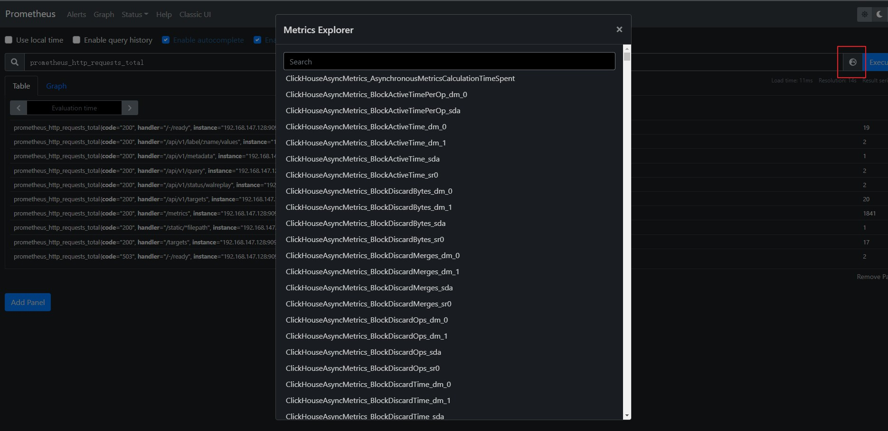
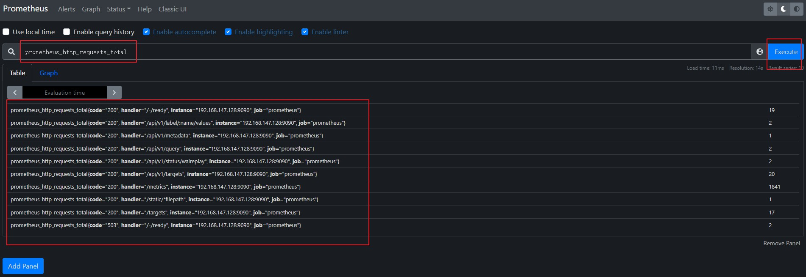
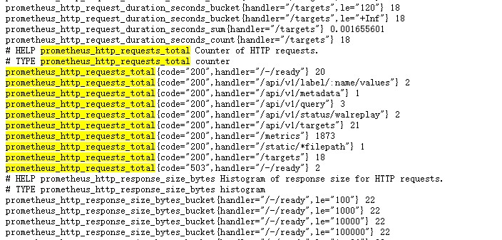
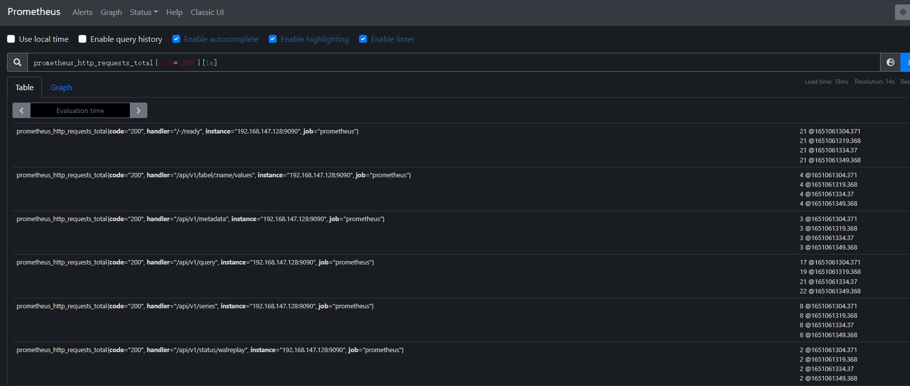

# 概述

prometheus自己有一套查询语言,合法的PromQL至少包含一个指标或者一个过滤器

# 语法

主面板上，点击execute 旁边的小地球，即可浏览所有的指标



## 单指标查询

选择对应的指标名称，如 `prometheus_http_requests_total` 为prometheus的http请求总数，执行即可



可以看到查询的指标，及参数，数据的来源是通过 /metrics 接口获取



## 筛选

可以通过过滤器 `{}` 指定指标的参数，进行过滤

```bash
prometheus_http_requests_total{handler='/api/v1/targets'}
# 反之可以使用 != 进行排除
prometheus_http_requests_total{handler!='/api/v1/series'}
```

还可以匹配正则表达式，使用 `=~` 符合

```bash
prometheus_http_requests_total{code=~'200'}
# 反之可以使用 !~ 进行排除
prometheus_http_requests_total{code!~'200'}
```

可以通过 `__name__ `来指定指标名称查询

```bash
{__name__='prometheus_http_requests_total'}
```

## 范围查询

默认情况会返回最新的一次的数据，是瞬时向量表达式

可以按照时间范围查询，是区间向量表达式

通过 时间范围选择器 `[]` 定义，如下面选取1分钟内的数据

```bash
prometheus_http_requests_total{code='200'}[1m]
```

后续的数据会有时间戳



## 时间位移

可以拿到之前时间点的数据，通过 offset 关键字指定

如拿到10分钟前的数据

```bash
prometheus_http_requests_total{} offset 10m
```

## 聚合操作

可以通过 sum() 方法进行聚合

```bash
sum(prometheus_http_requests_total{code='200'})
```


# rule配置

