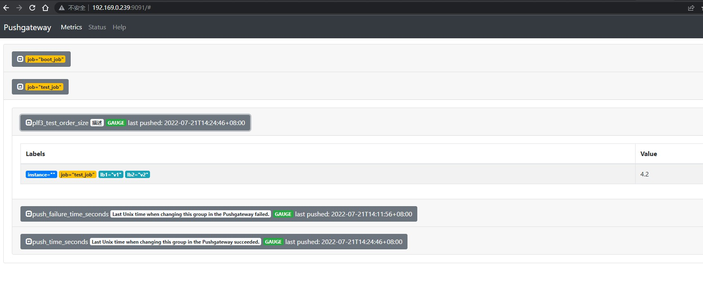

# 概述

pushgateway 可以作为一个指标的中转站，提供给prometheus抓取

# 部署

下载解压后，直接启动即可

```bash
./pushgateway
```

默认端口为 9091 ，访问 http://localhost:9091/ 即可进入ui界面 ，访问 http://localhost:9091/metrics 即可查看指标

设置prometheus抓取 pushgaeway

```yaml
- job_name: pushgateway
  static_configs:
  - targets:
    - 192.169.x.x:9091
```

# java推送数据

引入pushgateway

```xml
<dependency>
    <groupId>io.prometheus</groupId>
    <artifactId>simpleclient_pushgateway</artifactId>
    <version>0.16.0</version>
</dependency>
```

推送默认 registry 下的所有指标

```java
import io.prometheus.client.exporter.PushGateway;

PushGateway pushGateway = new PushGateway("192.169.0.239:9091");
pushGateway.pushAdd(CollectorRegistry.defaultRegistry,"test_job");
```

即可在页面查看推送的指标数据




# springboot 配置

在 springboot中，引入 actuator 可以自动配置 prometheus 相关

```xml
<dependency>
    <groupId>org.springframework.boot</groupId>
    <artifactId>spring-boot-starter-actuator</artifactId>
</dependency>

<dependency>
    <groupId>io.micrometer</groupId>
    <artifactId>micrometer-registry-prometheus</artifactId>
</dependency>

<dependency>
    <groupId>io.prometheus</groupId>
    <artifactId>simpleclient_pushgateway</artifactId>
</dependency>
```

配置 核心 yml ，即可把指标定时推送到pushgateway，默认一分钟，可配置

```yaml
management:
  metrics:
    export:
      prometheus:
        enabled: true
        descriptions: true
        pushgateway:
          base-url: http://192.169.0.239:9091
          enabled: true
          job: boot_job
```

