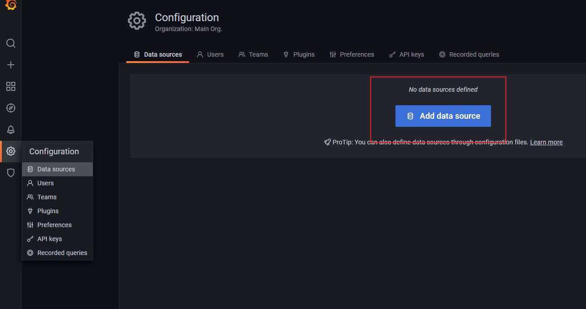
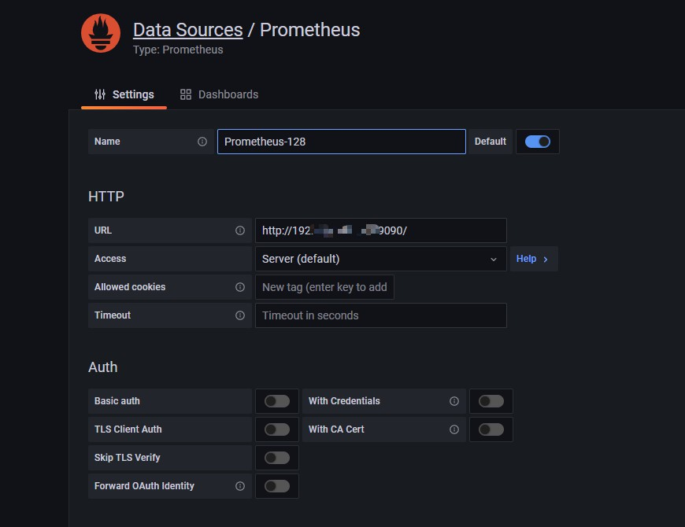
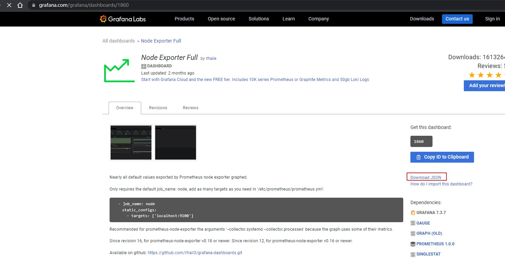
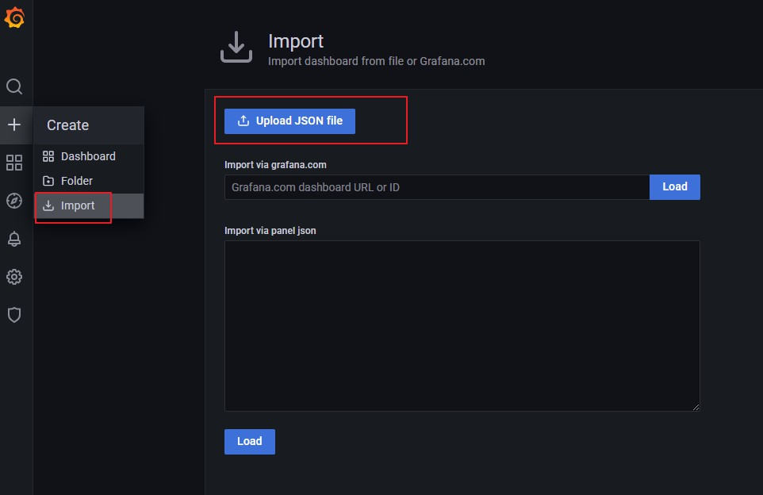
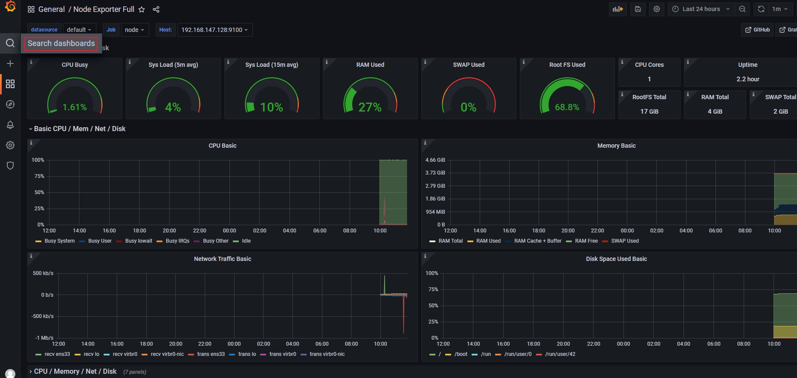
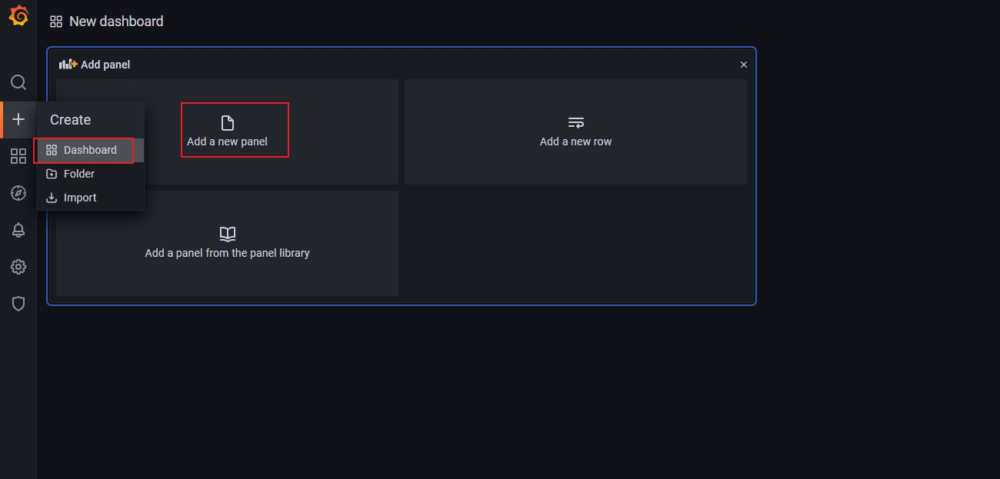
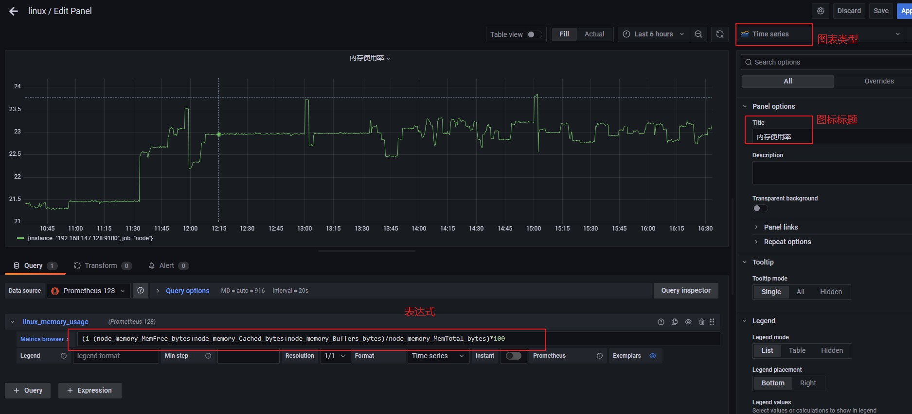

# 安装grafana

https://grafana.com/

下载 `grafana-enterprise-8.4.2.linux-amd64.tar.gz` ，解压

后台启动，并暴露 3000 端口

```bash
nohup ./bin/grafana-server web > ./grafana.log 2>&1 &
```

访问 `http://localhost:3000` ，默认的账户名密码为 admin/admin，初次会要求修改密码，也可直接跳过

# 配置数据源

然后需要我们创建一个数据来源，这里我们选择 prometheus



配置



# 导入仪表盘

然后创建仪表盘，可以自己创建也可以导入模板

进入官方模板网站 [https://grafana.com/grafana/dashboards/](https://gitee.com/link?target=https%3A%2F%2Fgrafana.com%2Fgrafana%2Fdashboards%2F) ，找到合适的模板下载json格式的配置，或者复制id



导入json文件 或 导入id，创建视图面板



然后即可查看我们的数据面板了



# 自定义仪表盘

我们也可以自己创建自己的视图面板

添加一个 dashboard 后，添加 panel 



进行编辑，填写我们的指标或者表达式,保存即可



