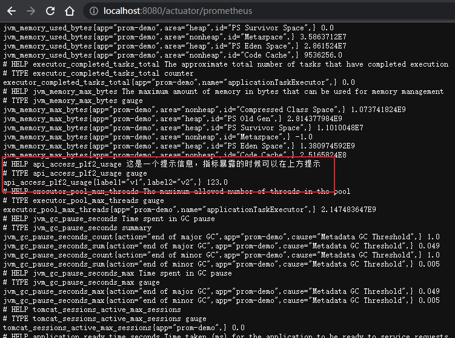

# 指标监控

`https://docs.spring.io/spring-boot/docs/current/reference/html/actuator.html#actuator.metrics`

Spring Boot Actuator 提供了 Micrometer 的自动配置，可以对接多种监控系统。

## 监控springboot 应用

添加依赖

```xml
<dependency>
    <groupId>org.springframework.boot</groupId>
    <artifactId>spring-boot-starter-actuator</artifactId>
</dependency>

<dependency>
    <groupId>io.micrometer</groupId>
    <artifactId>micrometer-registry-prometheus</artifactId>
</dependency>
```

配置 `application.yml`

```yaml
management:
  server:
  # 可以给相关监控单独给个端口，和服务区分开,后续通过该端口访问 http://localhost:9099/actuator
    port: 9099
  endpoints:
   # endpoints 是 暴露信息的方式，默认有 web 和 jmx 两种方式，jmx是jvm的监控工具，我们通常使用 web接口的方式
    web:
      exposure:
        # 这里配置可以用那些接口，可以配多个，可以配 * ,默认只配了 health
        # 配了就可以通过对应的接口访问指标了 http://localhost:9099/actuator/prometheus
        include: 'prometheus,health,metrics'
  endpoint:
   # 这里配置是否开启端点，默认情况，除了 shutdown 端点外，其他端点默认开启
    health:
      show-details: always
    prometheus:
      enabled: true
    metrics:
      enabled: true
  metrics:
    export:
     # 这里是 Prometheus 具体的配置，包括pushgateway等
      prometheus:
        enabled: true
        descriptions: true
```

最简配置

```yaml
management:
  endpoints:
    web:
      exposure:
        include: 'prometheus'
```

访问 http://localhost:9099/actuator/prometheus 即可参考系统相关指标

## 自定义指标

配置指标

```java
import io.micrometer.core.instrument.MeterRegistry;
import io.prometheus.client.CollectorRegistry;
import io.prometheus.client.Counter;
import io.prometheus.client.Gauge;
import org.springframework.boot.actuate.autoconfigure.metrics.MeterRegistryCustomizer;

@Configuration
public class SysMetricConfiguration {

    /**
     * 该类为 actuator 包下 PrometheusMetricsExportAutoConfiguration 自动配置的
     * 用来注册指标
     */
    @Resource
    private CollectorRegistry collectorRegistry;

    /***
     * 配置全局的标签，通常来标识这个应用，所有springboot系统信息的指标都会带这个标签，不包括自定义的
     */
    @Bean
    public MeterRegistryCustomizer<MeterRegistry> metricsCommonTags(@Value("${spring.application.name}") String appName) {
        return (registry) -> registry.config().commonTags("app", appName);
    }

    /**
     * 配置 gauge 指标，指定指标名称，标签，提示等。并注册
     */
    @Bean
    Gauge apiAccessPlfUsage() {
        return Gauge.build().name("api_access_plf2_usage")
                .labelNames("label1", "label2")
                .help("这是一个提示信息，指标暴露的时候可以在上方提示")
                .register(collectorRegistry);
    }

    /**
     * 配置 counter 指标，指定指标名称，标签，提示等。并注册
     */
    @Bean
    Counter apiAccessPlfTotal() {
        return Counter.build().name("api_access_plf_total")
                .labelNames("label1", "label2")
                .help("这是一个提示信息，指标暴露的时候可以在上方提示")
                .register(collectorRegistry);
    }

}
```

使用指标

```java
import io.prometheus.client.Counter;
import io.prometheus.client.Gauge;

@RestController
public class HelloController {

    // 直接注入 指标的bean
    @Autowired
    private Gauge apiAccessPlfUsage;

    @Autowired
    private Counter apiAccessPlfTotal;

    @GetMapping("/hello")
    public String hello(){
        // 给指标设置标签和值
        apiAccessPlfTotal.labels("value1","value2").inc();
//        apiAccessPlfTotal.labels("value1","value2").inc(12.2);

        apiAccessPlfUsage.labels("v1","v2").set(123);
        return "hello";
    }
}
```

当指标有值后 ，访问 http://localhost:9099/actuator/prometheus 即可查看我们的指标



许多监控的指标 如 cpu ，内存等，和 jmx 类似，但是指标名称不同。特有的指标，如logback日志，接口请求数等。

常用指标的promql

```
springboot指标

---common
启动时长(分钟):process_uptime_seconds / 60
堆内存使用量（MB）：sum by (instance)(jvm_memory_used_bytes{area='heap'}) / (1024*1024)
非堆内存使用量（MB）：sum by (instance)(jvm_memory_used_bytes{area='nonheap'}) / (1024*1024)
堆内存使用率（%）：sum by (instance)(jvm_memory_used_bytes{area='heap'}) / sum by (instance)(jvm_memory_max_bytes{area='heap'}) * 100
非堆内存使用率（%）:sum by (instance)(jvm_memory_used_bytes{area='nonheap'}) / sum by (instance)(jvm_memory_max_bytes{area='nonheap'}) * 100
cpu核心数（个）：system_cpu_count
cpu使用率（%）：process_cpu_usage
加载的类数量（个）:jvm_classes_loaded_classes
守护线程数（个）：jvm_threads_daemon_threads
存活的线程数（个）：jvm_threads_live_threads
线程数峰值（个）：jvm_threads_peak_threads
gc总次数（次）：sum by (instance)(jvm_gc_pause_seconds_count)
gc耗时（豪秒）：sum by (instance)(jvm_gc_pause_seconds_sum) * 1000
---special
各接口的请求总数（次）：sum by (instance,uri) (http_server_requests_seconds_count)
各接口每分钟的请求数（次）：sum by (instance,uri)(increase(http_server_requests_seconds_count[1m]))
所有接口请求总数（次）：sum by (instance) (http_server_requests_seconds_count)
每10分钟info日志数(条）：increase(logback_events_total{level='info'}[10m])
每10分钟error日志总数（条）：increase(logback_events_total{level='error'}[10m])
```


# java直接使用

## 创建指标

添加依赖

```xml
<dependency>
    <groupId>io.prometheus</groupId>
    <artifactId>simpleclient</artifactId>
    <version>0.16.0</version>
</dependency>
```

创建指标，默认会注册到 `CollectorRegistry.defaultRegistry` ，遍历指标即可拿到，指标，标签，值

```java
import io.prometheus.client.CollectorRegistry;
import io.prometheus.client.Gauge;
// 构建 gauge 指标
Gauge gaugeOrderSize = Gauge.build().name("plf3_test_order_size").help("描述")
    .labelNames("lb1", "lb2").register();
gaugeOrderSize.labels("v1", "v2").set(2.2);

// 遍历指标
Enumeration<Collector.MetricFamilySamples> sampleValue = CollectorRegistry.defaultRegistry.metricFamilySamples();
if(sampleValue.hasMoreElements()){
    Collector.MetricFamilySamples metricFamilySamples = sampleValue.nextElement();
    for (Collector.MetricFamilySamples.Sample sample : metricFamilySamples.samples) {
        System.out.println(sample);
    }
}
```

## 暴露指标

不过此时，没有好看的格式展示，需要暴露到服务接口上展示 

```xml
<dependency>
    <groupId>io.prometheus</groupId>
    <artifactId>simpleclient_httpserver</artifactId>
    <version>0.16.0</version>
</dependency>
```

创建服务，默认会暴露 `CollectorRegistry.defaultRegistry` 下 的指标

```java
import io.prometheus.client.exporter.HTTPServer;

HTTPServer server = new HTTPServer.Builder().withPort(8085).build();
```

访问 http://localhost:8085/metrics 即可页面上格式化的展示指标 （ / 请求任何路径都会处理）


如果是暴露到已存在的web项目，需要引入 ` simpleclient_servlet`依赖，使用`MetricsServlet`

## 推送pushgateway

引入pushgateway

```xml
<dependency>
    <groupId>io.prometheus</groupId>
    <artifactId>simpleclient_pushgateway</artifactId>
    <version>0.16.0</version>
</dependency>
```

推送

```java
import io.prometheus.client.exporter.PushGateway;

PushGateway pushGateway = new PushGateway("192.169.0.239:9091");
pushGateway.pushAdd(CollectorRegistry.defaultRegistry,"test_job");
```

# 通过 micrometer 使用

添加依赖

```xml
<dependency>
    <groupId>io.micrometer</groupId>
    <artifactId>micrometer-registry-prometheus</artifactId>
    <version>1.9.2</version>
</dependency>
```

核心为 PrometheusMeterRegistry ，把指标注册到这里，调用scrape即可得到抓取的指标

```java
import io.micrometer.prometheus.PrometheusConfig;
import io.micrometer.prometheus.PrometheusMeterRegistry;
import io.micrometer.core.instrument.binder.jvm.ClassLoaderMetrics;
import io.micrometer.core.instrument.binder.jvm.JvmGcMetrics;

// 创建核心抓取实例
PrometheusMeterRegistry registry = new PrometheusMeterRegistry(PrometheusConfig.DEFAULT);
// 全局标签
registry.config().commonTags("app","testApp");
// 注册系统相关指标，源码点进去可以看到很多注册指标的示例
new ClassLoaderMetrics().bindTo(registry);
new JvmMemoryMetrics().bindTo(registry);
new JvmGcMetrics().bindTo(registry);
new ProcessorMetrics().bindTo(registry);
new JvmThreadMetrics().bindTo(registry);
new UptimeMetrics().bindTo(registry);
new FileDescriptorMetrics().bindTo(registry);
// 自定义counter指标，值通过返回的实例去incr递增值
Counter counter = Counter.builder("plf2.order.size").tags("orderName","扭转醇").register(registry);
counter.increment(2);
// 自定义 gauge 指标，需提供一个对象和回调函数，每次抓取时，调用这个对象的函数
OrderStatus orderStatus = new OrderStatus(2);
Gauge.builder("plf2.order.status",orderStatus,OrderStatus::getStatusValue)
    .tags("orderName","聚酸酯")
    .description("描述1")
    .register(registry);
orderStatus.setStatusValue(3);
// 自定义 回调式counter指标，属于counter 类型，通过回调设置值
FunctionCounter.builder("plf2.test.funcount",orderStatus,OrderStatus::getStatusValue).tags("orderName","研磨石").register(registry);
// 抓取指标
String metrics = registry.scrape();
System.out.println(metrics);
```

> 用 micrometer的方式，有个缺陷是，指标的标签，在注册时已经确定了，不能灵活的去设置标签值

打印内容如下，至于结果输出到哪里，看开发者自己，通常输出到 `/metrics` 接口，或者写入文件

```
# HELP jvm_memory_committed_bytes The amount of memory in bytes that is committed for the Java virtual machine to use
# TYPE jvm_memory_committed_bytes gauge
jvm_memory_committed_bytes{area="heap",id="PS Survivor Space",} 1.1010048E7
jvm_memory_committed_bytes{area="heap",id="PS Old Gen",} 8.8604672E7
jvm_memory_committed_bytes{area="heap",id="PS Eden Space",} 1.32120576E8
jvm_memory_committed_bytes{area="nonheap",id="Metaspace",} 2.9229056E7
jvm_memory_committed_bytes{area="nonheap",id="Code Cache",} 7405568.0
jvm_memory_committed_bytes{area="nonheap",id="Compressed Class Space",} 4063232.0
...
```

