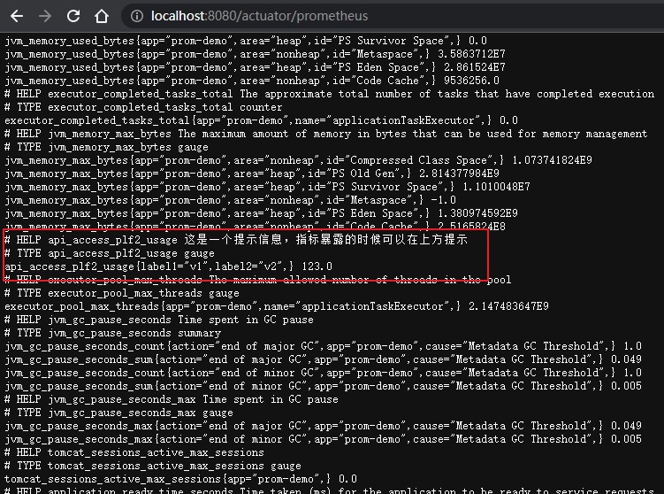

# 指标监控

`https://docs.spring.io/spring-boot/docs/current/reference/html/actuator.html#actuator.metrics`

Spring Boot Actuator 提供了 Micrometer 的自动配置，可以对接多种监控系统。

## 监控springboot 应用

添加依赖

```xml
<dependency>
    <groupId>org.springframework.boot</groupId>
    <artifactId>spring-boot-starter-actuator</artifactId>
</dependency>

<dependency>
    <groupId>io.micrometer</groupId>
    <artifactId>micrometer-registry-prometheus</artifactId>
</dependency>
```

配置 `application.yml`

```yaml
management:
  server:
  # 可以给相关监控单独给个端口，和服务区分开,后续通过该端口访问 http://localhost:9099/actuator
    port: 9099
  endpoints:
   # endpoints 是 暴露信息的方式，默认有 web 和 jmx 两种方式，jmx是jvm的监控工具，我们通常使用 web接口的方式
    web:
      exposure:
        # 这里配置可以用那些接口，可以配多个，可以配 * ,默认只配了 health
        # 配了就可以通过对应的接口访问指标了 http://localhost:9099/actuator/prometheus
        include: 'prometheus,health,metrics'
  endpoint:
   # 这里配置是否开启端点，默认情况，除了 shutdown 端点外，其他端点默认开启
    health:
      show-details: always
    prometheus:
      enabled: true
    metrics:
      enabled: true
  metrics:
    export:
     # 这里是 Prometheus 具体的配置，包括pushgateway等
      prometheus:
        enabled: true
        descriptions: true
```

最简配置

```yaml
management:
  endpoints:
    web:
      exposure:
        include: 'prometheus'
```

访问 http://localhost:9099/actuator/prometheus 即可参考系统相关指标

## 自定义指标

配置指标

```java
import io.micrometer.core.instrument.MeterRegistry;
import io.prometheus.client.CollectorRegistry;
import io.prometheus.client.Counter;
import io.prometheus.client.Gauge;
import org.springframework.boot.actuate.autoconfigure.metrics.MeterRegistryCustomizer;

@Configuration
public class SysMetricConfiguration {

    /**
     * 该类为 actuator 包下 PrometheusMetricsExportAutoConfiguration 自动配置的
     * 用来注册指标
     */
    @Resource
    private CollectorRegistry collectorRegistry;

    /***
     * 配置全局的标签，通常来标识这个应用，所有springboot系统信息的指标都会带这个标签，不包括自定义的
     */
    @Bean
    public MeterRegistryCustomizer<MeterRegistry> metricsCommonTags(@Value("${spring.application.name}") String appName) {
        return (registry) -> registry.config().commonTags("app", appName);
    }

    /**
     * 配置 gauge 指标，指定指标名称，标签，提示等。并注册
     */
    @Bean
    Gauge apiAccessPlfUsage() {
        return Gauge.build().name("api_access_plf2_usage")
                .labelNames("label1", "label2")
                .help("这是一个提示信息，指标暴露的时候可以在上方提示")
                .register(collectorRegistry);
    }

    /**
     * 配置 counter 指标，指定指标名称，标签，提示等。并注册
     */
    @Bean
    Counter apiAccessPlfTotal() {
        return Counter.build().name("api_access_plf_total")
                .labelNames("label1", "label2")
                .help("这是一个提示信息，指标暴露的时候可以在上方提示")
                .register(collectorRegistry);
    }

}
```

使用指标

```java
import io.prometheus.client.Counter;
import io.prometheus.client.Gauge;

@RestController
public class HelloController {

    // 直接注入 指标的bean
    @Autowired
    private Gauge apiAccessPlfUsage;

    @Autowired
    private Counter apiAccessPlfTotal;

    @GetMapping("/hello")
    public String hello(){
        // 给指标设置标签和值
        apiAccessPlfTotal.labels("value1","value2").inc();
//        apiAccessPlfTotal.labels("value1","value2").inc(12.2);

        apiAccessPlfUsage.labels("v1","v2").set(123);
        return "hello";
    }
}
```

当指标有值后 ，访问 http://localhost:9099/actuator/prometheus 即可查看我们的指标



许多监控的指标 如 cpu ，内存等，和 jmx 类似，但是指标名称不同。特有的指标，如logback日志，接口请求数等。

常用指标的promql

```
springboot指标

---common
启动时长(分钟):process_uptime_seconds / 60
堆内存使用量（MB）：sum by (instance)(jvm_memory_used_bytes{area='heap'}) / (1024*1024)
非堆内存使用量（MB）：sum by (instance)(jvm_memory_used_bytes{area='nonheap'}) / (1024*1024)
堆内存使用率（%）：sum by (instance)(jvm_memory_used_bytes{area='heap'}) / sum by (instance)(jvm_memory_max_bytes{area='heap'}) * 100
非堆内存使用率（%）:sum by (instance)(jvm_memory_used_bytes{area='nonheap'}) / sum by (instance)(jvm_memory_max_bytes{area='nonheap'}) * 100
cpu核心数（个）：system_cpu_count
cpu使用率（%）：process_cpu_usage
加载的类数量（个）:jvm_classes_loaded_classes
守护线程数（个）：jvm_threads_daemon_threads
存活的线程数（个）：jvm_threads_live_threads
线程数峰值（个）：jvm_threads_peak_threads
gc总次数（次）：sum by (instance)(jvm_gc_pause_seconds_count)
gc耗时（豪秒）：sum by (instance)(jvm_gc_pause_seconds_sum) * 1000
---special
各接口的请求总数（次）：sum by (instance,uri) (http_server_requests_seconds_count)
各接口每分钟的请求数（次）：sum by (instance,uri)(increase(http_server_requests_seconds_count[1m]))
所有接口请求总数（次）：sum by (instance) (http_server_requests_seconds_count)
每10分钟info日志数(条）：increase(logback_events_total{level='info'}[10m])
每10分钟error日志总数（条）：increase(logback_events_total{level='error'}[10m])
```

