# 1,简介

​	**spring boot** 可以简化spring应用的开发，像以前如果想要搭建经典的SSM框架，需要自己找各种需要的jar包或者依赖，再在web.xml中配置核心servlet,并且编写spring的配置文件。配置事物，数据源，mybatis，mvc等等各种配置，运行的话需要打成war包，放到tomcat中运行。

​	**但是**，如果使用spring boot后，只需要导入启动器(starter)，甚至无需做配置，就可以搭建一个环境，并且运行时不需要tomcat，因为springboot内置了tomcat。大大简化了开发。

# 2,Hello World

创建一个maven项目

###导入依赖

我们来到springboot的官网'https://projects.spring.io/spring-boot/',导入官方给我们的配置,一个父项目，和一个starter依赖，

​	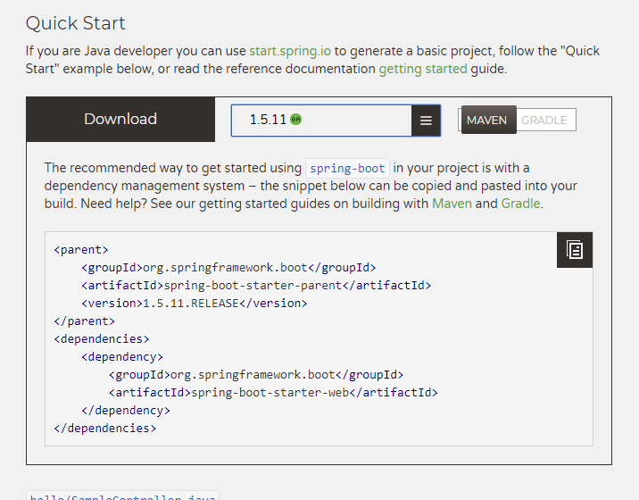

​	导入到我们的pom.xml中,等待jar包下载完成

​	eclipse会自动帮我们下载jar包，idea中会弹出如下窗口，选择enable auto-import  开启自动导入

​	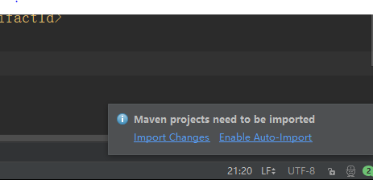

### 编写主类

在项目的根包下创建主类,也是官方推荐的包结构，

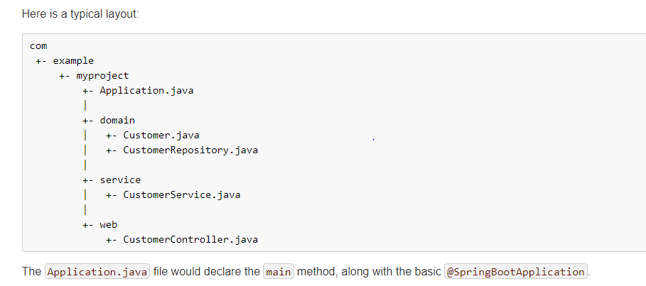

编写MyApplication,使用@SpringBootApplication标识这个类，在main方法中调用SpringApplication的run方法使用本类的类对象作为参数,@SpringBootApplication会自动扫描**本包和子包**中的组件，所以推荐把主类放在根包下，如果写在了同级包下的组件需要用@ComponetScan指定要扫描的包

```java
@SpringBootApplication
//@ComponentScan(value = "")
public class MyApplication {

    public static void main(String[] args) {
        SpringApplication.run(MyApplication.class,args);
    }
}

```

### 编写Controller

在controller包下创建controller，和spring mvc一样

```java
@Controller
public class HelloController {

    @RequestMapping("hello")
    @ResponseBody
    public String hello(){
        return "Hello World";
    }
}
```

### 运行

直接运行main方法,可以看到spring的logo，以及一些日志，

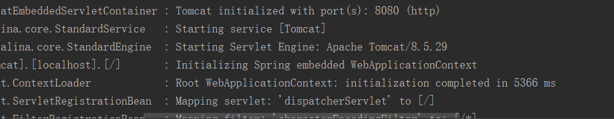

可以看出在端口号8080开启了项目，并且请求映射为了`"/"`,在浏览器中请求我们的controller,验证服务


### 打包

添加打包插件

```xml
    <!-- Package as an executable jar -->
    <build>
        <plugins>
            <plugin>
                <groupId>org.springframework.boot</groupId>
                <artifactId>spring-boot-maven-plugin</artifactId>
            </plugin>
        </plugins>
    </build>
```

在pom中添加springboot的打包插件可以直接把项目打成一个可以执行的jar包,在eclispe中右键项目执行maven的package命令，在idea中左下角调整视图，找到右边的maven projects选中Lifecycle(生命周期),点击package

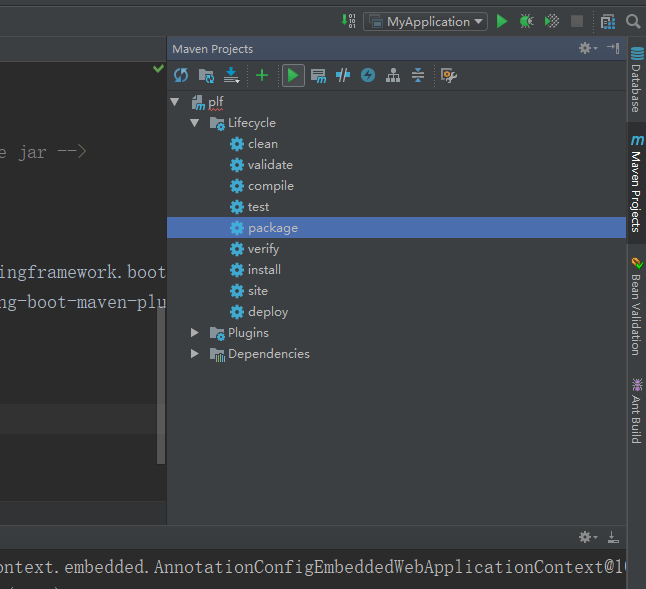

出现build success,在target目录中已经有了我们的jar包

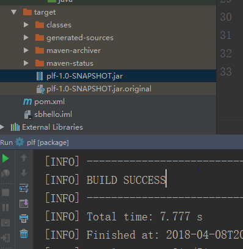

使用java -jar  的命令运行我们的jar包，同样会执行，并且不需要tomcat

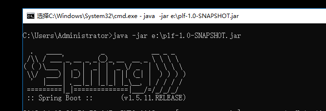

# 3,使用插件快速创建springboot项目

这里需要使用eclipse安装spring的插件，或者直接使用STS和IDEA

新建项目选择spring initializr

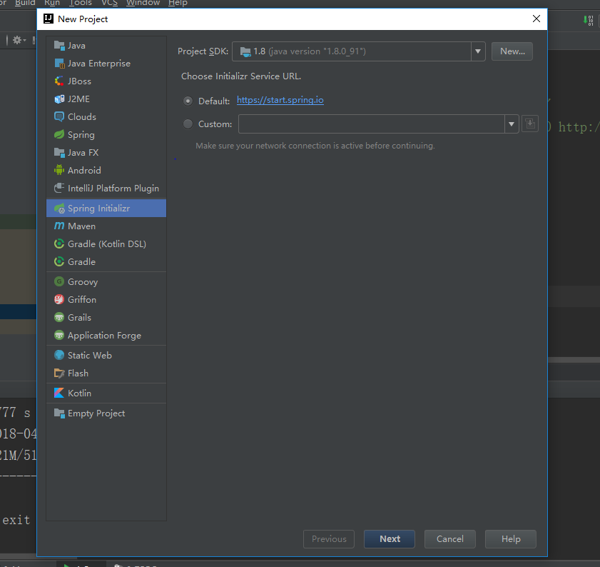

点next，选择jdk的版本等等

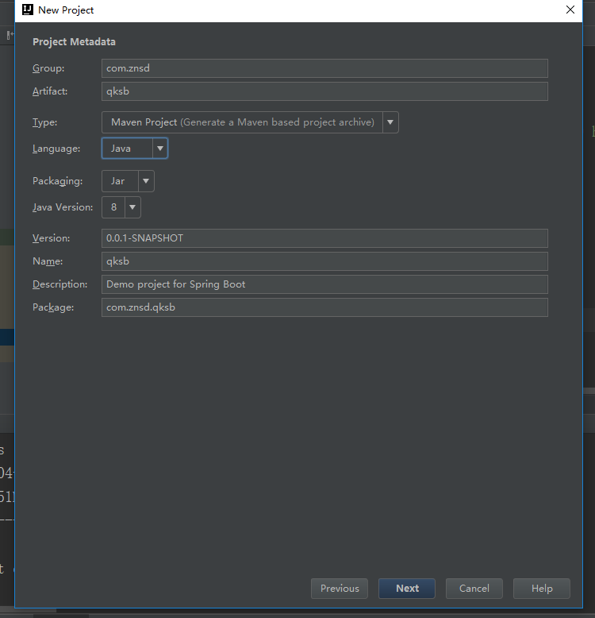

然后想要什么功能直接选中即可,注意springboot的版本

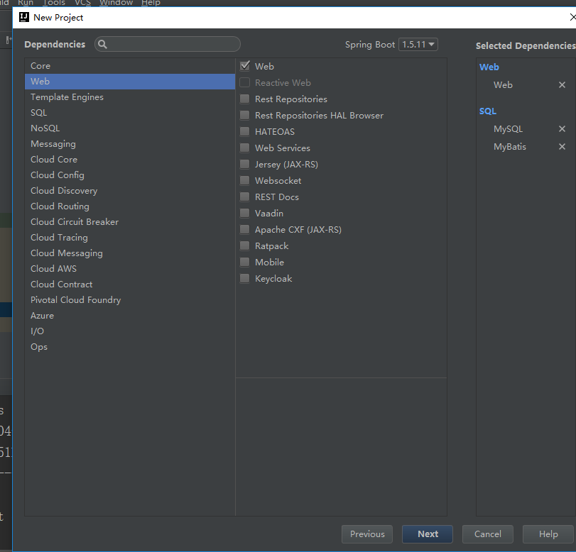

完成项目构建，需要联网

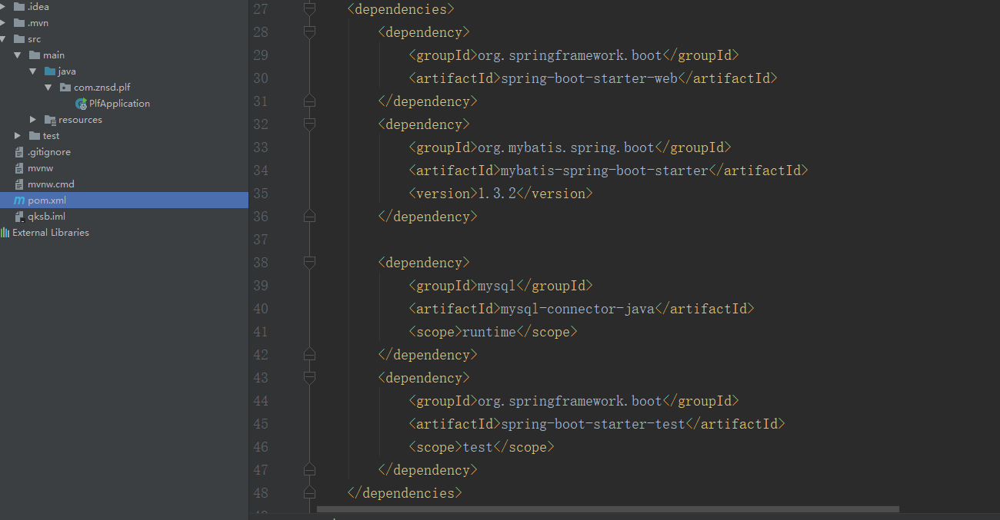

会自动帮我们编写主类和导入依赖

# 4，配置文件

springboot的核心配置文件名为application，后缀可以是properties和yml,所有的配置都在这里，代替以前臃肿的xml文件

可以修改springboot的默认值。和一些必须配置的属性如数据库连接信息.

### properties

```properties
##配置端口号
server.port=8081
##配置项目路径
server.context-path=/qksb
##配置数据源
spring.datasource.type=com.alibaba.druid.pool.DruidDataSource
spring.datasource.driver-class-name=com.mysql.jdbc.Driver
spring.datasource.url=jdbc:mysql://192.168.2.135:3306/test
spring.datasource.username=root
spring.datasource.password=root
```


### yml

如上配置少量信息还好，想数据库-信息配置起来就显得相当重复和臃肿，没用层次结果，可读性差，于是就有来yml文件来做配置，yml全名yaml，”不是一种标记语言”的缩写 ,类似于标记语言,但是语法简单结构清晰,以上同样的配置使用yml如下

```yaml
server:
  port: 8082
  context-path: qksb
spring:
  datasource:
  	driver-class-name: com.mysql.jdbc.Driver
    type: com.alibaba.druid.pool.DruidDataSource
    url: jdbc:mysql://192.168.2.135:3306/test
    username: root
    password: root
```

yml的语法为  属性名:(空格)属性值,注意冒号后面一定要有空格，空格后接属性值,属性名区分大小写,靠缩进来代表层级关系，缩进的格数没用限制，只要缩进一样就为同一级,

driver-class-name等价于driverClassName,两者效果一样

### 注册属性，读取属性

编写一个实体类,使用@ConfiguratiuonProperties标记并设置前缀

```java
@Component
@ConfigurationProperties(prefix = "student")
public class Student {

    private String studentName;
    private int studentId;
    private Date birthday;
    private List<String> subjects;
    private Map<String,Object> grades;
    private Dog dog;
```

再依赖中添加配置处理器,重新运行项目

```xml
<dependency>
    <groupId>org.springframework.boot</groupId>
    <artifactId>spring-boot-configuration-processor</artifactId>
    <optional>true</optional>
</dependency>
```

发现属性已经注册上来，并且有提示

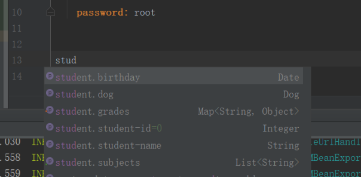

设置这些属性，并获取,字符串不用加引号，数组使用方括号，map使用大括号，冒号后面也要有空格,

```yaml
student:
  student-id: 123
  student-name: 张三
  birthday: 1995/12/12
  subjects: [数学,语文,英语]
  grades: {体育: 1,音乐: 2}
  dog:
    dogName: 阿黄
```

在springboot的单元测试中,自动注入student，并打印

```java
@RunWith(SpringRunner.class)
@SpringBootTest
public class PlfApplicationTests {

	@Autowired
	Student student1;

	@Test
	public void contextLoads() {
		System.out.println(student1);
	}

}
```

得到结果

```java
//Student{studentName='张三', studentId=123,
// birthday=Tue Dec 12 00:00:00 CST 1995, subjects=[数学, 语文, 英语],
// grades={体育=1, 音乐=2}, dog=Dog{dogName='阿黄'}}
```

如果使用properties记得改文件编码,file encoding

如果不使用@ConfigurationProperties,还可以使用@Value注解一个个指定,@Value注解还支持spel表达式,可以直接取值赋值到任何componet中，不需要写成一个实体类的属性

```java
@Value("${student.student-name}")
private String studentName;
```

### 传统xml配置与配置类

springboot可以通过@ImportResource注解导入一个传统的spring的xml配置文件,使其生效

```java
@SpringBootApplication
@ImportResource(value = {"classpath:beans.xml"})
public class PlfApplication {

	public static void main(String[] args) {
		SpringApplication.run(PlfApplication.class, args);
	}
}
```

也可以使用配置类来完成,通过@Configuration注解标识这是一个配置类，用来代替传统的xml文件,@Bean修饰的方法相当于以前的一个Bean节点,用代码来实现

```java
@Configuration
public class MyConfig {

    @Bean
    public StudentService studentService(){
        return new StudentServiceImpl();
    }
}
```

### 占位符

随机数占位符:

无论是properties还是yml都可以使用随机数占位符,使用${random.类型}来设置值

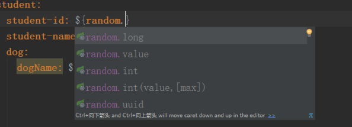

属性占位符:

可以使用${属性名:默认值}读取之前的值来作为属性

```yaml
student:
  student-id: ${random.int(-1,10)}
  student-name: 张三
  dog:
    dogName: ${student.student-name:def}的阿黄
```

如果属性不存在，会直接使用表达式作为值，可以用冒号设置默认值，这里不用空格

