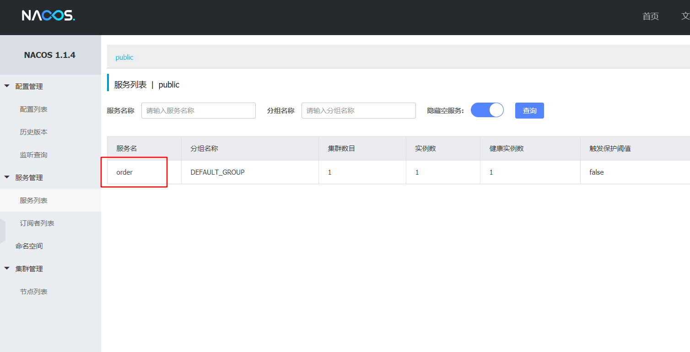

# 概述

`nacos`是一款服务治理和配置管理的平台。https://nacos.io/zh-cn/docs/quick-start.html

下载地址 https://github.com/alibaba/nacos/releases ,目前的稳定版本为 1.1.4

解压后，直接进入 bin 目录，双击击 `startup.cmd` 即可启动。

然后访问 http://localhost:8848/nacos/index.html 进入控制台。默认帐号密码为 `nacos/nacos`

`nacos` 服务端启动完成

# 服务注册

引入依赖

```xml
<dependency>
    <groupId>com.alibaba.cloud</groupId>
    <artifactId>spring-cloud-starter-alibaba-nacos-discovery</artifactId>
</dependency>
```

启动类中开启服务发现。使用`@EnableDiscoveryClient`

```java
@SpringBootApplication
@EnableDiscoveryClient
public class OrderApplication {
```

在 `application.yml` 中配置`nacos`的地址,注意一定要配置 `spring.application.name` ,否则注册不上。

```yaml
spring:
  application:
    name: order
  cloud:
    nacos:
      server-addr: localhost:8848
```

在控制台上可以看见注册信息




# 负载均衡

`nacos` 内部继承了 ribbon

当两个服务都注册进入 `nacos` 则可以使用 `spring.application.name`替换之前的 url 地址

消费者创建 `RestTemplate` ,并用 `@LoadBalanced` 标注。

```java
@Bean
@LoadBalanced
public RestTemplate restTemplate(){
    return new RestTemplate();
}
```

使用时，请求的地址直接是 `appName` 即可。

```java
private static final String ORDER_URL = "http://order";

@Resource
private RestTemplate restTemplate;

@GetMapping("/{orderId}")
public Result<Order> getOrderById(@PathVariable Long orderId){
    Result<Order> result = restTemplate.getForObject(ORDER_URL + "/order/" + orderId, Result.class);
    return result;
}
```

如果生产者做了集群，将以轮询的方式，分发到不同的机器。

被请求的生产者的代码，一个标准的 rest 服务。

```java
@Slf4j
@RestController
@RequestMapping("/order")
public class OrderController {

    @GetMapping("/{orderId}")
    public Result<Order> getOrderById(@PathVariable Long orderId){
        log.info("订单编号为{}",orderId);
        Result<Order> result = new Result<>();
        result.setStatus(200);
        result.setMsg("获取成功");
        Order order = new Order();
        order.setOrderId(orderId);
        result.setData(order);
        return result;
    }
}
```

# Feign

之前使用 `RestTemplate`  进行调用，改为 Feign 后会更方便的调用。

消费者 加入依赖

```xml
<dependency>
    <groupId>org.springframework.cloud</groupId>
    <artifactId>spring-cloud-starter-openfeign</artifactId>
</dependency>
```

开启Feign,主类使用`@EnableFeignClients` 标注。

可以删掉之前的 `RestTemplate` 的 bean 配置

```java
@SpringBootApplication
@EnableDiscoveryClient
@EnableFeignClients
public class PayApplication {
```

编写 `FeignClient` ,使用`@FeignClient("order")` 注解指定生产者的 appName

在 `Feign` 中使用 `@PathVariable` 时，需指定变量名称。

```java
@FeignClient("order")
@RequestMapping("/order")
public interface OrderService {

    @GetMapping("/{orderId}")
    Result<Order> getOrderById(@PathVariable("orderId") Long orderId);
}
```

使用 `FeignClient` ,只需注入进来，调用方法即可。

```java
@Autowired
private OrderService orderService;

@GetMapping("/{orderId}")
public Result<Order> getOrderById(@PathVariable Long orderId){
    log.info("订单id为{}",orderId);
    Result<Order> order = orderService.getOrderById(orderId);
    log.info("查询结果:{}",order.toString());
    return order;
}
```


