# 概述

sentinel 提供了限流，熔断等功能，还提供了一个可视化的客户端。

# 控制台

下载 jar 包，`https://github.com/alibaba/Sentinel/releases`

相关文档，`https://github.com/alibaba/Sentinel/wiki/%E6%8E%A7%E5%88%B6%E5%8F%B0`

启动

```bash
java -Dserver.port=8080 -Dcsp.sentinel.dashboard.server=localhost:8080 -Dproject.name=sentinel-dashboard -jar sentinel-dashboard.jar
```

访问目标端口，使用 sentinel/sentinel 登录

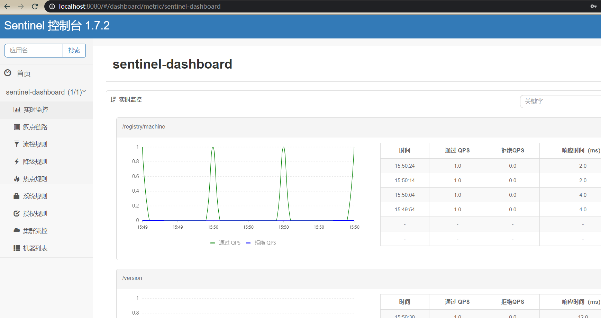

即可看见当前服务的监控情况。

# 注册

要想一个微服务被 sentinel 监控，需要注册进入sentinel控制台

引入依赖

```xml
<dependency>
    <groupId>com.alibaba.cloud</groupId>
    <artifactId>spring-cloud-starter-alibaba-sentinel</artifactId>
</dependency>
```

在`application.yml`中配置 sentinel 地址

```yaml
server:
  port: 8081
spring:
  application:
    name: hello
  cloud:
    sentinel:
      transport:
        # 与控制台交流的端口，指定一个没被占用的端口即可
        port: 8999 
        # 指定sentinel 控制台的地址
        dashboard: localhost:8080
```

启动项目 ,需要访问一次hello服务后，可以看到已经注册进入了控制台。

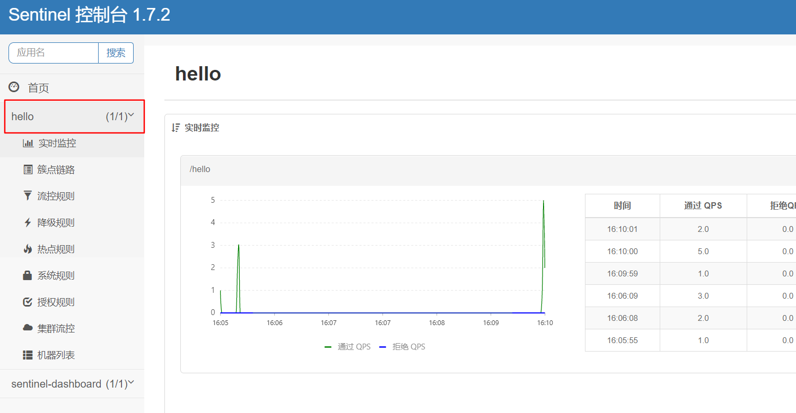

# 限流

资源：sentinel要保护的对象

规则：sentinel如何保护这些对象

编写一个请求

```java
@RestController
public class HelloController {

    @GetMapping("/hello")
    public String hello(){
        return "<h1>hello sentinel</h1>";
    }
}
```

在控制台上找到该请求，添加限流规则

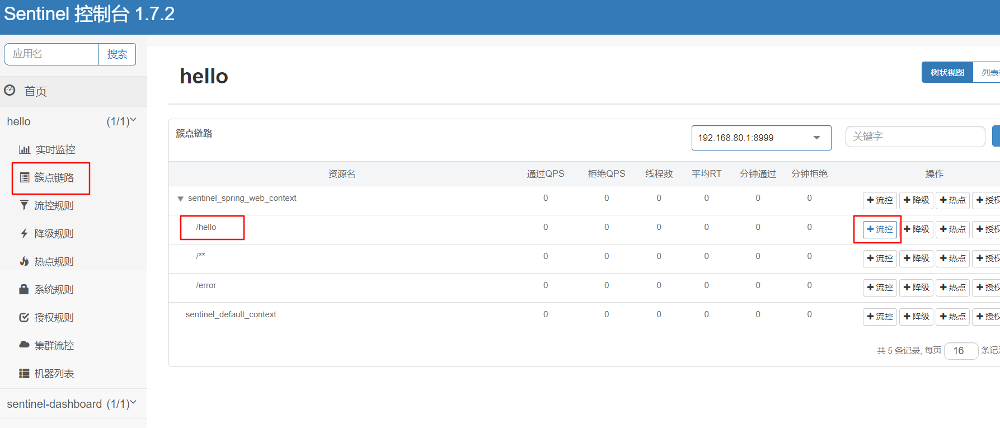

选择 qps ，设置单机阈值

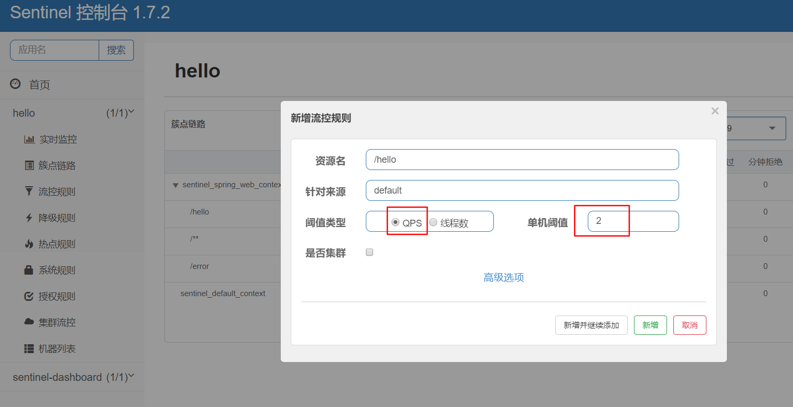

正常请求时 ,状态码为 200  。快速刷新，触发限流，状态码为 429。

 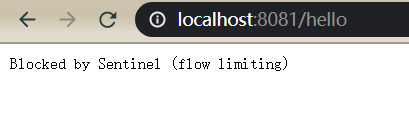

# 降级

在控制台上选择降级

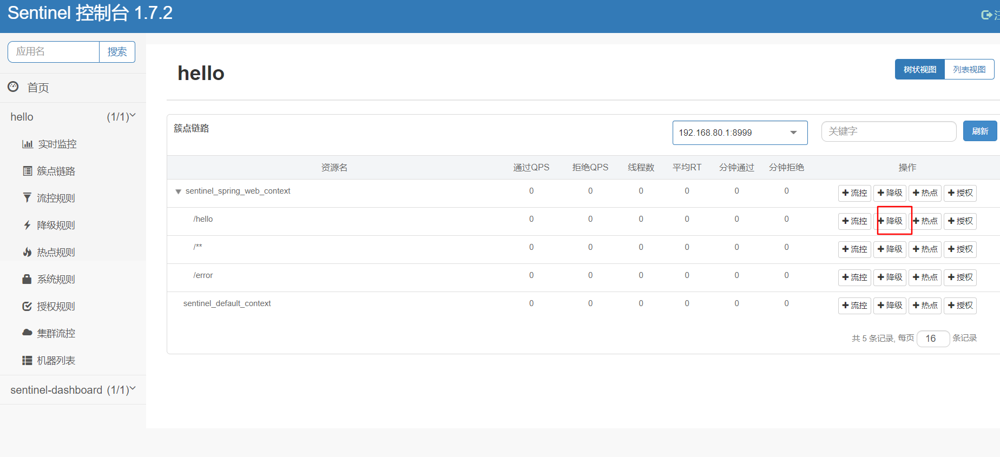

## RT

RT模式为平均响应时间

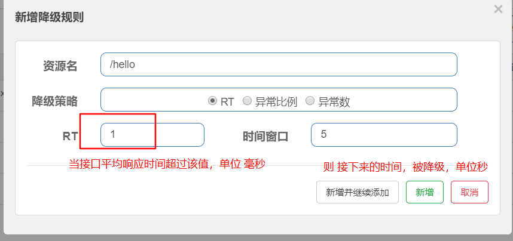

## 异常比例

编辑降级规则，选择异常比例，比例设置为 0 到 1 之间

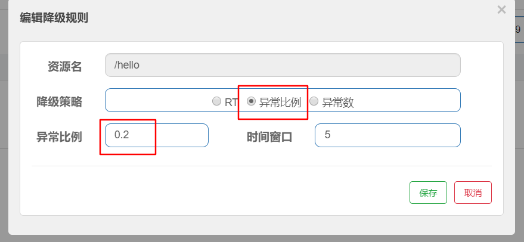

修改我们的请求，使得请求有三分之一的会异常。

```java
static int i = 1;

@GetMapping("/hello")
public String hello() {
    i++;
    if (i % 3 == 0) {
        throw new RuntimeException("333");
    }
    return "<h1>hello sentinel</h1>";
}
```

## 异常数

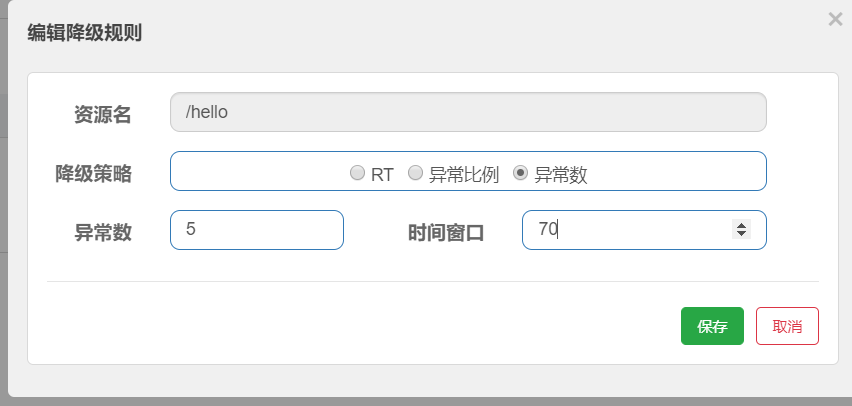

当一分钟内的异常数，达到该数量触发降级。

由于时间范围按一分钟计算，所以时间窗口需要设置为大于60s，不然时间窗口过后，会再次被降级。

# 热点

修改代码,通过 `@SentinelResource` 标识一个资源，并指定两个参数

```java
@GetMapping("/hello")
@SentinelResource("hello")
public String hello(Integer id, String name) {
    return "<h1>hello " + id + name + " sentinel</h1>";
}
```

配置热点规则，索引为1的参数进行热点限制

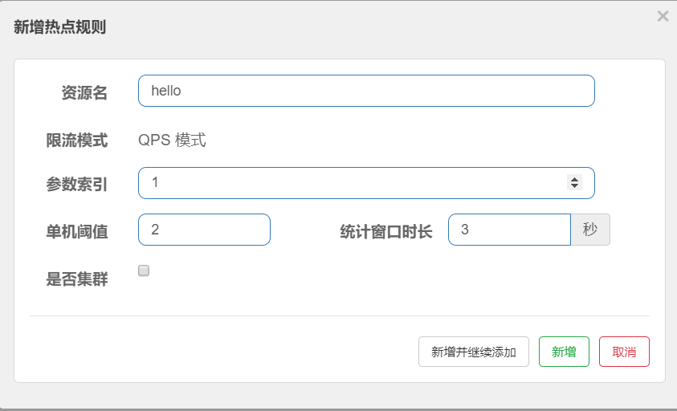

当请求 `http://localhost:8081/hello?id=1` 时，不会收到限制

而请求 `http://localhost:8081/hello?name=张三` 时，快速刷新，则会触发限流

还可在高级选项中，设置参数值

# 自定义异常结果

编写一个异常处理器 ，实现`com.alibaba.csp.sentinel.adapter.spring.webmvc.callback.BlockExceptionHandler`接口

会传入 一个`BlockException` ,判断子类型，给出不同的响应。

```java
@Component
public class SentinelExceptionHandler implements BlockExceptionHandler {
    @Override
    public void handle(HttpServletRequest httpServletRequest, HttpServletResponse httpServletResponse, BlockException e) throws Exception {
        httpServletResponse.setContentType(MediaType.APPLICATION_JSON_UTF8_VALUE);
        Map<String, Object> result = new HashMap<>(2);
        result.put("status", -1);
        if (e instanceof FlowException) {
            result.put("msg", "该接口被限流了");
        } else if (e instanceof DegradeException) {
            result.put("msg", "该接口被降级了");
        }
        httpServletResponse.getWriter().write(JSON.toJSONString(result));
    }
}
```

触发限流后的异常页面。

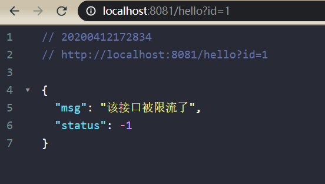

# SentinelResource

该注解可以定义处理异常的方法

```java
@GetMapping("/hello")
@SentinelResource(value = "hello",fallback = "helloFallback",blockHandler = "helloBlockHandler")
public String hello(Integer id, String name) {
    return "<h1>hello " + id + name + " sentinel</h1>";
}

public String helloBlockHandler(Integer id, String name) {
    return "<h1>block " + id + name + " sentinel</h1>";
}

public String helloFallback(Integer id, String name) {
    return "<h1>fallback " + id + name + " sentinel</h1>";
}
```

如果抛出 `BlockException` 则进入 `blockHandler` 指定的方法

如果抛出 `Throwable` 则进入 `fallback` 指定的方法

如果没指定，则进入自定义异常处理器，如果没有自定义异常处理器，则使用默认的限流响应。


## 提取公共类

以上写法，会使代码变得臃肿，可以把备用方法，提取到一个类中。

通过 `fallbackClass`属性指定该类，`fallback`指定该类中的一个方法。

```java
@GetMapping("/hello")
@SentinelResource(value = "hello", fallback = "hello", fallbackClass = HelloFallback.class)
public String hello(Integer id, String name) {
    if (id == 2) {
        throw new RuntimeException("222");
    }
    return "<h1>hello " + id + name + " sentinel</h1>";
}
```

编写改类,对应的方法要为 static ，且参数和返回值和原方法一致。

```java
public class HelloFallback {

    public static String hello(Integer id, String name) {
        return "<h1>fallback cc " + id + name + " sentinel</h1>";
    }
}
```

block同样有对应的使用方式。

# 规则持久化

